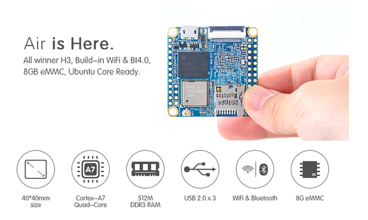
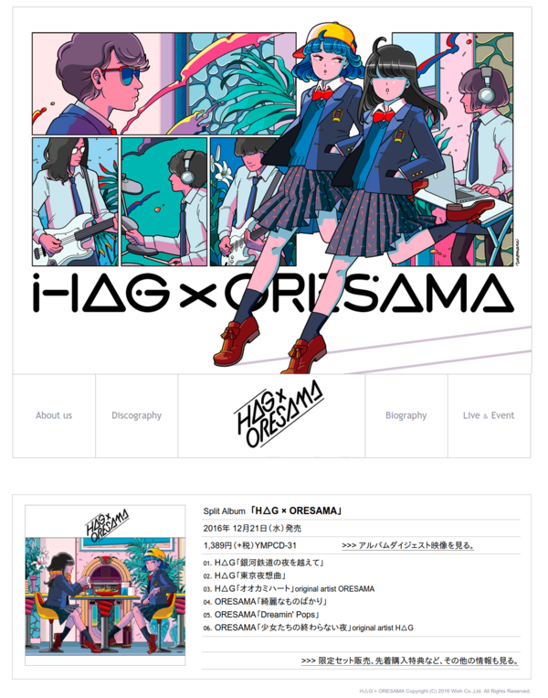
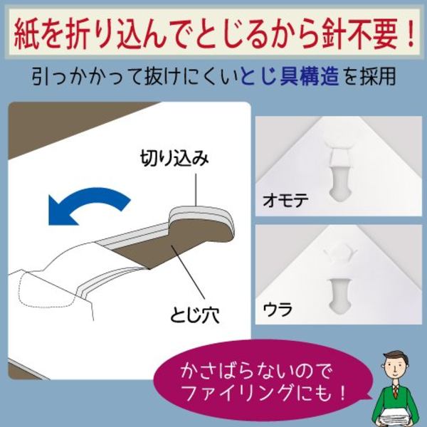
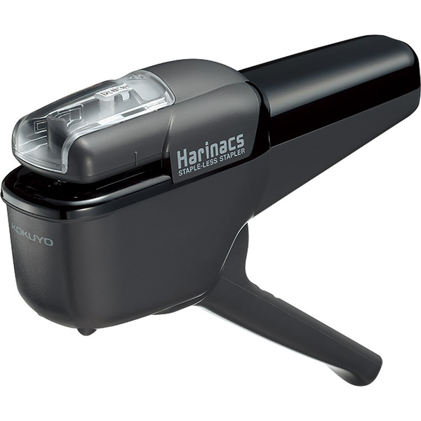
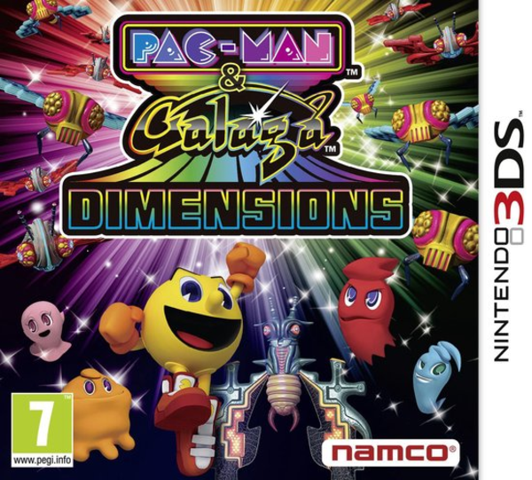
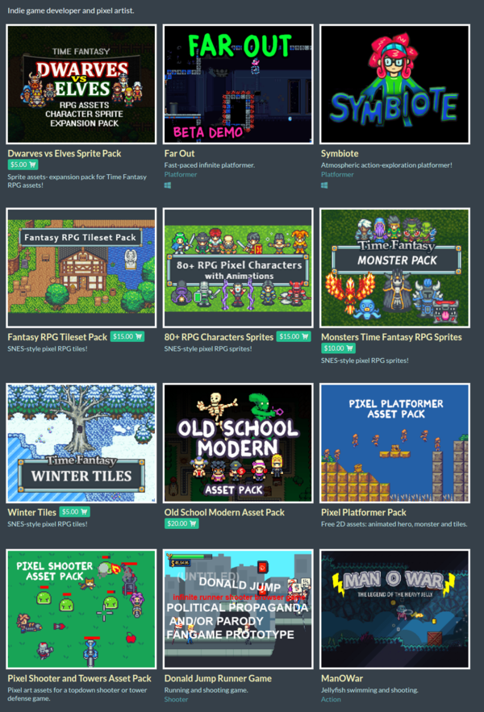

* [http://www.crunchyroll.com/](http://www.crunchyroll.com/), Crunchyroll because it has Digimon Tri anime.

* [http://www.friendlyarm.com/index.php?route=product/product&product_id=151](http://www.friendlyarm.com/index.php?route=product/product&product_id=151), NanoPI Air. RaspBerry PI Zero alternative with WiFi and Bluetooth and it is twice smaller too!

* [http://wish-japan.co.jp/hag-oresama/](http://wish-japan.co.jp/hag-oresama/), HAG and Oresama collaboration album, here are some sample clips, [https://www.youtube.com/watch?v=WX0rq9pAxoo](https://www.youtube.com/watch?v=WX0rq9pAxoo).

* [https://www.amazon.com/Kokuyo-Harinacs-Japanese-Stapleless-Stapler/dp/B00F2YSDYY/](https://www.amazon.com/Kokuyo-Harinacs-Japanese-Stapleless-Stapler/dp/B00F2YSDYY/), staples that no need to be filled. It uses specific folding mechanics to bind papers. However, this can only be used to bind less than 10 papers.

* [https://www.bol.com/nl/p/pac-man-galaga-dimensions/1004004011303984/?suggestionType=typedsearch](https://www.bol.com/nl/p/pac-man-galaga-dimensions/1004004011303984/?suggestionType=typedsearch), I want to play classic Pac Man in 3DS.

* [https://finalbossblues.itch.io/](https://finalbossblues.itch.io/), video game asset from FinalBossBlue. He/she is my favorite sprite artist that provides cheap and easy to modified sprite art.