* Here are my summary for German class on Wednesday, 9th of November 2016.

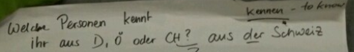

* "Welche Personnen kennt?" means "What people know?".
    * I think this was not meant as sentence.
* For example if I want to ask these.
    * Which people do you know?
    * Which person do you know?
* These would translates into these.
    * Which people do you know?
        * Welche Leute kennen Sie?
        * Welche Leute kennst du?
        * Welche Personnen kennen Sie?
        * Welche Personnen kennst du?
    * Which person do you know?
        * Welche person kennen Sie?
        * Welche person kennst du?

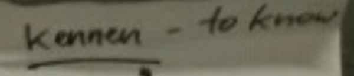

* "Kennen" means "to know".

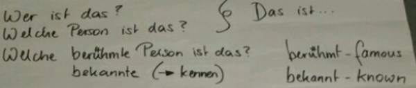

* "Welche bekannte Person ist das?" means "Which known person is that?".
* "Welche beruhmte Person ist das?" means "Which famous person is that?".
* "Welche Person ist das?" means "Which person is that?".
* "Wer ist das?" means "Who is that?".

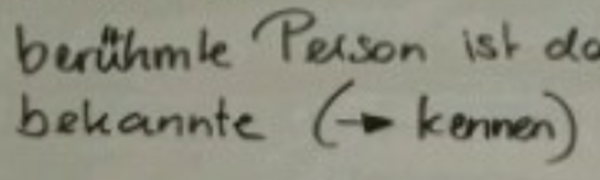

* The word "bekannte" is similar to the word "kennen". Hence, it means "known".

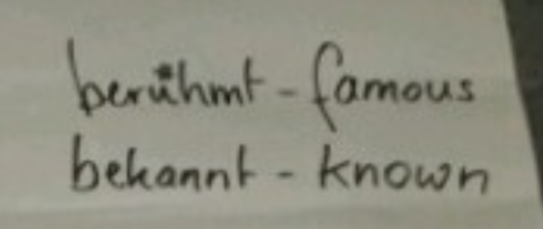

* "Bekannt" means "known".
* "Beruhmt" means "famous".

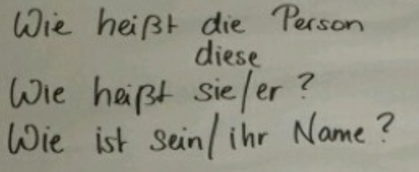

* "Wie heissbt er?" means "Who is he?" this is used to specifically asking for name.
* "Wie heissbt sie?" means "Who is she" this is used to specifically asking for name.
* "Wie ist ihr Name?" means "What is her name?".
* "Wie ist sein Name?" means "What is his name?".
* Wie heissbt die Person? means "Who is this person?".
* Wie heissbt diese Personnen? means "Who is these people?".

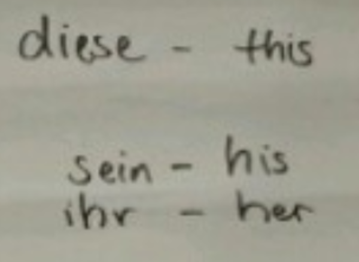

* "Diese" means "this".
* "Ihr" is the proposition for she (direct translation from "her").
* "Sein" is the preposition for he (direct translation from "his").

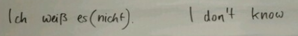

* "Ich weiss es nicht". means "I do now know it.".
* "Ich weiss es." means "I know it.".

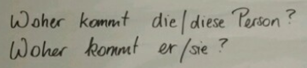

* "Woher kommt die Person?" means "Where does this person comes from?".
* "Woher kommt diese Personnen?" means "Where does this people comes from?".
* "Woher kommt er?" means "Where does he comes from?".
* "Woher kommt sie?" means "Where does she comes from?".

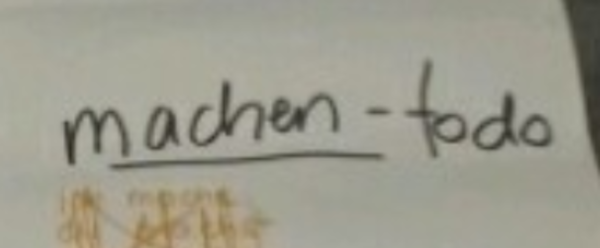

* "Machen" means "to do".

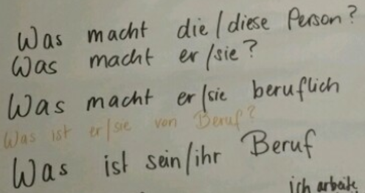

* "Was ist er von Beruf?" means "What is his job?".
* "Was ist ihr Beruf?" means "What is her job?".
* "Was ist sein Beruf?" means "What is his job?".
* "Was ist sie von Beruf?" means "What is her job?".
* "Was macht die Person?" means "What does this person do?".
* "Was macht diese Personnen?" means "What does this people do?".
* "Was macht er beruflich?" means "What is his occupation?".
* "Was macht sie beruflicht?" means "What is her occupation?".

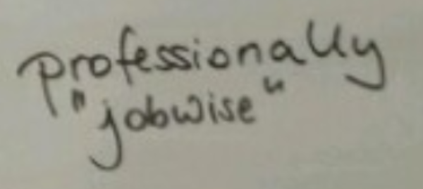

* The questions above are meant to use for asking a professional job.
* They are not meant to ask something that the subject do on the go.

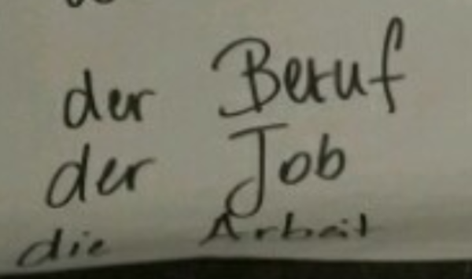

* Der Beruf. This means that the word "Beruf" is masculine.
* Der Job. This means that the word "Job" is masculine.
* Die Arbeit. This means that the word "Arbeit" is feminine.

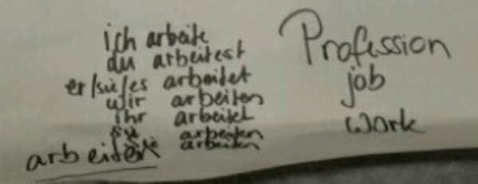

* Example of verb casting.
    * Du arbeitest.
    * Er arbeitet.
    * Es arbeitet.
    * Ich arbeite.
    * Ihr arbeitet.
    * Sie (she) arbeiten.
    * Sie (they) arbeitet.
    * Sie (you (formal)) arbeiten.
    * Wir arbeiten.
* Below is the photo for all notes within this class session.

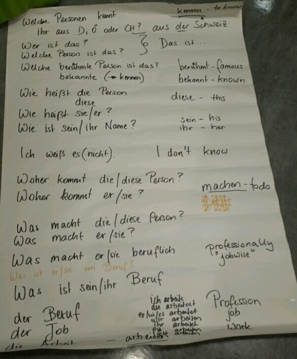