* "Genau" means "correct".
* "Das ist" means "that is".
* "Woher komt du?" means "Where are you come from?".

* "Nachname" means "last name".
* "Meine nachtname ist Kristya." means "My last name is Kristya".
* "Meine" is a possession of "ich" it just like English's "mine". However there are some variants, [http://german.stackexchange.com/questions/22085/the-difference-between-mein-and-meine](http://german.stackexchange.com/questions/22085/the-difference-between-mein-and-meine).
    * "Mein" is a possession for feminine singular noun.
    * "Meine" is a possession for feminine plural noun.
    * "Meine" is a possession for masculine or neutral plural noun.
    * "Meine" is a possession for masculine or neutral singular noun.

* "Nachtname" means "last name".
* "Ungarn" means "Hungary".
* "Vorname" means "first name".

* "Gute nacht" means "good night". Good night is not used to greet someone.
* "Guten abend" means "good evening". "Abend" is a masculine word hence there is a suffix "n" in "gute".
* "Guten mittag" means "good afternoon". "Mittag" is a masculine word hence there is a suffix "n" in "gute".
* "Guten morgen" means "good morning". "Morgen" is a masculine word hence there is a suffix "n" in "gute".
* "Guten tag" means "good day". "nacht" is a feminine word hence there is no suffix in "gute".
* "Halo" is used to greet or to kick start conversation.
* "Herzlich willkommen" means that the person welcoming you wholeheartedly.

* "Gruezi" means "hello".
* "Gruss dich" means "howdy".
* "Grusse dich" means "greetings to you".
* "Grusse euch" means "greetings to you".
* "Servus" means "hello" or "goodbye" or "so long".

* Below are the informal ways to say goodbye.
    * "Ciao" means "bye".
    * "Tschau" means "bye".
    * "Tschuss" means "bye".

* "Auf wiedersehen" means "sampai berjumpa kembali".
    * "Sehen" means "see".
    * "Wieder" means "again".

* "Frau" means "madam" or "Mrs.".
* Herr means "Mr".
* "Damen und heren" means "ladies and gentlemen".
* "Guten tag" means "good day". This can be used to greet the whole morning until sunset.
* "Guten abend" means "good evening".
* "Gute nacht" means "good night". This should not be used to greet instead use this when you are going to sleep or if someone is getting sleep.

* "Dann" means "then".
* "Das ist doch ganz einfach." means "That is very easy.".
    * "Doch" means "but".
    * "Einfach" means "easy".
    * "Ganz" means "all".

* "So, und jetz du." means "So, now your turn." or "So, now you.".

* "Enschuldige mich" is an expression of regret only for friend, because this is very informal.
* "Entschuldigung" means "I am sorry.". This is more professional. So, use this in most of occasion.
* "Tut mir leid" means "I am sorry.". However, this is more into personal expression of regret. For example within you and your mom.
* There is "pardon" as well but it is not so common to use.

* "Kein problem" means "It is no problem".
* "Na gut" means "well, well"
* "Na los" means "go on".
* "Nicht passiert" means "It did not happen". This is actually an answer if someone says sorry to you, although it is not translated directly.

* "Keine zeit" means "no time".
* "Noch ein mal" means "one more time".
* "Noch mal" means "again".
* "Warte" means "to wair" but for a subject.
* "Wartet" means "to wait" but for all of the subject.

* "Bitte" has the same meaning like Dutch's "alstublieft".
* In German, "bitte" can have these meaning.
    * "Please"
    * "You are welcome.".

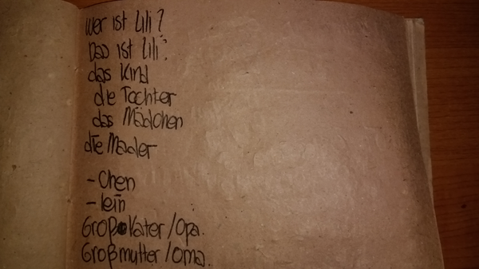

* "Das ist Lili." means "That is Lili.".
* "Das Kind." means "The child".
* "Das Madchen" means "The girl".
* "Der Junge" means "The boy".
* "Die Mader" means "The mother".
* "Die Tochter." means "The teacher".
* "Wer ist Lili?" means "Who is Lili?".

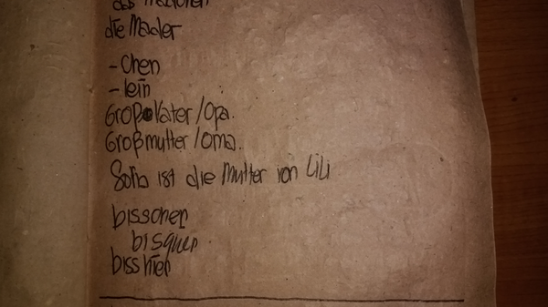

* "Grossmutter" means "grandmother".
* "Grossvater" means "grandfather".
* "Sofia ist die Mutter von Lili." means "Sofia is the grandmother of Lili.".

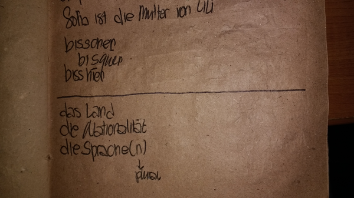

* "das Land" means "the country".
* "die Nationalitat" means "the nationality".
* "die Sprachen" means "the languages".
* "die Spreche" means "the language".

* "Ich kommen aus ...." means "I come from ....".
* The answer could be one from all countries on Earth.
    * "Bolivien".
    * "Brasilien".
    * "Deustchland".
    * "Indonesien".
    * "Osterich".
    * "Vietnam".
* There is this "en" suffix for most countries (on this case Vietnam does not use the "en" suffix).

* "Ich bin ...." means "I am ....".
* The follow up of the sentence could be anything. However in this case I would like to use this sentence to determine nationality.
* In German the nationality is differ from a man and a woman. These are some examples.
    * "Brasilianer".
    * "Brasilianerin".
    * "Deustcher".
    * "Deustcherin".
    * "Indonesier".
    * "Indonesierin".
    * "Ostereicher".
    * "Ostereicherin".
    * "Vietnamese".
    * "Vietnamesin".
* The "er" suffix is used for man while the "in" suffix is used for woman.

* "Ich spreche ...." means "I speak ....".
* This sentence is used to tell people what language(s) do you speak.
* In German usually there is "sch" suffix in the name of the country. These are for examples.
    * "Chinesisch".
    * "Frazosisch".
    * "Indonesisch".
    * "Portuguesisch".
    * "Spanisch".
    * "Tschechisch" this is the Czech national language.
    * "Vietnamesisch".

* "Was ist die Hauptstadt von ...?" means "What is the capital city of ...?".
* The sentence is about to ask what is the capital city of certain country. For example "Was ist die Haupstadt von Indonesien?" means "What is the capital city of Indonesia?".

* "Freut mich." means "Nice to meet you.".
* "Genau" means "correct".
* "Kennen zu lernen." means "(Nice) to know you.".
* "Kennen" means "to know".
* "Korrekt" means "correct".
* "Lernen" means "learn".
* "Neu" means "new".
* "Passt" means "fit". The "fit" here is to determine an answer toward something. So it is not used to determine if a person is a fit (physically) or not.
* "Perfekt" means "perfect".
* "Sehr gut" means "very good".
* "Sehr" means "very".
* "Stimmt" means "true".

* "Das freut mich." means "That pleases me.".
* "Freut" means "please".
* Singular subjects.
    * "Ich" means "I".
    * "Du" means "you".
    * "Er" means "he".
    * "Sie" means "she".
    * "Es" means "it".

* Plural subjects.
    * "Wir" means "we".
    * "Ihr" means "you" to refer a person pointing to people.
    * "Sie" means "they".
* Other subject.
    * "Sie" means "you" but this is used for formal language.
        * This "Sie" always written in capital letter.
        * This "Sie" can be used for singular and plural.

* Example of verb "kommen".
    * "Komme" is used for "ich".
    * "Kommen" is the infinitive verb, the basic verb.
    * "Kommen" is used for "sie" (they).
    * "Kommen" is used for "Sie" (you, formal).
    * "Kommen" is used for "wir".
    * "Kommen" means "to come".
    * "Kommt" is used for "er"/"sie"/"es".
    * "Kommt" is used for "ihr".
    * "Komst" is used for "du".

* Example of verb "heissen".
    * "Heisse" is used for "ich".
    * "Heissen" is the infinitive verb, the basic verb.
    * "Heissen" is used for "sie" (they).
    * "Heissen" is used for "Sie" (you, formal).
    * "Heissen" is used for "wir".
    * "Heissen" means "to come".
    * "Heisst" is used for "du".
    * "Heisst" is used for "er"/"sie"/"es".
    * "Heisst" is used for "ihr".
* The "ss"s are the weird B like letter in German.

* Example of verb "horen".
    * "Hore" is used for "ich".
    * "Horen" is the infinitive verb, the basic verb.
    * "Horen" is used for "sie" (they).
    * "Horen" is used for "Sie" (you, formal).
    * "Horen" is used for "wir".
    * "Horen" means "to hear".
    * "Horst" is used for "du".
    * "Hort" is used for "er"/"sie"/"es".
    * "Hort" is used for "ihr".

* Example of article.
    * "Bin" is used for "ich".
    * "Bist" is used for "du".
    * "Ist" is used for "er"/"sie"/"es".
    * "Seid" is used for "ihr".
    * "Sind" is used for "sie" (they).
    * "Sind" is used for "Sie" (you, formal).
    * "Sind" is used for "wir".
* "Bist du eine Frau?" means "Are you a woman?".

* These are words for asking wh based questions.
    * "Wann" means "when".
    * "Was" means "what".
    * "Wer" means "who".
    * "Wie" means "how".
    * "Wo" means "where".
    * "Woher" means "where ... come from.".
    * "Wohin" means "where ... going to.".

* "Warum" means "why".
* "Welcher" means "which object".
* "Wie viel" means "how many".

* "Wann komst du?" means "When are you coming?".
* "Welche sprachen sprichts du?" means "Which languages do you speak?".
* "Wie viel geld hast du?" means "How much money do you have?".
* "Wie viel kostet die Banane?" means "How much is the banana?".
* "Wo ist das Buch?" means "Where is the book?".
* "Woher komst du?" means "Where are you going?".
* Based on this link, [http://www.verbformen.net/conjugation/sprechen.htm](http://www.verbformen.net/conjugation/sprechen.htm), "sprichts" means to be used in subject "du" in simple present.

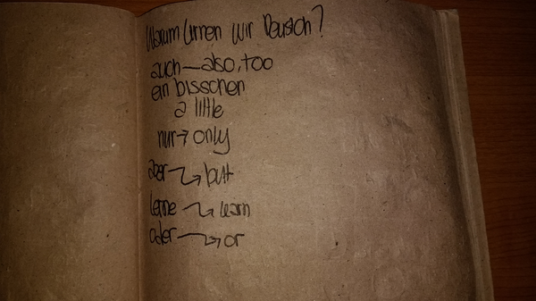

* "Aber" means "but".
* "Auch" means "also".
* "Ein bisschen" means "a little".
* "Lernen" means "to learn".
* "Nur" means "only".
* "Oder" means "or".
* "Warum lernen wir Deustch?" means "Why are we learning German?".

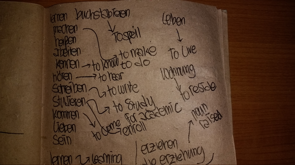

* "Arbeiten" means "to work".
* "Buchstabieren" means "to spell".
* "Heissen" means "to call".
* "Horen" means "to hear".
* "Kennen" means "to know".
* "Kommen" means "to come".
* "Lernen" means "to learn".
* "Lieben" means "to live".
* "Machen" means "to do".
* "Schreiben" means "to write".
* "Sein" means "to be".
* "Studieren" means "to study".
* "Wohnen" means "to reside".

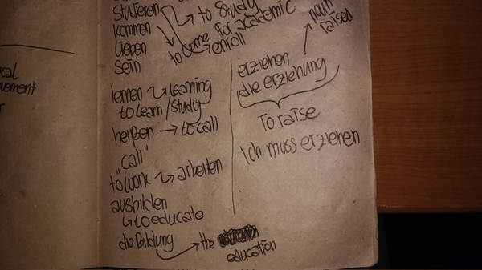

* "Ausbilden" means "to educate".
* "Die Bildung" means "the education".
* "Die Erzienung" means someone who raise something. For example your parents has been raising you since you were born.
* "Erziehen" means "to raise".

* "Ihr" means "her".
* "Noch" means "still".
* "Schon" means "fine".
* "Sein" can be also means "his".
* "Sein" means "to be".
* There are 6 forms of verb that we in this German course will learn.

* "Arbeitest du?" means "Do you work?".
* "Beruflicht" means "a professional worker". For example doctor, ....
* The example question would be, "Was machst du?" which means "What do you do?".

* "Beruf" means "job".
* "Der Beruf" means "the job". Which also means that the word "beruf" is a masculine word.
* "Der Geschaftmann oder die Geschaftfrau" means "the businessman or the businesswoman".
* "Der Unternehmer/die unternehmerin" means "the entrepreneur".
* "Es ist heisst." means "It is hot.".
* "Heiss" means "hot".
* "Kalt" means "could".

* "Das Model" means "the model".
* "Der Autor/die Autorin" means "the author".
* "Der Designer/die Designerin" means "the designer".
* "Der Musiker/die Musikerin" means "the musician".
* "Der Schauspieler oder die Schauspielerin" means "the actor or the actress".
* "Der Schrifstiller/die Schrifstillerin" means "the writer".
* "Der Sportler/die Sportlerin" means "the athlete".
* "Zwei sportlerinen" means "two athletes".

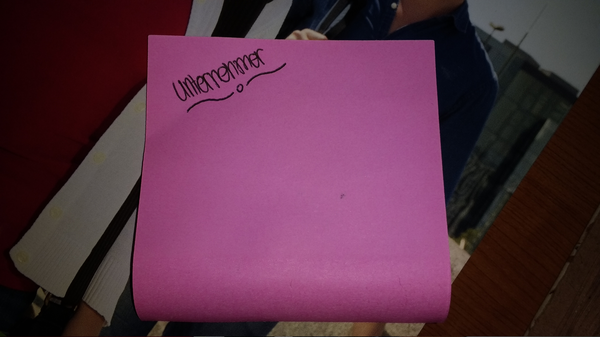

* "Ich möchte Unternehmer sein." means "I want to be entrepreneur.".

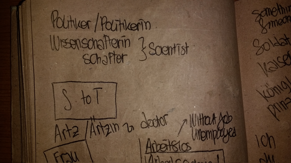

* "Der Politiker/die Politikerin" means "the politician".
* "Der Wissenschaftler/die Wissenschaftlerin" means "the scientist".
* "Der Artz/die Artzin" means "the doctor".

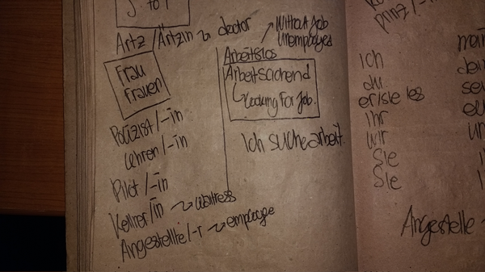

* "Arbeitsloss" means "jobless".
* "Arbeitssuchend" means "looking for job".
* "Der Angestellte/die Angestellter" means "the employee".
"Der Kellner oder die Kellnerin" means "the waiter or the * waitress".
* "Der Lehren/die Lehrenin" means "the teacher".
* "Der Pilot/die Pilotin" means "the pilot".
* "Der Polizist/die Polizistin" means "the police".
* "Ich suche arbeit." means "I am looking for job.".

* "Der Kaiser oder die Kaiserin" means "the emperor or the empress".
* "Der Konig oder die Konigin" means "the king or the queen".
* "Der Prinz oder die Prinzessin" means "the prince or the princess".
* "Der Soldat/die Soldatin" means "the soldier".

* Possessive subjects.
    * "Du" goes with "dein".
    * "Er" goes with "sein".
    * "Es" goes with "sein".
    * "Ich" goes with "mein".
    * "Ihr" goes with "euer".
    * "Sie" goes with "ihr".
    * "Sie" goes with "ihr".
    * "Sie" goes with "ihr".
    * "Wir" goes with "unsere".

* "Angestellte" means "employees".

* "Ich bin krank." means "I am ill.".
* "Nicht gut, weil ich kran bin." means "Not good, because I am sick.".
* "Weil" means "because".
* In compund sentence in Dutch or German the verb goes into the back of the sentence.

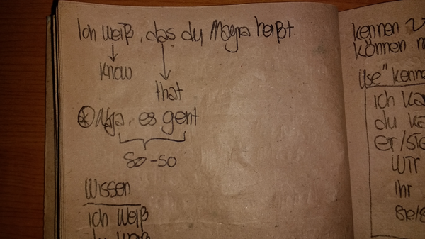

* "Dass" means "that".
* "Ich weiss, dass du Mayra heisst." means "I know you are Mayra".
* "Na ja, es geht" this sentence express a normal condition. If you are feeling neither good or bad.

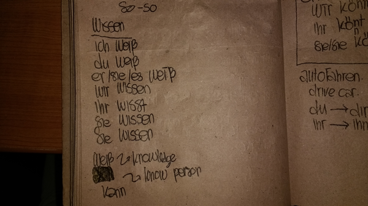

* Example of verb "weissen".
    * "Weisse" is used for "ich".
    * "Weissen" is the infinitive verb, the basic verb.
    * "Weissen" is used for "sie" (they).
    * "Weissen" is used for "Sie" (you, formal).
    * "Weissen" is used for "wir".
    * "Weissen" means "to know".
    * "Weisst" is used for "du".
    * "Weisst" is used for "er"/"sie"/"es".
    * "Wist" is used for "ihr".
* The word "weissen" means "to know". Have identical meaning with "kennen".
* However, "kennen" is used if the object is a person.
* The word "weissen" also has a specific "ihr" verb. Which is "wist" instead of the presumably "weissen".

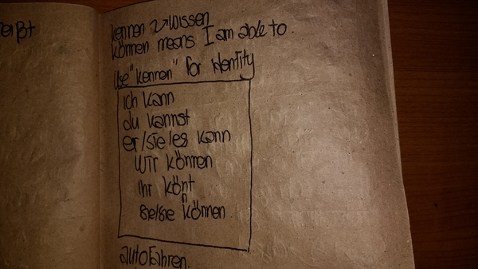

* There is also this word that is similar to "kennen" which is "konen" with umlaud on "o".
* "Konen" means "to be able to" or simply "can".
* Example of verb "konen".
    * "Kann" is used for "er"/"sie"/"es".
    * "Kann" is used for "ich".
    * "Kannst" is used for "du".
    * "Konen" is the infinitive verb, the basic verb.
    * "Konen" is used for "sie" (they).
    * "Konen" is used for "Sie" (you, formal).
    * "Konen" is used for "wir".
    * "Konen" means "to know".
    * "Kont" is used for "ihr".

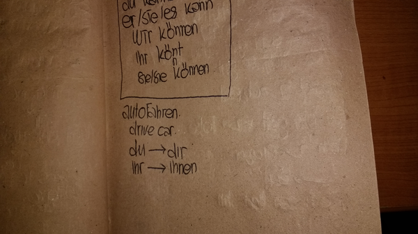

* "Autofahren" means "to drive a car".
* Subject as object.
    * "Du" becomes "dir".
    * "Ihr" becomes "ihnen".

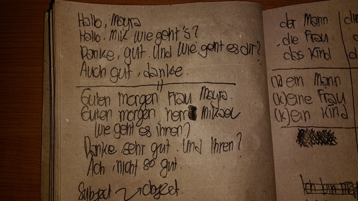

* Example conversation 1.
    * "Halo, Mayra." means "Halo, Mayra.".
    * "Halo, Mik wie gehts?" means "Halo, how are you Mik?".
    * "Danke, gut. Und wie geht es dir?" means "Thanks, I am good. And how are you?".
    * "Auch gut, danke." means "Also good, thanks.".
    * "Auch" means "also".
* Example conversation 2.
    * "Guten morgen Frau Mayra." means "Good morning Mrs./Ms. Mayra.".
    * "Guten morgen Herr Mik. Wie geht es ihnen?" means "Good morning Mr. Mik. How are you?".
    * "Danke, sehr gut. Und ihnen?" means "Thanks, I am very fine. How about you?".
    * "Acht, nicht so gut." means "Ahhh, not so good.".

* "Doch" means "but".
* This means that "but" can go into "aber" or "doch" in German.
* "Alle frauen liebt ihn." means "All women loves him.".

* Translation and the usage of "the" in German.
    * Singular.
        * "Das Kind" (neutral word) means "the child".
        * "Der Mann" (masculine word) means "the man".
        * "Die Frau" (feminine word) means "the woman".
    * Plural.
        * "Die Frauen" (neutral word) means "the women".
        * "Die Kinder" (masculine word) means "the children".
        * "Die Mannen" (feminine word) means "the men".
* The translation of article "a" in German.
    * Singular.
        * "Ein kind" (neutral word) means "a child".
        * "Ein mann" (masculine word) means "a man".
        * "Eine frau" (feminine word) means "a woman".
    * Plural.
        * "Frauen" (neutral word) means "women".
        * "Kinder" (masculine word) means "children".
        * "Mannen" (feminine word) means "men".

* The translation of "I do not have any ...." in German.
    * Singular.
        * "Kein kind" (neutral word) means "no child".
        * "Kein mann" (masculine word) means "no man".
        * "Keine frau" (feminine word) means "no woman".
* "Das ist keine Person." means "This is not a person.".
* "Ich bin keine frau." means "I am not a woman".
* "Ich habe kein kind." means "I have no child.".
* "Ich lerne nicht." means "I do not learn.".

* "Die Aufgabe" means "the task".
* "Die Hausaufgabe" means "the homework".
* "Die Hausubung" means "the homework".
* "Die Ubung" means "the exercise". This is not meant for physical exercise I assume.

* Example of verb "haben".
    * "Habe" is used for "ich".
    * "Haben" is the infinitive verb, the basic verb.
    * "Haben" is used for "sie" (they).
    * "Haben" is used for "Sie" (you, formal).
    * "Haben" is used for "wir".
    * "Haben" means "to have".
    * "Habt" is used for "ihr".
    * "Hast" is used for "du".
    * "Hat" is used for "er"/"sie"/"es".