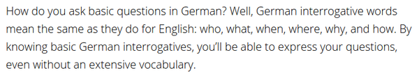
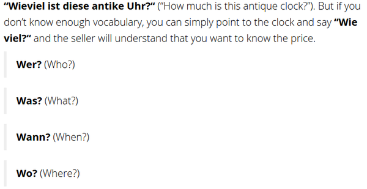
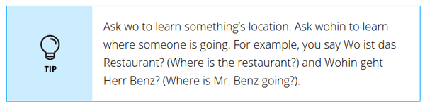
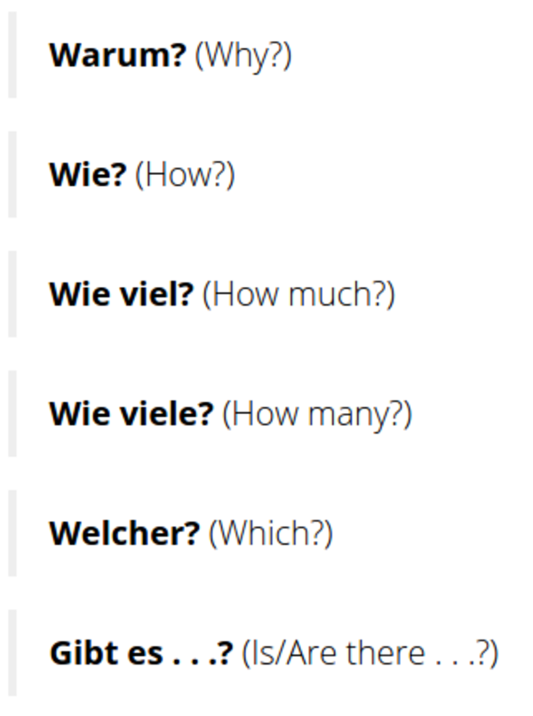
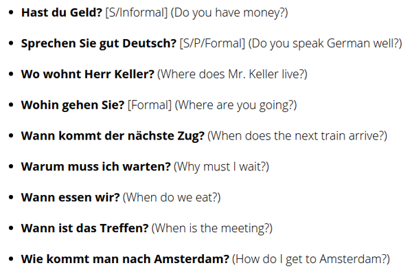
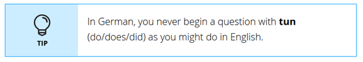
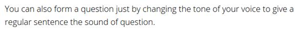
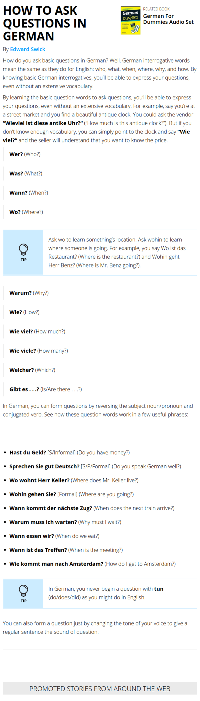

* German interrogative words are the same with English'.

* Examples.
    * "Wieviel ist diese antike Uhr?" means "How much is this antique clock?".
    * However, "Wieviel?" also fine.
* Vocabularies.
    * "Wann" means "when".
    * "Was" means "what".
    * "Wer" means "who".
    * "Wo" means "where".

* "Wo" is used to asking a location.
* Whereas "wohin" is used to asking where someone is going.
* For examples.
    * "Wo ist das restaurant?" means "Where is the restaurant?".
    * "Wohin geht Herr Benz?" means "Where is Mr. Benz going?".

* Examples.
    * "Gibt es" means "is/are there".
    * "Warum" means "why".
    * "Welcher" means "which".
    * "Wie viel" means "how much".
    * "Wie viele" means "how many".
    * "Wie" means "how".

* Examples.
    * "Hast du geld?" is an informal sentence that means "Do you have money?".
    * "Sprechen Sie gut Deutsch?" is a formal sentence that means "Do you speak German well?".
    * "Wo wohnt Herr Keller?" means " Where does Mr. Keller live?".
    * "Wohin gehen Sie?" is a formal sentence means "Where are you going?".
    * "Wann kommt der nachste Zug?" means "When does the next train arrive?".
    * "Warum muss ich warten?" means "Why I must wait?".
    * "Wann essen wir?" means "When do we eat?".
    * "Wann ist das Treffen?" means "When is the meeting?".
    * "Wie kommt man nach Amsterdam?" means "How do I get to Amsterdam?".

* There is no question that begin with "tun".
* "Tun" means "do/does/did".

* The most pity way is to ask question by changing your tone while speaking. However, this is not a good practice for studying.
* Here is a link to the guide, [http://www.dummies.com/languages/german/how-to-ask-questions-in-german/](http://www.dummies.com/languages/german/how-to-ask-questions-in-german/).
* Here is the full screenshot of the guide.

