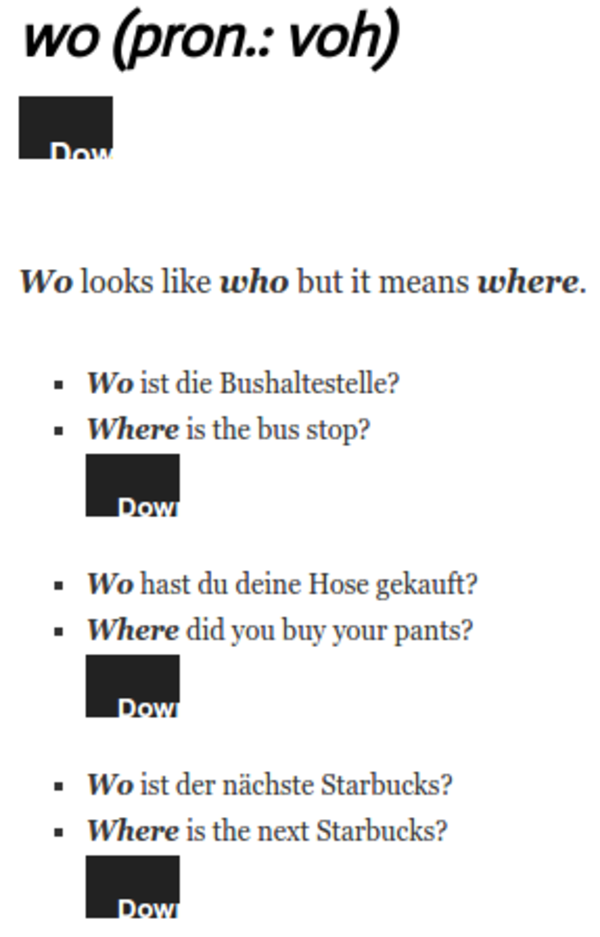
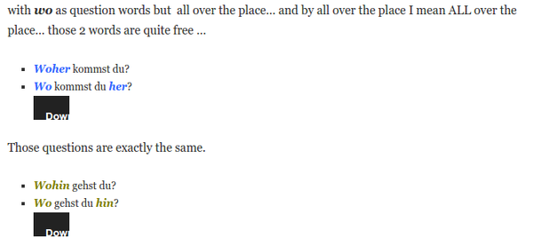
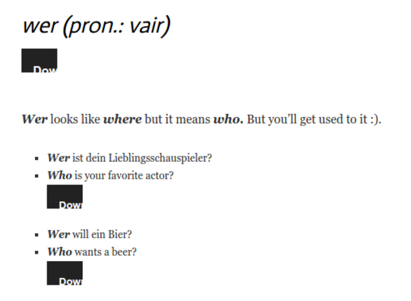

* There are two kind of questions.
    * Yes or no questions.
    * Questions that has a question word (5W + 1H).

* In English here is a simple w - question structure likes.
    * question_word + verb + subject + maybe_verb + the_rest_of_the_sentence?
* However not all verbs are all equal in English. There are modal verbs like can, must, shall. And there is also auxiliary verb like to have, to be, will.

?

* Example in German.
    * Heute lese ich ein Buch.
    * Wann lese ich ein Buch?
    * Today I read a book.
    * When I read a book

* "Was kannst du machen?" means "What can you do?".
* "Was hast du gemacht?" means "What have you done?".

* These are the safest patterns.
    * subject + verb + adjective_or_adverb.
    * question_word + verb + subject + adjective_or_adverb?
* This is a wrong pattern.
    * question_word + do + subject + verb + adjective_or_adverb?

* "Wann" means "when".
* Examples.
    * "Wann kommst du nach Hause?" means "When are you going to come home?".
    * "Wann fahrt der Bus?" mean "What time does the bus go?" or "When the bus go?".

* "What time?" is never a proper way to ask for time in German language.
* So for asking time always use "wann".

* "Bis" means "until when".
* "Seit" means "since when".
* Examples usage of "bis" and "seit".
    * "Bis wann musst du arbeiten?" means "Until when you have to work?".
    * "Seit wann wohnst du hier?" means "Since when have you been living here?".

* There is also a word called "wenn" which is a combination of "when" and "if".
* However this is not a question word. So, never use this for asking question.

* "Wo" means "where".
* Examples.
    * "Wo ist die Bushaltestelle?" means "Where is the bus stop?".
    * "Wo hast du deine Hose gekauft?" means "Where did you buy your pants?".
    * "Wo ist der nachtste Starbucks?" means "Where is the next Starbucks?".

* There are "woher and "wohin" as well.
* In German language places is separated into these.
    * Place to go there.
    * Place to be there.
    * Place to come from there.

* For example "Where is your house?" means a place to be there.
* Whereas "Where are you going?" means a place to go there.

* "Wohin" always indicates that we are talking about destination.
* Whereas "woher" always indicates that we are talking about the origin.
* "Wo" indicates a place, static place.

* Examples.
    * "Wohin gehst du?" means "Where are you going (to)?".
    * "Wohin fahrt dieser Bus?" means "Where is this bus going?".

* In contrast asking "Wo fahrt dieser bus?" means "Where is this bus located?" the answer could be "The bus is located at the bus station.".

* Examples with "woher".
    * "Woher komst du?" means "Where do you come from?".
    * "Woher kennst du ihn?" means "Where do you know him from?".

* Examples of the flexibility of using "wo".
    * "Woher komst du?" can be asked with "Wo komst du her?".
    * "Wohin gehst du?" can be asked with "Wo gehst du hin?".

* To sum up.
    * "Wo" is used to ask for at what location.
    * "Wohin" is used to ask to what location.
    * "Woher" is used to ask from what location.

* "Was" means "what".
* Examples.
    * "Was willst du essen?" means "What do you want to eat?".
    * "Was ist deine Lieblingfarbe?" means "What is your favorite color?".
* Random sentence, "Die Wolfe in Twilight sind der beste Special Effekt aller Zeiten." means "The wolves in Twilight is the best special effect ever."

* Alright! There are these things about "was".
* For some reason German is really like to use "wo".
    * Instead of "von was" they said "wovon".
    * Instead of "mit was" they said "womit".
    * There are other "wo" as well for "von", "mit", "nach", "um".
* In this guide it says that all of these variants are all the same.
* Example of sentence without the translations.
    * Wovon hast du letzte Nacht getraumt?
    * Worauf freust du dich?
    * Woran denkst du?

* In English "what"can have a lot of preposition. These are some examples.
    * What did you dream of last night?
    * What are you looking forward to?
    * What are you thinking about?

* In German the preposition is in the beginning of the sentence. These below are some example of the English sentences with the German sentence structure.
    * Of what did you dream last night?
    * To what are you looking forward?
* Hence, it is translated like these in German.
    * Wovon hast du letzte Nacht getraumt?
    * Worauf freust du dich?
    * Woran denkst fu?

* "Wer" means "who".
* Examples.
    * "Wer ist dein Lieblingsschauspieler?" means "Who is your favorite actor?".
    * "Wer will ein Bier?" means "Who wants a beer?".

* "Worauf freust du dich?" means "What are you looking forward to?".

* "Whom" translates into "wem" or "wen".
* "Whose" translates into "wessen".
* If you want to know who did/does/is something then use "wer".
* When you are using "wer" always put the preposition in the front of it.
    * In English the structure is like this whom + from_or_of_or_to_or_with?
    * In German the structure is like this zu_oder_von_oder_fur_oder_mit + wem_oder_wen?

* "Warum" means "why".
* Examples.
    * "Warum lernst du Deutsch?" means "Why are you learning German?".
    * "Warum hast du mich nicht angerufen?" means "Why did not you call me?".

* There are three synonym of "warum", which are these.
    * "Weshalb".
    * "Weswegen".
    * "Wieso".
* There are difference at all from all those words. So I might as well stick with "warum".

* "Wie" means "how".
* Examples.
    * "Wie gehts dir?" means "How are you?".
    * "Wie komme ich von hier zur Superstrasse?" means "How can I get to super street from here?".
    * "Wie grosse bist du?" means "How tall are you?".

* Examples.
    * "Wie lange dauert es, Deutsch zu lernen?" means "How long does it takes to learn German?".
    * "Wie viel kostet das?" means "How much is that?".

* "Wie" is also a word to make a comparison.
* For examples.
    * "Ich bin genauso gross wie du." means "I am exactly as tall as you.".
    * "Die Suppe riecht ein bisschen wie Bier." means "The soup smells a little like beer.".

* There are also "wieso" which means "how so".

* "Welche" means "which".
* This word has a lot of forms like these.
    * "Welche".
    * "Welchem".
    * "Welchen".
    * "Welcher".
    * "Welches".
* The form is depending on how the subject is singular or not.
* And I guess also depending on whether the subject is countable or not.

* But for all "welche" is just fine and correct.

* Examples.
    * "Welche Sprachen kannst du sprechen?" means "Which languages can you speak?".
    * "Welches Bier wollen wir zuerst trinken?" means "Which beer should we drink first?".

* "Welche"/"welchem"/"welchen"/"welches" can be used as well as pronoun. Here are some examples.
    * "I saw a movie last night", "Which one?".
    * "Ich hab gestern abend einen Film gesehen.", "Welchen?".

* There is nothing called "welche eine"/"which one" in German.

* There is a possibility for "welche" to be used as it is "das", "der", or "die".
* But for safety it is recommended to only use "welche" for asking question.
* Full article can be found in here, [https://yourdailygerman.com/2013/06/04/german-question-words/](https://yourdailygerman.com/2013/06/04/german-question-words/).
* Full screenshot.

