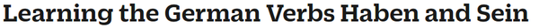
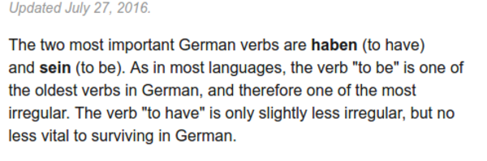
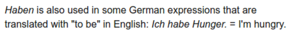
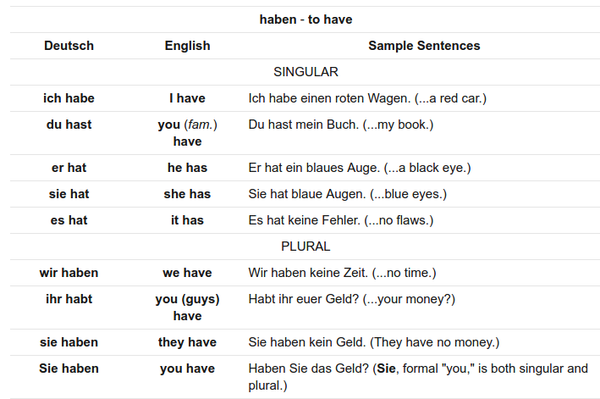
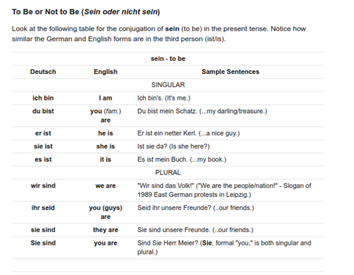

* I read this article that explains on how the verb "haben" and "sein" works, [http://german.about.com/od/grammar/fl/Learning-the-German-Verbs-Haben-and-Sein.htm](http://german.about.com/od/grammar/fl/Learning-the-German-Verbs-Haben-and-Sein.htm).

* "Haben" is a regular verb.
* "Haben" means "to have".
* "Sein" is an irregular verb.
* "Sein" means "to be".
* Both "haben" and "sein" is the most used German words.

* "Haben" is used in some German expression for expression that translates into "to be" (alright, I am confused here).
* For example, "Ich habe Hunger." means "I am hungry".
* In that example "haben" is used instead of "sein". If "sein" is used the sentence would be "Ich bin hunger.".
* However, Google Translate translates different thing. English's "I am hungry." translates into "Ich bin hungrig".
* I am not sure where the word "hungrig" comes from.

* Table of possible form of "haben".

* Table of possible form of "sein".