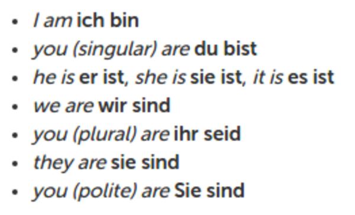

* Found this discussion in Duolingo, [https://www.duolingo.com/comment/7135103](https://www.duolingo.com/comment/7135103).
* Basically any possible "to be" in German.
* "To be" translates into "sein". But "sein" is infinitive form. "Sein" has several from as explained in table below according to which is the subject.

