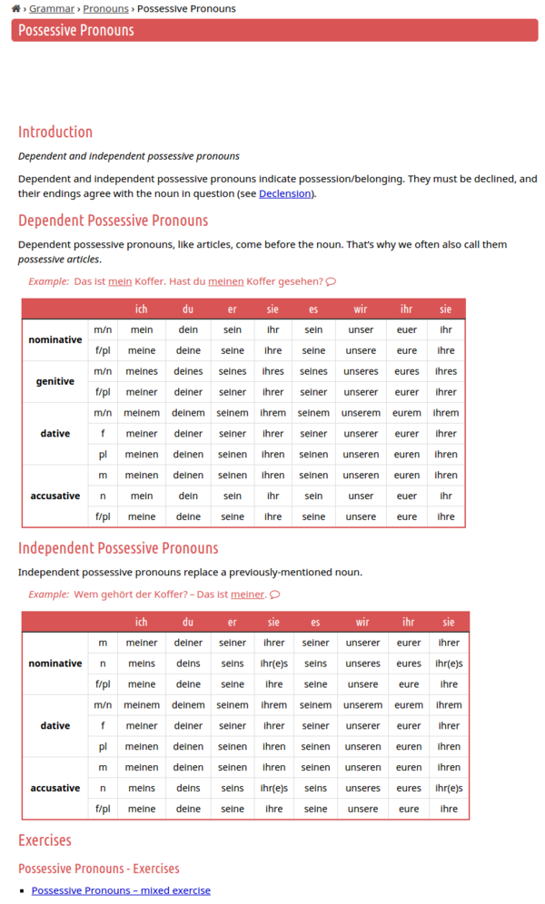

* List and table of possessive pronoun in German, [https://deutsch.lingolia.com/en/grammar/pronouns/possessive-pronouns](https://deutsch.lingolia.com/en/grammar/pronouns/possessive-pronouns).
* I do not know what they mean "accusative" and "dativ" yet.

