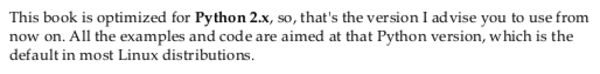

* This book will teach you on how to build fully featured web applications with database integration.
* Also with making REST service.


* The name of application variable is usually `app`.
* The argument `__name__` is used to tell the application where to look for resource (for example, static contents or templates).


* Flask can handle basic routing as well.


* There is this `urlparse` library to verify whether a string is a valid URL path or not.
* Above image is a simple example of the implementation of the `urlparse`.


* This book uses Python 2.x.



* Python 2.x is usually default in Linux distribution.


* Some packages that need to be installed, `sudo apt-get install python-dev python-pip`.
* The author of this books uses Linux Mint, hence the packages comes from Linux Mint repository.
* `pip` is the package manager for Python. Similar to NPM of NodeJS.


* Install virtual environment so that the dependencies of the project is exclusive to the virtual environment and are not system wide.

```markdown
sudo pip install virtualenvwrapper
echo "source /usr/local/bin/virtualenvwrapper.sh" >> ~/.bashrc
```


* Example command on how to make Python virtual environment and then install Flask.

```markdown
mkvirtualenv hello
pip install flask
```

* However this is my preferred ways to install and use Python virtual environment.
    * Install Python virtual environment using `pip` with `sudo pip install virtualenv`.
    * Or, in Ubuntu you can install it from the Ubuntu repository, `sudo apt-get install python-virtualenv`.
* The to make the Python virtual environment.

```markdown
mkdir project_name
cd project_name
virtualenv venv
. venv/bin/activate
pip install flask
```

* `. venv/bin/activate` is used to go inside the virtual environment.
* To go out from the virtual environment use this  command `deactivate`.


* This book method on how to use Python virtual environment.


* Use `# coding:utf-8` in the beginning of the Python entry file (usually `main.py`) to tell Python to use `utf-8` encoding.
* This helps you to prevent nasty bugs exists within the application.