* This is the paper that I would like to read.

[./20161103-2041-gmt+2-brp-enhancing-organizational-communication-1-1.pdf](./20161103-2041-gmt+2-brp-enhancing-organizational-communication-1-1.pdf)

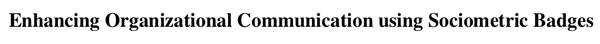

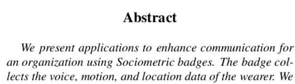

* The sociometric badge is initially intended to be used within organizational environment.

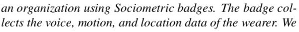

* This badge collects these things below from its wearer.
    * Location.
    * Motion.
    * Voice.

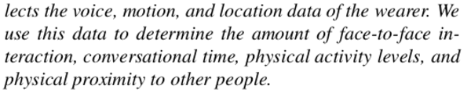

* From the data those taken (location, motion, and voice) this badge able to determine these things.
    * Face to face communication.
    * Conversational time.
    * Physical activity level.
    * Physical proximity of the badge wearer to other badge wearer.

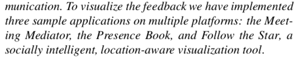

* There are these applications that had been made to show what the sociometric badge can do.
    * Follow The Star, socially intelligent, location aware, visualization tool.
    * Meeting mediator.
    * Presence book.

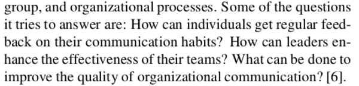

* These are some questions those the sociometric badge wants to answer.
    * How can individuals get regular feedback on their communication habit?
    * How can leader enhance the effectiveness of their team?
    * What can be done to improve the quality of organizational communication?

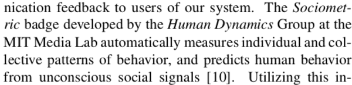

* The sociometric badge was developed by Human Dynamics Group at Massachusetts Institute Of Technology.
* The sociometric badge automatically measures individual and collective patterns of behavior and predicts human behavior from unconscious social signals.

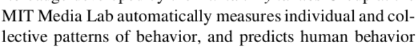

* So here are things those sociometric badge able to do.
    * Analyze collective pattern on group of people.
    * Predicts human behavior.
* "Predicts human behavior" seems to sci - fi to be true. Is this what Harry Seldon thought of?

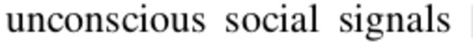

* This is the most interesting part for me.
* The badge need to be able to detect patterns of unconscious social signals.

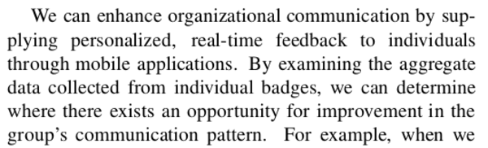

* Real time feedback through mobile application.
* Aggregate data is collected from the wearers. So this device is already in conform with MIT's Sandy Pentland "New Deals On Data" ways of dealing with privacy invasive application/gadget.
* Opportunity of improvement can be determined from group's social pattern.
* The 3 points of "New Deals On Data".
    * Data collections is an option and informed.
    * Individuals control their own data.
    * Data must be aggregated (the meaning of aggregated will be explained later).

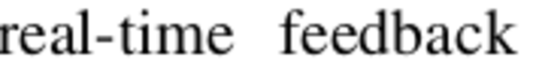

* Real time feedback. So they have already thought about having data streamed into another media while the social activity happens.

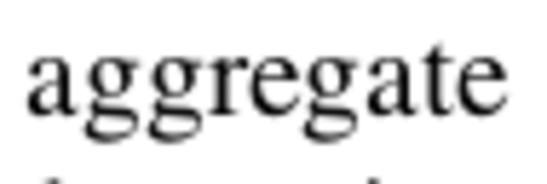

* Aggregate, I read in the previous article that in case you want to do social data mining, ethically you need to aggregate the data ("New Deal On Data"). Check this article, [https://www.technologyreview.com/s/424104/what-big-data-needs-a-code-of-ethical-practices/](https://www.technologyreview.com/s/424104/what-big-data-needs-a-code-of-ethical-practices/).
* Aggregate means that all data are bundle into one. More over, there would be no way to display the data per profile.
* What I meant here is that in case you take social data all data need to be displayed aggregately (perhaps by taking average, ...).

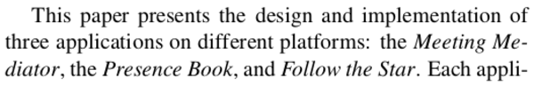

* Example applications.
    * Follow The Star.
    * Meeting Mediator.
    * The Presence Book.
* At this age term "application" is still for both hardware and software. While, nowadays "application" is more for software application. While, hardware application is commonly called by gadget.

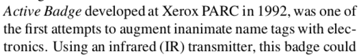

* There was this Active Badge by Xerox PARC in 1992. Thing that kick started the usage of electronics/RFID badge nowadays.

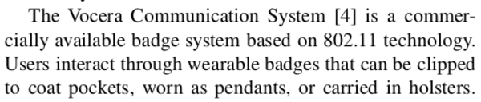

* There was also this Vocera Communication System.
* This is like the original sociometric badge but with more communication features.

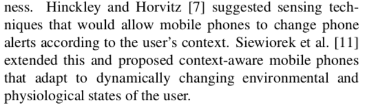

* There was this idea about having context aware mobile phone.
* Mobile phone that is aware of the user social situation (available, busy, psychological states of the user, ...).
* This mobile phone is expected to dynamically react to the environment and stream - in/out data in real time .

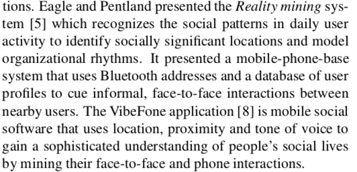

* There was this Reality Mining System.
* The website is pretty cool and informative actually, [http://realitycommons.media.mit.edu/index.html](http://realitycommons.media.mit.edu/index.html).
* And also there was a VibeFones.
* VibeFones is the socially aware mobile phone. Perhaps this is what they meant by the context aware mobile phone they mentioned several paragraph above.
* This link refer to research paper about VibeFones, [http://hd.media.mit.edu/tech-reports/TR-605.pdf](http://hd.media.mit.edu/tech-reports/TR-605.pdf).
* There is also this Android application about VibeFones, [https://github.com/weirdwater/VibePhone](https://github.com/weirdwater/VibePhone). However it is lack of information.

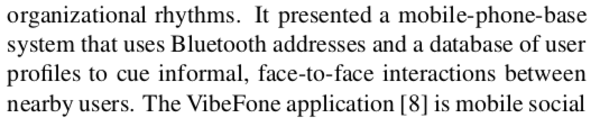

* The Reality Mining System is presented by a mobile phone base system that uses Bluetooth addresses and database of user profile to determine face to face interaction within nearby user.
* I am wondering how can you determine face to face communication by only using Bluetooth connection?

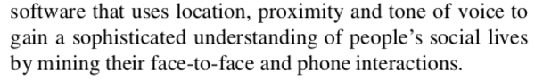

* VibeFones uses its user location, proximity, and tone of voice to gain sophisticated understanding of people's social lives.
* This achieved by mining their face to face and phone interactions.

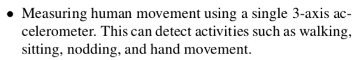

* Several points below mention about sensory modules and how this badge use those sensory modules to get sociometric data.
* There is this 3 axis xyz accelerometer to detect activity such as hand movement, nodding, sitting, and walking.

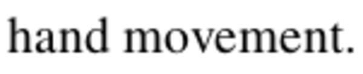

* I am not sure how can a sole xyz accelerometer detects hand movement.

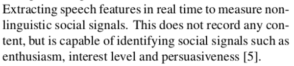

* There is speech processing modules, but it does not record any content.

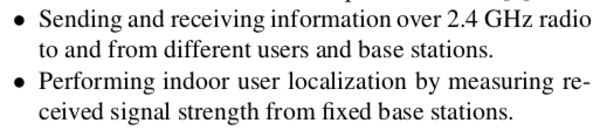

* Sending information over radio frequency.
* Location is determined by these radio frequency components. Perhaps, using some kind like triangular calculations.

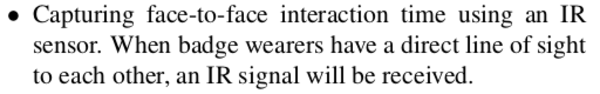

* Capturing face to face conversation with IR (infrared).
* When each badge has a line sight of each other then it is confirmed that face to face to conversation happens.

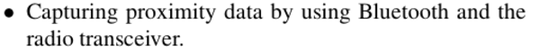

* Bluetooth is used to interfacing the sociometric badge with user's cellphone.

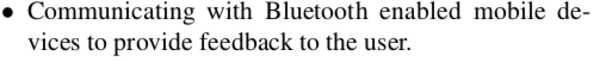

* Detect turn taking pattern of the conversation.
* Often people does not realize if he/she is dominating the conversation, while there are other people that need to be encouraged to participate more.

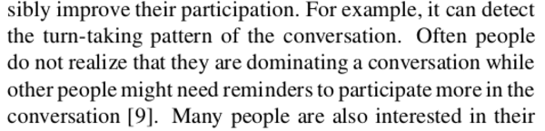

* The sociometric badge also know if one's speech always trigger boredom and negative response.

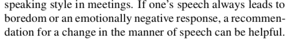

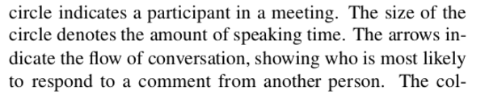

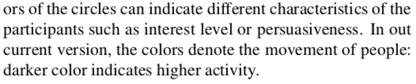

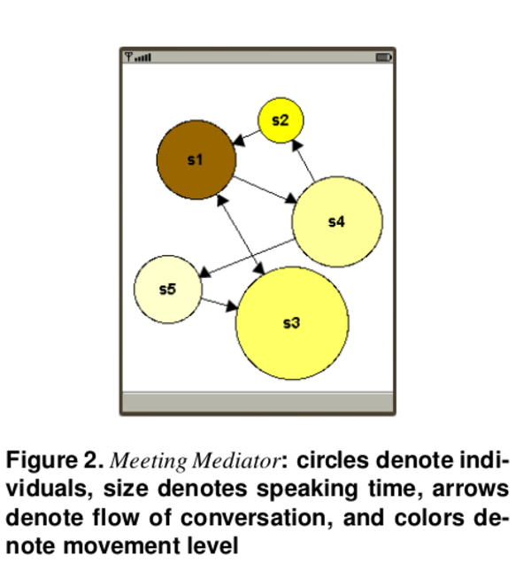

* Each circle indicates participant in a meeting.
* The size of the circle indicated the speaking duration.
* Arrow indicates the flow of conversation, shows who is most likely to answer an argument from another person.
* Color of the circle can indicates characteristic of the participant such as interest level or persuasiveness.
* However, in this case color denotes movement of the person. The darker the color is the higher the activity that the person does (perhaps the activity meant is a body activity, like hand or feet movement).

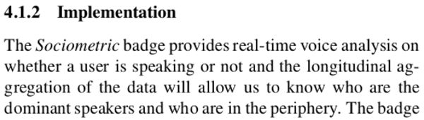

* Sociometric badge provides with real time analysis.
* The aggregate of the data it produces shows which speaker is the most  dominant speaker.

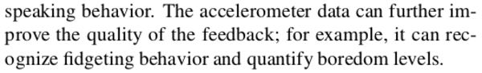

* Accelerometer can record fidgeting behavior, hence quantifying boredom level of certain conversation.

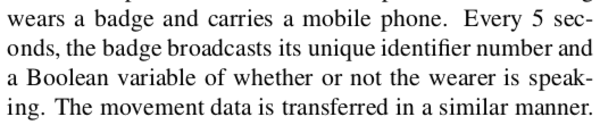

* This sociometric badge sends data to the mobile phone for every 5 seconds.
* I am not sure why it is need to be every 5 seconds. Perhaps because at that time there are no smart phone yet.

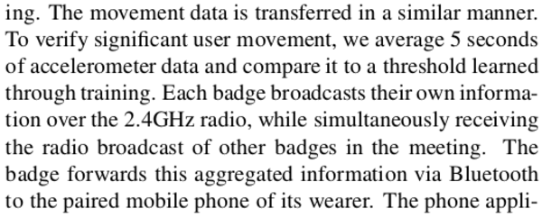

* Here, it is known that the sociometric badge construct a mesh network (I think) to share user movement data to each other badge.
* Then it will take average of all badge wearer to raise or lower the movement threshold.
* The data then will be aggregated via Bluetooth to mobile phone of its wearer.

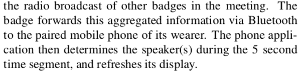

* The display of the mobile phones will be refreshed for every 5 seconds.

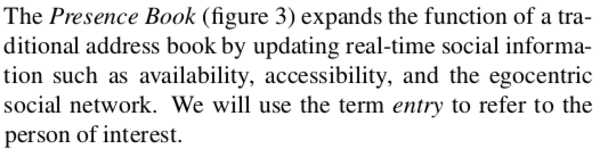

* There is this Presence Book.
* The Presence Book is like a socially aware phone book application for mobile phone.
* In case the person busy or available it can be told directly from Presence Book.

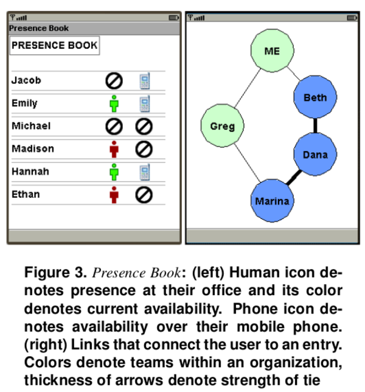

* Example mock up of presence book.

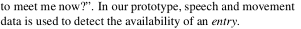

* In Presence Book movement and speech activity of a wearer determine whether this wearer is available or not.

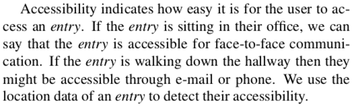

* Let say the badge wearer has less movement and the badge wearer located on its office, he/she cold be sitting and available for face to face conversation.
* If the badge wearer is known walking. Then he/she might be accessible through email or phone call.
* This Presence Book use location data of the badge wearer to detect their accessibility.

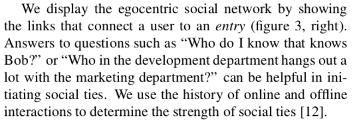

* Presence Book can easily display which person might know what person.
* So this is like the People Wiki idea that I suggested before.

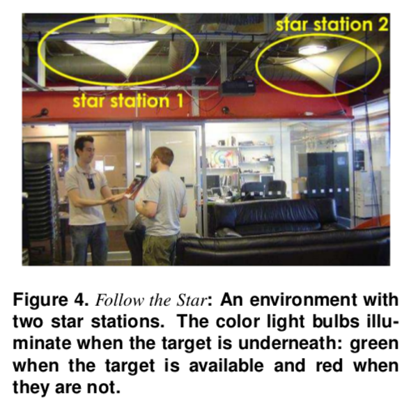

* This is an example called Follow The Star.

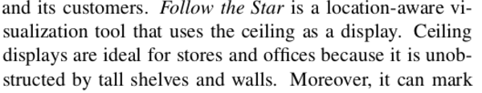

* Follow The Star is a location aware physical visualization that uses ceiling as display.
* Ceiling displays are ideal for stores and office because it does not obstructed by shelves or walls.

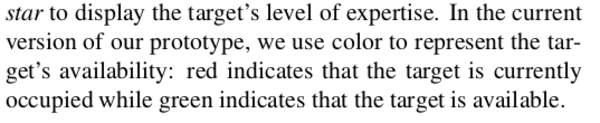

* This Follow The Star displays badge wearer's level of expertise on certain topic.
* The color of green on the "Follow Of The Star" indicates that the target is currently available.
* The color of red on the "Follow Of The Star" indicates that the target is currently occupied.

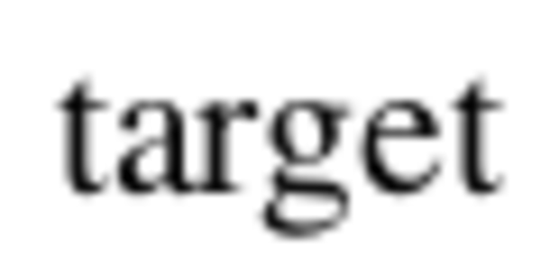

* I suggest that the target that they mean here is the badge wearer.
* So this Follow The Star installation is like the interface of the sociometric badge.
* Follow The Star is the mobile phone equivalent from the Presence Book implementation.

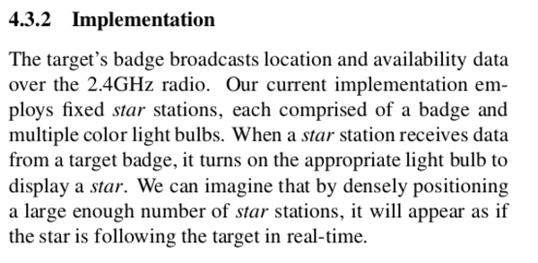

* Communication happen one way from badge to the Follow The Star.
* When the star receives data it will specific light bulb turned on.

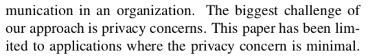

* The biggest challenge is privacy concern.
* This is because in the actual implementation there will be a lot of social data mined out of the badge wearer.
* This paper is limited to application of which privacy concern minimal.

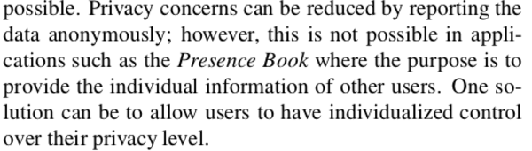

* Privacy concern can be reduced by reporting data anonymously.
* However, in the Presence Book application this is not possible due to its principle on reporting whether or not a person is available or busy.
* Another solution is to let user has a control of her/his privacy level.

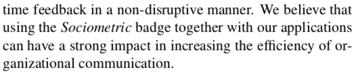

* The main goal of the sociometry badge is to increase efficiency of organizational communication and work.