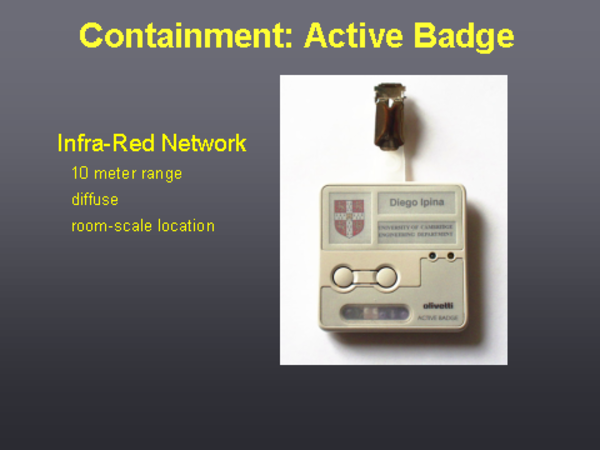
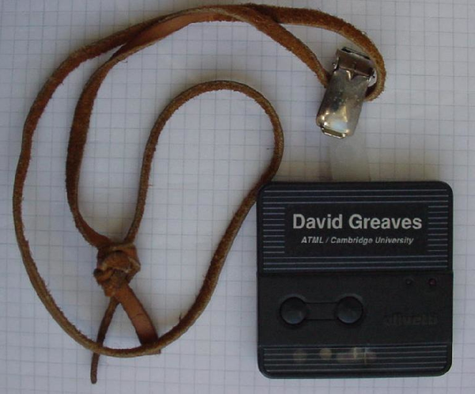
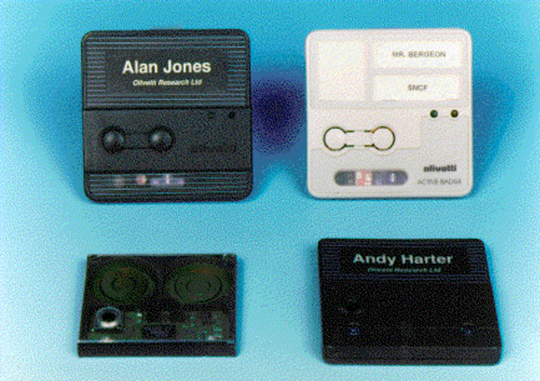
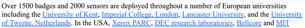
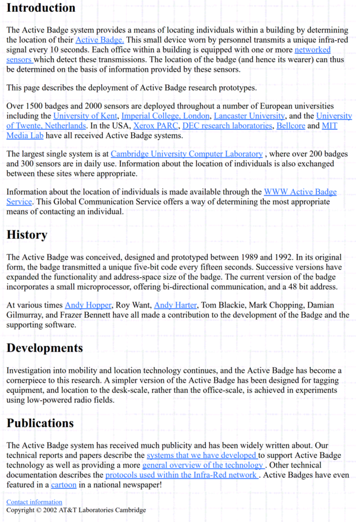

* There is this active badge system that is the root of the original sociometric badge.
* It is called the Active Badge System.
* It looks like this.

* And based on an article here, [http://www.cl.cam.ac.uk/research/dtg/attarchive/ab.html](http://www.cl.cam.ac.uk/research/dtg/attarchive/ab.html). At some point in the past Universiteit Twente was actually have (some) of this/these.

* Based on the article it was the CS (Computer Science) of Universiteit Twente department who has the Active Badge System.
* Here is the full screenshot of the article.

