[./20161006-1210-gmt+2-brp-manual-1-1-manual.pdf](./20161006-1210-gmt+2-brp-manual-1-1-manual.pdf)

* This above is the graduation project manual, I need to make sure I understand everything from this.

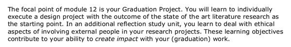

* The bachelor thesis project assignment is an assignment project that will be learnt individually.
* The opening point is the state of the are literature study. So need to have a lot of things to read. Perhaps like a previous researches, forum discussions, articles, books, or like a "getting started" books to get start fast.
* Learning the ethical aspect. I think this is more like what will I do and the impact of it into the commonality.

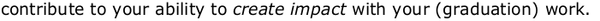

* The other goal is to create impact with the project.

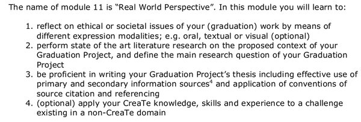

* I am not so sure on how this module things are working, I need to contact Mr. Richard Bults.
* Reflect everything on the social issue.
* Make a question and then search my answers within the literature studies.
* Be proficient in writting the essay.
* Apply Creative Technology skills in non Creative Technology domain.

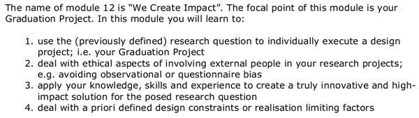

* "We Create Impact.". This is the focal point or the main thing in my graduation project.
* Here I need to use the research questions and the literature studies to execute the project.
* I think I need as well to determine the ethical impact.

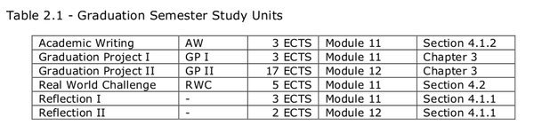

* Graduation semester study unit. I think these are mainly for the Post - TOM student. But I am not so sure, I need to ask Mr. Richard Bults.

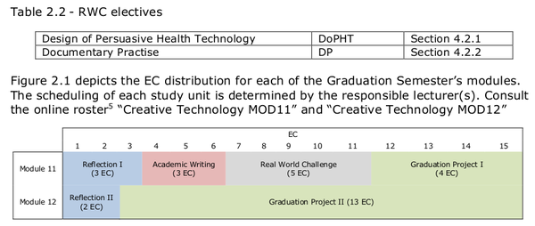

* RWC electives. I am not sure on what is that RWC electives. But I have done all of my electives so I think this would not be a problem. I need to make sure of this with Mr. Richard Bults.
* There are these courses that I am not sure.
    * Reflection 1.
    * Academic Writing, course that I am pretty sure I have two of these.
    * Real World Challenge, oh this is the RWC mentioned before.
    * Reflection 2.
    * And the the graduation project itself.

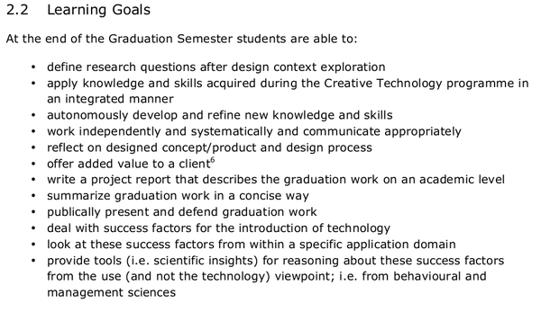

* Learning goals, I will try to make a little summary on those which are not obvious.
    * Define research questions after design context exploration.
        * What is design context exploration?
        * So based on this point I need to define question based on my context exploration.
    * Reflect the product with the design plan.
        * Because sometimes the works done is not fit with the plan that previously made.
    * Offer added value to the client.
    * Acknowledge the success factor. And the failed ones.
    * Create a research tools (theory and not a prototype of technology). Perhaps like the philosopher's razor (Hitchen's, Occam's, ...).

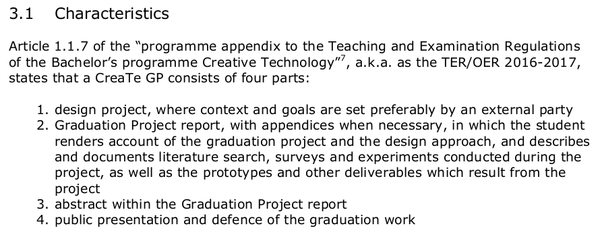

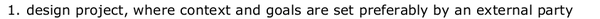

* The main points for the examination committee, I think.
    * Design project.
        * Context by external party.
        * Goals by external party.
    * Report.
    * Abstract.
    * Public presentation.

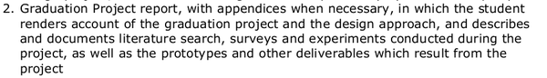

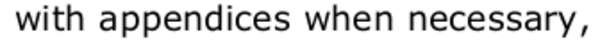

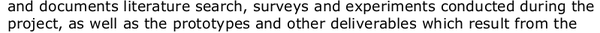

* In the graduation report, make sure to have these.
    * Appendices.
    * Design Approaches.
    * Literature Researches.
    * Surveys.
    * Experiment.
    * Prototypes.

* Make sure to have the third party to do define these.
    * Context.
    * Goals.

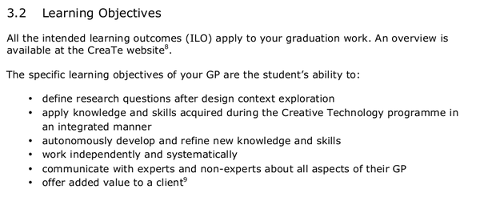

* The abstract results hoped from the Creative Technology faculty itself.
    * Design context exploration.
    * Research questions.
    * Apply Creative Technology knowledge.
    * Develop and refine new skills.
    * Work independently and systematically.
    * Communicate and communicate and communicate.
    * Added value. Please be like you are an inventor asking for money to investor. Why makes one a good employee?

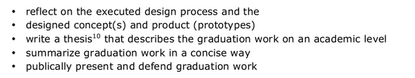

* Always reflect the executed design process with the plan.
* Design the concept products and prototypes.
* Write the documentation.
* Summarize everything happened in the most concise ways (I think this is like making an abstract).
* Pitch, presentation, asking questions.

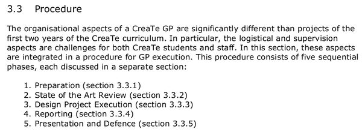

* These are things that I need to study.
* The process on making bachelor thesis.
    * Preparation.
    * State of the art review.
    * Design project execution.
    * Reporting.
    * Presentation.
* I need to make sure I understand every bit of these.

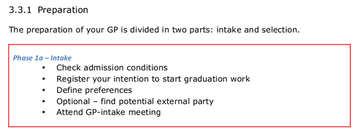

* I think I have done all of these except for the GP - Intake Meeting.

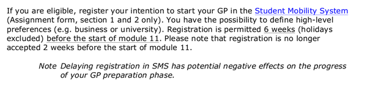

* I need to ask what happen with Student Mobility System, because I was not aware of this.

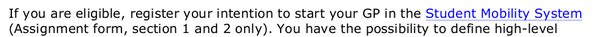

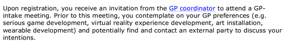

* I have done all of these.

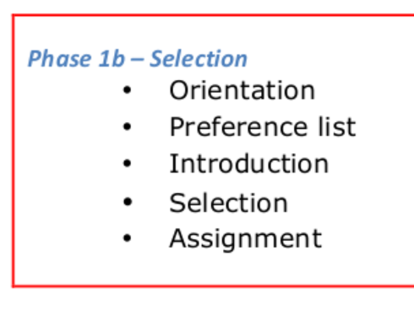

* I am not sure about these things.
    * Orientation.
    * Assignment.
* I guess at this moment I am at the assignment part.

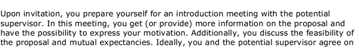

* I have done this and meet 3 projects candidates.
    * R3D3.
    * Sociometry Badge.
    * Tracking Robot.

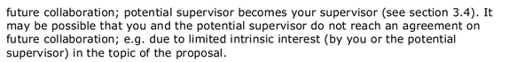

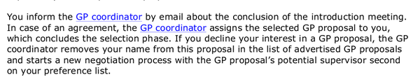

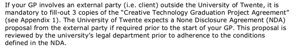

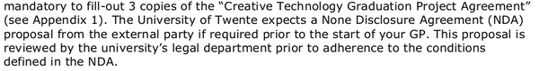

* Oh, so it will be mandatory to sign NDA if only the party is outside Universiteit Twente.

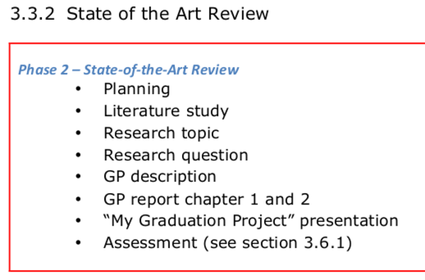

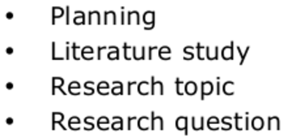

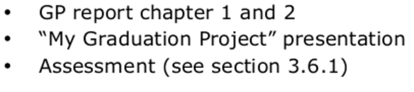

* State of art review.
    * Planning, this is what should I do now.
    * Literature study.
    * Research topics.
    * Research questions.
    * Project description.
    * Make the report for chapter 1 and chapter 2.
        * So what are these chapter 1 and chapter 2.
    * Small presentation I guess.
    * Assessment (see point 3.6.1).
        * I am not sure what assessment meant. Probably like a small talk or presentation?

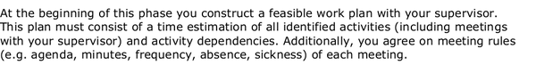

* At the beginning construct a feasible work plan with the supervisor.
* So this is for sure what I should have do.

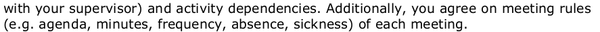

* We should agree on activity and schedule. Moreover meeting rules.

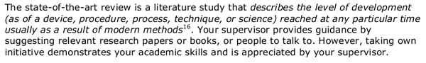

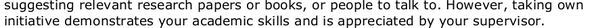

* State of the art review is a literature studies that describe the level of development during particular amount of time.
* Supervisors are hoped to point to certain theory, papers, book, or even person to have a dialog with regarding the bachelor thesis project.
* Demonstrate ability.

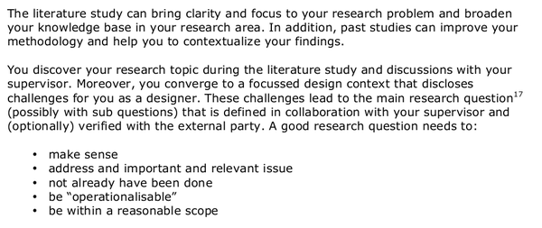

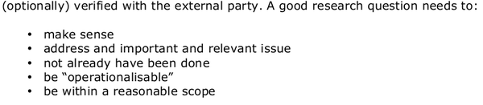

* Literature studies can bring clarity and focus to the project, broaden the knowledge base, and improve methodology.
* I and the supervisor need to determine the topic during the literature research.
* Define the topic and the questions. Example of good questions.
    * Make sense.
        * What is an example of questions those are not make sense?
            * Obviously easy to answer? For example, what is 1 + 1?
            * Rational, which mean the question can be answered (not with meta physics and things like that). For example, whether or not god is exist.
            * I do not know anymore.
    * Address important issues and relevant.
        * So the topic should be current problem or upcoming one.
        * Not necessary to discuss topic that already been done or not even important.
    * Not have been done before. This is rather difficult to search.
    * Operationalable, practically can be proven with current limitation. I think this is what the point means. Let say something that is not operationalable would be if I want to do bachelor assignment about interactivity of people living in outer space.
    * Between a reasonable scope. "Is ghost exist?".

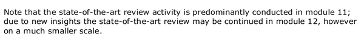

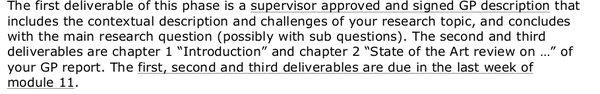

* The first deliverable would be a supervisor approved and signed project description.
* The first chapter is introduction and the second chapter is the state of the art review of the project name.
* The deadline is at the end of the last week of module 11 so like in the end of November, perhaps.
* In the end of module 11 I need to have these done.
    * Chapter 1.
    * Chapter 2.
    * Chapter 3.
* I think this would be good if I also done these as well.
    * Hardware/software/tools requirement. Like an ingredients to make a food.
    * Simple how - to (Instructables style).
    * Simple prototype.
    * Small interview.
    * Small surveys.

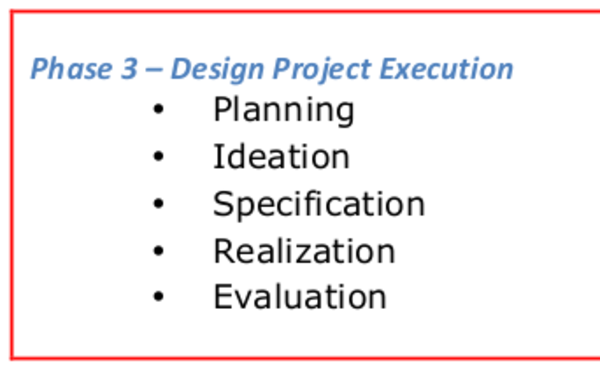

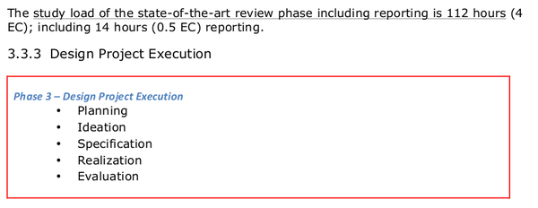

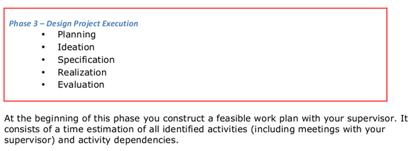

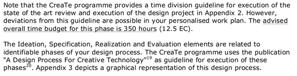

* Phase 3 I think would be in the second block of this semester.
* There is a document called "A Design Process For Creative Technology" that should be used as a guidelines.

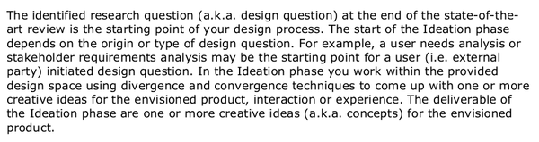

* The starting point would be the research questions and the state of the art review.
* Need to find out what is state of the art review on Internet.
* Also in the starting point I need to define requirements.
* And then later there would be an ideation phase.
* This is the delivery of one or more ideas. The concept itself (not industry ready things) of the product.

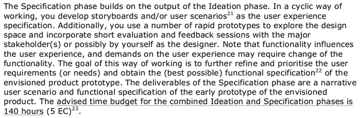

* Specification is the result of the ideation phase.
* Here like story board or user scenario.
* Rapid prototypes to explore the design.
* Feedback session with the stakeholder.
* The best possible functional specification.
* The deliverables of the specification phase are these.
    * A user scenario of using the project's envisioned product
    * And a functional prototype.

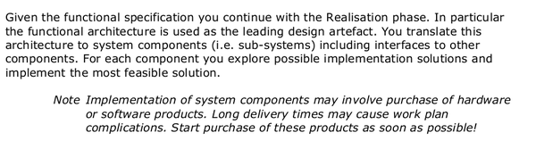

* Next is a realization phase.
* Here I need to define sub - systems.

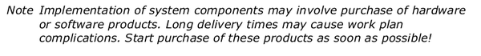

* Beware when I need to purchase things.

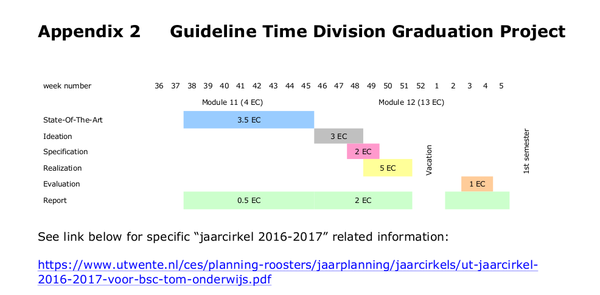

* Time line.

[./20161006-1210-gmt+2-brp-manual-1-52-form-nda.pdf](./20161006-1210-gmt+2-brp-manual-1-52-form-nda.pdf)

* Above is the NDA in case I am working with someone outside of the Universiteit Twente.
* So to sum up these are what I need to do.
    * Make simple schedule with revision and everyone need to discuss then agree on it.
    * Make a simple communication workflow.
        * For the first time
        * Make a blog using Raneto.
        * Just for this project!
        * ToDoIst.
        * Notes.
    * Context.
    * Literature contact with Mr. Efke Ufkes and Ms. Khiet Truong.
    * Contact Mr. Richard Bults.
    * Contact Mr. Efke Ufkes and Ms. Khiet Truong.
    * Ask questions in the next meeting.