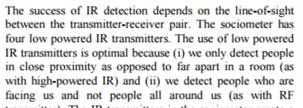
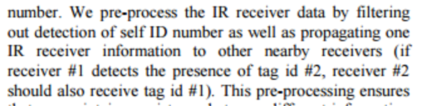

* Here is my summarization of sociometer research paper.
* This paper specifically tell you on how to extract voice data for sociometric calculation and on how to detect if face to face conversation happens.
* So, this is great paper to follow if you want to go deep into the face to face detection and speech recognition.
* Below is the .pdf.

[./20161109-0110-gmt+2-brp-sociometer-1-1.pdf](./20161109-0110-gmt+2-brp-sociometer-1-1.pdf)

* Sociometer is a wearable sensor package for measuring face to face interactions between people.

* Sociometric is important in these fields.
    * Knowledge management application for finding expert.
    * Organizational behavior.
    * Social network analysis.

* Especially noted that I also had a similar idea about this people Wikipedia, where you can search informations based on the person.

* The sociometer and the Sociometric Badge are exist to minimize the usages of these things.
    * Diaries (what?!?!?!).
    * Questionnaires.
    * Surveys.

* There is this Bayesian network that is crucial for the sociometer.
* However, I have no clue on what is this.
* Quick Google search refer me to this Wikipedia page, [https://en.wikipedia.org/wiki/Bayesian_network](https://en.wikipedia.org/wiki/Bayesian_network).

* Nature of communication is important to understand the following phenomenas.
    * Diffusion on informations.
    * Group problem solving.
    * Consensus building.
    * Coalition information.
* Neither of these has a place in my memory.

* Knowing physical structure of an institution can either encourage or hinder productivity.

* Wearable sensors with pattern recognition will play important role in modeling and sensing physical interactions.

* There were no other option to gather interactions data at this moment this paper is written.
* This is because it is hard to obtain reliable data out of social activity.

* They used machine learning to understand the pattern.
* I believe this is the oldest thing I see term "machine learning" mentioned.
* I guess I need start to look back to see what kind of things will popular in the future.

* Interaction state like these.
    * The duration of the conversation.
    * To whom this person are talking to.
* These informations above solely can be used to infer dynamic and social structures.
* This method should be cheaper and efficient than human driven interview or questionnaire.

* Also sociometer and its iteration are hoped to make social research to be easily scalable to larger group.

* In summary they are looking to discover on how information about social network relationship can be derived by statistical machine learning.

* To know identity of to whom this person is talking, sociometer uses IR transceiver to broadcast information.
* This is good to mention actually because in my current state of my bachelor thesis my badge has no idea to whom this people are talking to.

* The sociometer was designed by wearable designer Brian Clarkson (Google search returns nothing related, or I missed things).
* Although the sociometer was designed to have these in mind.
    * Aesthetic.
    * Comfort.
    * Optimal sensors placement.
* However, it did not prevent its wearers to stop using it because it is not "wearable" enough.

* Some specifications of the sociometer.
    * 2 accelerometers.
    * 256 MB on board storage.
    * IR transceiver.
    * Microphone.
    * Power supply.
    * Powered by 4 AAA batteries.
    * Shoulder mount.

* Basically this device store information about these things.
    * Information about nearby people.
    * Motion information.
    * Speech information.

* Other sensors can be added as well. For example like these.
    * Light sensor.
    * GPS.
* It is mentioned here that the researchers are not yet to use the data from motion sensors.

* Sociometer hardware.

* The use of low powered IR transceiver is optimal because of these matters.
    * Only detect people that is facing the sociometer wearer.
    * Sociometer only detects people in close range.

* The transceiver create a cone shaped region in front of its wearer.

* IR range detection is approximately 6 feet.

* Here are some concern about privacy.
* However, the researchers mentioned here that the data taken is only the important parameter without the context.
* For example for sound, the data extracted is only the features (pitch, volume, ...) without the contextual speech itself.

* It is called to garbling the audio.
* To make the audio features are all the same.
* But "encrypt" the voice.

* There was a problem with IR transceiver because the signals are not consistent.
* This is due to nature of human conversation that is not always face to face.

* There was also a problem that the IR transceiver detects face to face communication with its own wearer.

* Above is a quite specific explanation on how to calculate face to face detection.
* I do not read these things yet.

* Above is a quite specific explanation on how to combine face to face detector with the speech detector.
* These are all to detect if a conversation happen.
* Whether or not the sociometer wearer just blabbering around or having an actual conversation.
* I do not read these things fully yet, nor I understand these.

* Simple summation on the social noise.

* Diagrams.
* I am not sure what are these for.
* But, these display on simplest sociometric flow. Please check into Moreno's Sociogram.