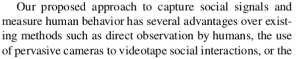

* This my summarization of State Of Art Paper from the creator of the sociometric badge.
* Here is the .pdf.

[./20161105-1413-gmt+2-brp-state-of-the-art-1-1.pdf](./20161105-1413-gmt+2-brp-state-of-the-art-1-1.pdf)

* This stuff is actually have started even before I touched senior highschool.
* Yet I just started this in 2016 XD.

* This paper is brought by Daniel Olguin Olguin and Professor Alex "Sandy" Pentland.
* I have seen these names a lot in article and paper regarding sociometric badge.

* The most basic function of sociometric badge.
    * Able to measure amount of face to face interaction.
    * Conversational time.
    * Physical activity level measured using xyz sensor.
    * Physical proximity to other people wearing the same badge.
    * Prosodic style. Prosodic is the study of suprasegmental characteristics of speech, like intonation, rhythm and stress, [https://en.wikipedia.org/wiki/Prosody_(linguistics)](https://en.wikipedia.org/wiki/Prosody_(linguistics)).
        * Intonation.
        * Rhythm.
        * Stress.

* Active Badge developed at Olivetti research in 1990.
* However, this company is not relevant anymore.

* The Active Badge contains small microprocessor and infrared transmitter.
* This badge is able to broadcast identity of the wearer and trigger things. For example these are things that can be automated.
    * Automatic door.
    * Automatic telephone call forwarding.
    * Computer display.

* The main application at that time was as an aid for telephone receptionist and mainly to track people inside a office environment.

* Then there was Thinking Tags in 1996.
* Thinking Tags were the first computational augmented name tags.
* Thinking Tags is capable to display what things are in common when two people meet in conference or meeting.
* This was achieved depending on how many question that these people answered that has same answer.

* Two years later in 1998 there is Meme Tag.
* Meme was based in Richard Dawkins' The Selfish Gene book at that time.
* Meme Tag allows people to electronically share brief ideas or opinion through a rather large LCD screen.
* This system is then evolved into nTag System.
* nTag system offers commercial solution to improve, measure, and automate meetings and events.

* A year later in 1999 there was Wearable Sensor Badge developed at Phillips Research Labs.
* This device is able to detecting simple activities using accelerometer.
* There there was iBadge to capture interaction with student, teacher, and common classroom object within classroom environment.

* There was SocioMeter.
* SocioMeter is a wearable sensor package designed to measure face to face interactions between people with an infrared transceiver, a microphone, and 2 accelerometer.
* This was used to mapping a network of social interaction.

* The cons is that the size of SocioMeter is big and also a bit heavy for common wearable devices.

* There was UbER Badge.
* It was developed at the MIT Media Lab.
* It has these.
    * Audio output via 3.5 mm headphone jack.
    * Flash memory capacity.
    * IR communication.
    * LED display capable of showing graph and scrolling texts.
    * Microphone for audio sampling.
    * Pager motor for vibratory feedback.
    * RF communication.
    * And a lot of other connectors for these.
        * LCD Display.
        * Attaching other sensors.

* The best known communication badge is the Vocera Communication Badge.
* The system has a servers that maintains these things.
    * Badge session identifiers.
    * Email addresses.
    * Names.
    * Telephone numbers.
    * Voice dialing phrases.
* This Vocera Communication Badge is more into communication rather than sociometric measurements.

* The current state of the art of sociometric badge is to measure individual and group behavior in social sciences.
* Researchers should not worry anymore to conduct social test using interviews or surveys.

* Surveys and observations are time consuming and this sociometric badge is here as an experimental research platform.

* They expect sociometric badge to have high demand in research communities and later in consumer market for self monitoring devices.
* So expect this to be in researchers hand first then in end consumers hand.

* The main functionality of this sociometric badge is to automatically capture individual and group pattern of social behaviors.

* Later this social pattern can be used to determine these matters.
    * Identify social affinity from this person to another person.
    * Unconscious signals.

* More so, sociometric badge need to be able to provide feedback to its user (either real time or not).

* The method of capturing social signals is different than using the expensive camera to videotaping social interactions.

* Direct observation of humans by humans is expensive.
* This also limited to the number of observer.
* Observers do not always agree on matters (I am not sure what they meant by this).

* Using camera is expensive and limited to a particular space (well not anymore, nowadays you can buy cheap and small camera).
* Surveys is inaccurate and time consuming.
* Below are examples of sociometric badge implementations.
    * Intelligent hospitals.
    * Knowledge management and collaboration tools.
    * Personal sales coach.
    * Sensible organizations.
    * The future of health care.
    * Virtual worlds and social networking sites.

* Sensible organizations mean to make an organization to give feedback and know the social structure within the organization.
* The sociometric badge offered capability to these matters.
    * Capable of monitoring human behavior.
    * Extracting meaningful information.
    * Provides the employees with performance evaluations and recommendations.
    * Provides the manager with group performance metrics.

* Knowledge management and collaboration tools is basically my idea about building people wiki.
* Knowledge management and collaboration tools provides employees with a knowledge base for discovering other colleagues working with similar projects or colleagues that has specific expertise and specific interest.

* This knowledge management and collaboration tools automatically monitors organization social structure adn group people based on their knowledge and expertise.

* For example these are things that the knowledge management and collaboration tools can do.
    * Data mining of digital documents.
    * Face to face interaction.
    * Monitoring emails.
    * Monitoring instant messaging.
    * Monitoring other form of communications.
* I am not sure if the points about monitoring are correct or if I just misinterpret things.
* Nevertheless, the knowledge management and collaboration tools provides information on how social structure within an organization works.
* Then give hints on how to engineer and optimize organizations.

* The other implementations of this sociometric badge is in health care.

* Sociometric badge can be used as a self monitoring device that alerts user if their family members has early symptoms of depression.

* Sociometric badge can be used as well to monitor daily activities of elderly people.
* For example it can detect falls of behavioral changes, then alert the nearby family members or medically capable of this potentially dangerous situation.

* Another thing is for managing obesity.
* Sociometric badge and mobile phone could be used to keep track of these things.
    * Energy expenditure.
    * Food intake.
    * Daily routines.
    * Provides feedback and suggestions to the user.

* Another implementations of sociometric badge is to make intelligent hospitals.
* This is similar on what Vocera Badge has achieved.
* In this paper sociometric badge can be used to provide information on location and specific person for right moment.

* Often time errors occur during nurse time - shifts.
* This wearable device can be used to monitor interaction between nurses and alert them on what kind information that should be told that would reduce the amount of errors incurred.

* Sociometric badge can be used as well to provide doctor in emergency situation.
* To track patients as they moved from one to another facility within the hospital.
* To transfer patient's psychological data as they moved inside the hospital or for future reference.

* Sociometric badge can be used as a personal sales coaching as well.
* It tells the user on what kind of matters will pull or push costumers.

* Sociometric badge gives advice on how to interact with clients more effectively.

* The problem was at that moment (2007) sales were lacking on sufficient feedback on their selling capability.

* Top performing sales usually have these skills.
    * Exhibit a lot of enthusiasm.
    * Form a personal bond with the customer.
    * Have a good communication skills.

* Sociometric badge can also be used in virtual worlds and social networking sites.

* Interaction in online video games and social networking sites is limited to text chat.
* However, sociometric badge can offer different layer of communication by knowing personal social signals to other player within world wide web.

* Sociometric badge provides new dimension of communication support.

* The long term goal of sociometric badge is to set interventions and recommendations that can lead to better individual.

* Electronics will eventually become smaller.

* Hence, sociometric badge will also become light weight and smaller.