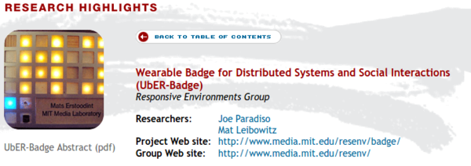

* Here are some other DIY badge that had/has been done.

* nTag badge is used to share (this article uses term "electronically swap") common interest between its users if they are in certain range.
* nTag badge is also quite programmable in term of it can show these kind of things.
    * Polls.
    * Schedules.
    * Session brochure (similar to Twitter but more old school).
    * Updates.
* nTag is also developed from MIT Media Lab.
* Its website, [http://www.ntag.com/](http://www.ntag.com/), is no longer active.
* Here is the article, [http://www.exhibitoronline.com/exhibitormagazine/article.asp?ID=388](http://www.exhibitoronline.com/exhibitormagazine/article.asp?ID=388).

* Hackaday the famous website for DIY and hacking has a specific tag that reviewed DIY badge, [https://hackaday.com/tag/badge/](https://hackaday.com/tag/badge/).

* Here are some examples that I took from, [https://hackaday.com/tag/badge/page/1/](https://hackaday.com/tag/badge/page/1/).
* Some badges those are reviewed here are these.
    * "I Can Reflow" Merit Badge.
    * 2016 Queercon Badge.
    * DEF CON's X86 Badge.
    * Hackaday Belgrade Badge.
    * Hackaday Supercon Badge.
    * The AND!XOR Unofficial DEF CON's Badge.
* However, nothing from these can carried out data for sociometric calculation.

* Another badge from MIT Media Art named The UbER - Badge.

* Another badge from MIT Media Art named Thinking Tags.

* Above is an image that shows basic functionalities of nTag.
* Its goals are these.
    * Easy to learn.
    * Eliminates paper based agenda and surveys.
    * Evaluate on - site activities.
    * Increase the value of sponsorship opportunities.
    * Web based interface.
* I am pretty sure that these stuffs can be carried with a smart phone application for Android or iOS.
* Nevertheless, the ability to put sponsorship spaces into this badge is actually genius.

* Another badge from MIT Media Art named MIT Meme Tag. This was there before the term "meme" misused.
* So to sum up there are these electronics badges.
    * "I Can Reflow" Merit Badge.
    * 2016 Queercon Badge.
    * DEF CON's X86 Badge.
    * Hackaday Belgrade Badge.
    * Hackaday Supercon Badge.
    * nTag Badge.
    * The AND!XOR Unofficial DEF CON's Badge.
    * The UbER - Badge.
    * Thinking Tags.