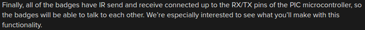

* Here is my summary about badge that was made for Hackaday conference in Belgrade.
* It can be programmed in Assembly and C.
* It has a programmer built in.
* It has an SDL2 based emulator to try things.
* It was made using PIC micro controller.

* The features of the badge are these.
    * 2 8x8 LED matrices (8x16 in total).
    * 4 push buttons.
    * IR receiver and transmitter.

* Above is the image of the Belgrade Hackaday Badge.

* There are 2 different set of firmwares in development.
    * Firmware is a permanent software programmed into read only memory.
* 1 of it is coded in Assembly.
* There is this guy named Voja that is the creator of this badge.

* This badge has a basic API that can be coded using Assembly or C.
* This badge also has an emulator made using SDL2. The emulator is meant for people who wants to code the badge but he/she has no access to the badge.

* The basic function is that for its user to be able to play Tetris.
* In the first iteration there were 3 buttons.
* However, later on there was additional button added to the badge, hence the Tetris implementation.

* It has its own programmer. So to program this badge you just need to plug - in micro USB cable.

* There are IR receiver and IR transmitter that can be programmed.
* However, at basic the badge has no function that uses these IR modules. So the user need to program these first.

* Above is the schematics of the badge.
* Here is the link to the article in Hackaday, [https://hackaday.com/2016/02/17/its-alive-badge-for-hackaday-belgrade/](https://hackaday.com/2016/02/17/its-alive-badge-for-hackaday-belgrade/).
* Here is the link to the tutorial in Hackaday, [https://hackaday.io/project/9509-badge-for-hackaday-belgrade-conference](https://hackaday.io/project/9509-badge-for-hackaday-belgrade-conference).
* Here is the full screenshot of the article.

* Here is the full screenshot of the tutorial.

