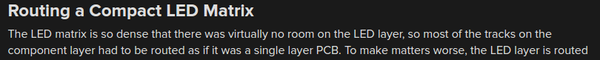
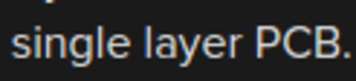
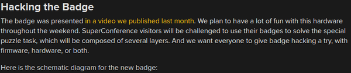
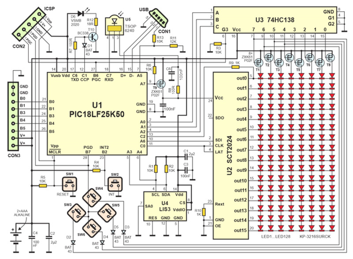
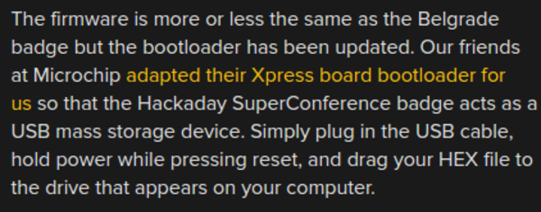
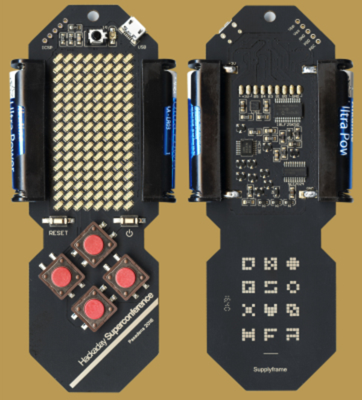
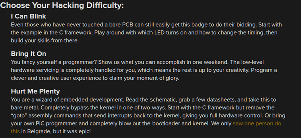
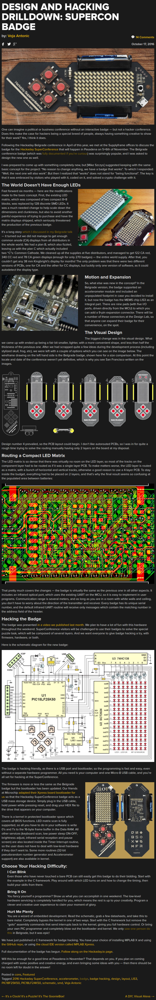
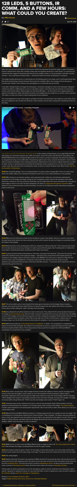

* My summary on Hackaday Supercon Badge.
* This badge is basically the updated version of Hackaday Belgrade Badge.
* This badge is intended to be hacked, so no sociometric calculation happens.

* Surprisingly this badge used single layer PCB.
* Well, except for the LED matrices part.

* Hack the badge!
* Hacking the badge can go into several parts of the badge.
    * The user can go hack the firmware.
    * The user can go hack the hardware.
    * Or combination of both!

* Above image is the schematics of the badge.
* It uses PIC micro controller.

* The firmware is update from the previous Hackaday Belgrade Badge.
* And it has an additional feature which is to be also a USB mass storage device.
* However, it is not shown in the article on how big the storage is.
* I assume that it as big as the memory in PIC micro controller.

* Above is the image of final iteration of the Hackaday Supercon Badge.

* Here is the hacking challenge guide.
    * The first is the classic "Hello World" - esque project for hardware development, to play around with LEDs.
    * The second tier is to interface the hardware.
    * The third tier is to hack into the kernel. Within this Hackaday Supercon there is only 1 person that could do this, [https://hackaday.com/2016/04/15/128-leds-5-buttons-ir-comm-and-a-few-hours-what-could-you-create/](https://hackaday.com/2016/04/15/128-leds-5-buttons-ir-comm-and-a-few-hours-what-could-you-create/).
* Here is the link to the article, [https://hackaday.com/2016/10/17/design-and-hacking-drilldown-supercon-badge/](https://hackaday.com/2016/10/17/design-and-hacking-drilldown-supercon-badge/).
* Here is the link to Hackaday Supercon log, [https://hackaday.com/2016/04/15/128-leds-5-buttons-ir-comm-and-a-few-hours-what-could-you-create/](https://hackaday.com/2016/04/15/128-leds-5-buttons-ir-comm-and-a-few-hours-what-could-you-create/).
* Here is the full screenshot of the article.

* Here is the full screenshot of the Hackaday Supercon log.

