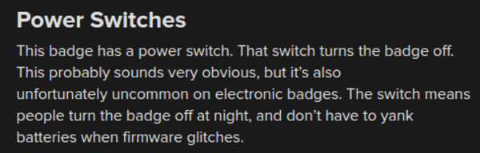

* This post is my summarization of a Queercon Badge.
* This badge was made for a queer (lesbians, gays, bisexuals, ...) hacker conference.

* This badge is so beautiful actually.
* Look at that curvy electronics paths.

* The features of this Queercon badge are these.
    * 60 cyan LEDs.
    * A button.
    * RF modules to have connection to other badge.
* There is this premade feature that when the user push he button it will "spread" the LED color into badges nearby. This is pretty cool.
* This shows me that RF connection can be used to broadcast data into nearby gadget.

* These are some other features.
    * Variable brightness.
    * Power switches.
    * "Hats"! Yes! You can add 2 add - ons in the upper side of the badges. An example below shows a unicorn horn hats that has LEDs inside.

* Although this badge cannot take sociometric data, it has a a social feature that helps its user to interact with other visitor in Queercon.

* Above is the example of the "hat". This is the unicorn LEDs "hat".
* Here is the link to the article, [https://hackaday.com/2016/08/10/what-we-learned-from-the-2016-queercon-badge/](https://hackaday.com/2016/08/10/what-we-learned-from-the-2016-queercon-badge/).
* here is the full screenshot of the article.

