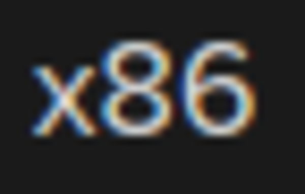
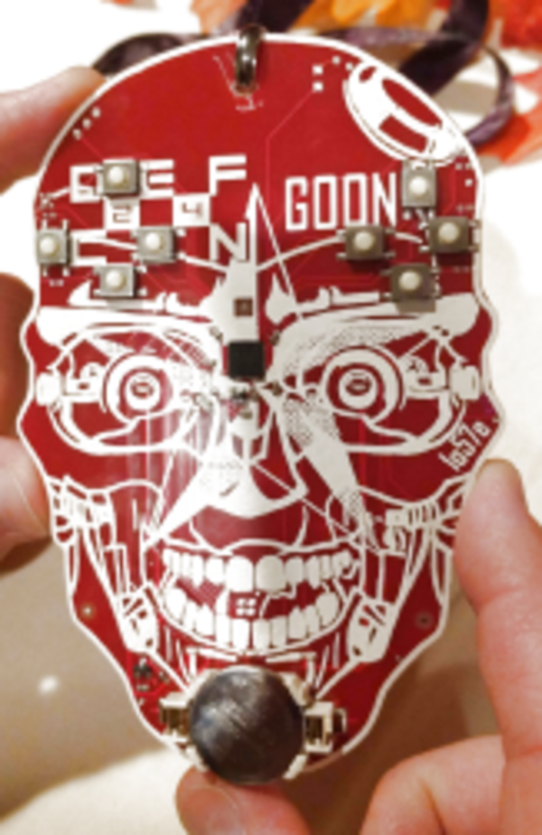

* My summary of Defcon Badge.

* This DEF CON badge has X86 architecture.
* This is the same architecture for old 32 - bit computer.

* This badge is using Intel Quark D2000 micro controller.
* This micro controller running at 32 MHz, with 32 kB of Flash memory, 8 kB of RAM.
* The specifications are nearly the same like ATMega 328 in Arduino.
* I wonder what does X86 provides compared to the traditional ATMega 328 in Arduino.

* The features for this badge are minimal.
    * 1 battery.
    * 5 LEDs.
    * 8 buttons makes 2 directional pad.

* What this badge provides is a puzzle for its user to solve.

* These below are images of the badges.
* It is beautifully done I see.

* Here is a link to full article, [https://hackaday.com/2016/08/05/def-cons-x86-badge/](https://hackaday.com/2016/08/05/def-cons-x86-badge/).
* Here is the full screenshot of the article.

