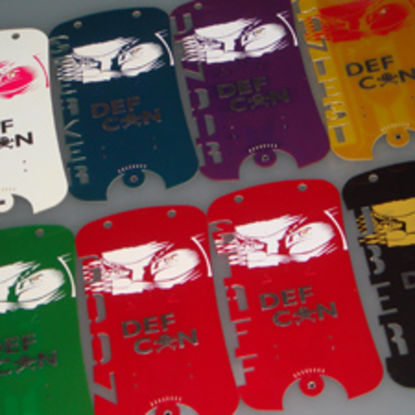

* These are other DEF CON badges.
* Here is link to the creator website, [http://www.grandideastudio.com/](http://www.grandideastudio.com/).
* GrandIdeaStudio is somewhat like a prototyping company.
* Here are link to each documentations.
    * [http://www.grandideastudio.com/def-con-18-badge/](http://www.grandideastudio.com/def-con-18-badge/), DEF CON 18 badge.
    * [http://www.grandideastudio.com/def-con-17-badge/](http://www.grandideastudio.com/def-con-17-badge/), DEF CON 17 badge.
    * [http://www.grandideastudio.com/def-con-16-badge/](http://www.grandideastudio.com/def-con-16-badge/), DEF CON 16 badge.
    * [http://www.grandideastudio.com/def-con-15-badge/](http://www.grandideastudio.com/def-con-15-badge/), DEF CON 15 badge.
    * [http://www.grandideastudio.com/def-con-14-badge/](http://www.grandideastudio.com/def-con-14-badge/), DEF CON 14 badge.
* DEF CON 18 badge images.

* DEF CON 18 badge documentation.

* DEF CON 17 badge images.

* DEF CON 17 badge documentation.

* DEF CON 16 badge images.

* DEF CON 16 badge documentation.

* DEF CON 15 badge images.

* DEF CON 15 badge documentation.

* DEF CON 14 badge images.

* DEF CON 14 badge documentation.

