* This is my summary about AND!XOR Unofficial DEF CON badge.
* There is this YouTube video that reviewed this badge, [https://www.youtube.com/watch?v=OgD4Es2KB5g](https://www.youtube.com/watch?v=OgD4Es2KB5g).

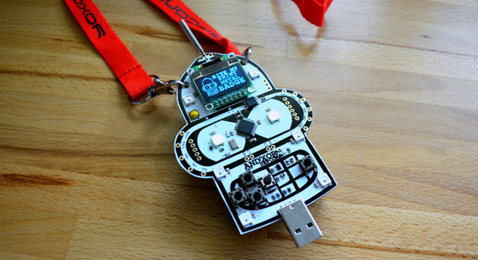

* Above is the AND!XOR badge.
* It has a shape of that Futurama robot, Bender.

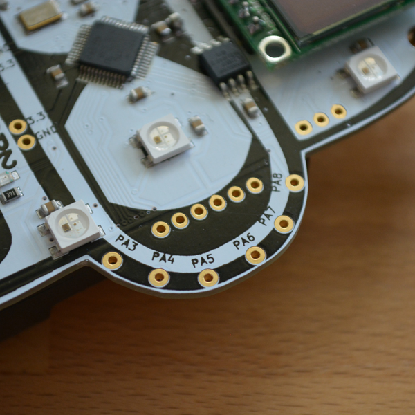

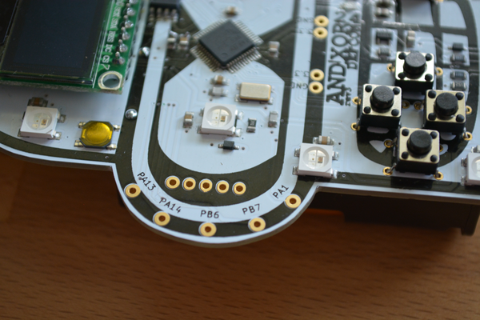

* There are some GPIO pins.
* This badge can also be used as a micro controller.

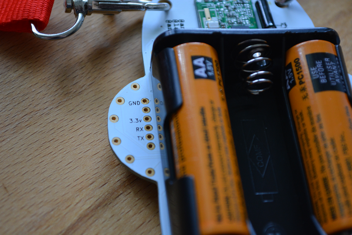

* There are ground and voltage pins and RX and TX pins for serial communications.

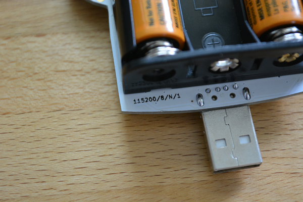

* There is normal USB male connector in the bottom of the badge.
* You can connect this into computer and do serial communications.

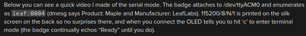

* The good thing is that this badge can be used in serial communication.

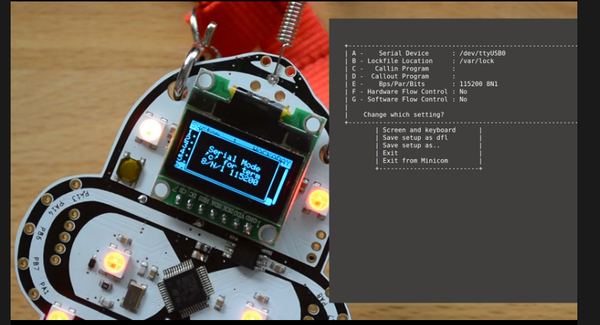

* Here is an example video on how to edit this badge setting via Serial communication, [https://www.youtube.com/watch?v=OgD4Es2KB5g](https://www.youtube.com/watch?v=OgD4Es2KB5g).
* This is actually good for my project. So, I only to create the Python codes to alter the functionalities of my badge.

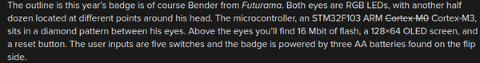

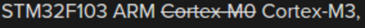

* Specifications.
    * 1 USB port.
    * 128x64 OLED screen (can be also those classic Nokia screen).
    * 16 Mbit of Flash memory.
    * 3 AA battery slots.
    * 5 switches.
    * Power pins.
    * RFM69W for 433 MHz communications.
    * RGB LEDs.
    * Serial pins.
    * Several GPIO pins.
    * STM32F103 ARM Cortex - M3.

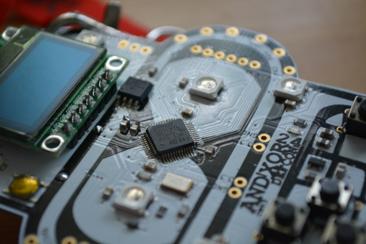

* Above is the image of the STM32F103 ARM Cortex - M3 controller.

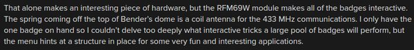

* This badge has a RFM69W for 433 MHz communications.

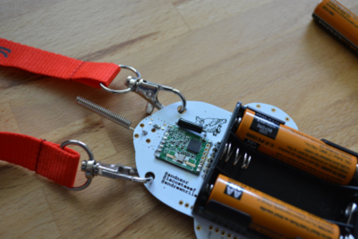

* Above is the images of the badge's antenna.
* The green PCB is the RFM69W.

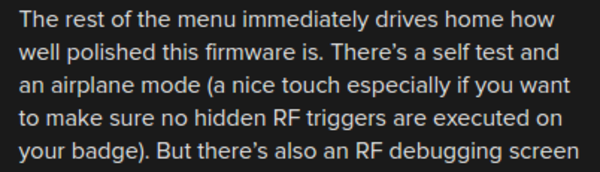

* The firmware for this badge is quite polished.
* There are a self test and an airplane mode.
* The airplane mode is to make the user sure that there are no unwanted RF communication to the badge.

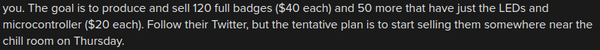

* The price for full badge is 40 US Dollars.
* The price for just LEDs and micro controller is 20 US Dollars.
* All in all what I like from this badge is that this badge offer a setting interface via serial communications.
* I think I could implement that in my badge.
* Here is the link to the article, [https://hackaday.com/2016/07/25/hands-on-the-andxor-unofficial-def-con-badge/](https://hackaday.com/2016/07/25/hands-on-the-andxor-unofficial-def-con-badge/).
* Here is the full screenshot of the article.

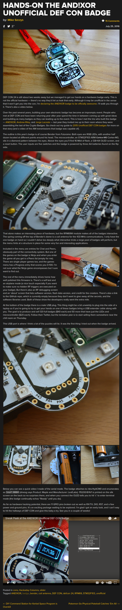