* Here is my summarization of the UbER - Badge I learn from its homepage.

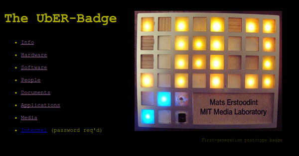

* UbER - Badge homepage, [http://resenv.media.mit.edu/badge/index.html](http://resenv.media.mit.edu/badge/index.html).

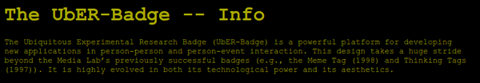

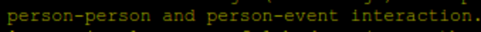

* UbER - Badge is a platform to develop powerful platform for developing new application in person to person event interaction.

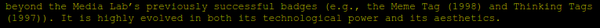

* The design of UbER - Badge takes from various successful badges made by MIT Media Lab.
    * 1997's Thinking Tags.
    * 1998's Meme Tag.

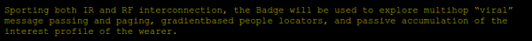

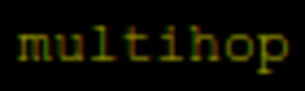

* The UbER - Badge has IR and RF connection.
* This badge will be used to explore multihop "viral" message paging and passing.
* There is a gradient based people locater.
* Also passive accumulation of interest of the badge wearer.

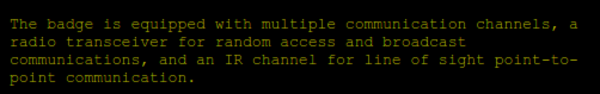

* This badge is equipped by multiple communication channels.
* This badge is equipped with a radio transceiver for random access and broadcast communication.
* The IR (infrared) is used for line of sight detection.

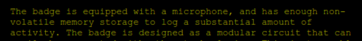

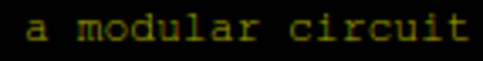

* The badge is equipped with microphone.
* The badge also has decent volatile memory to log activity.
* More over this badge is easily to be hacked because it has a modular circuit.

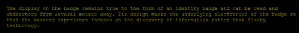

* The display of this badge is meant to be seen from several meters away.
* The design of the badge should be as ubiquitous as possible to that the wearer can focus on the conversation and not into the technological aspect of the badge itself.

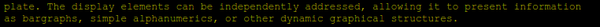

* The display element can be independently addressed to allow to present information such as these
    * Graph.
    * Simple alpha numeric.
    * Simple graphical structure.

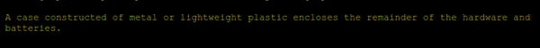

* The case could be just a simple metal or plastic enclosure.
* UbER - Badge information web page, [http://resenv.media.mit.edu/badge/info.html](http://resenv.media.mit.edu/badge/info.html).
* Here is the full screenshot of UbER - Badge information website.

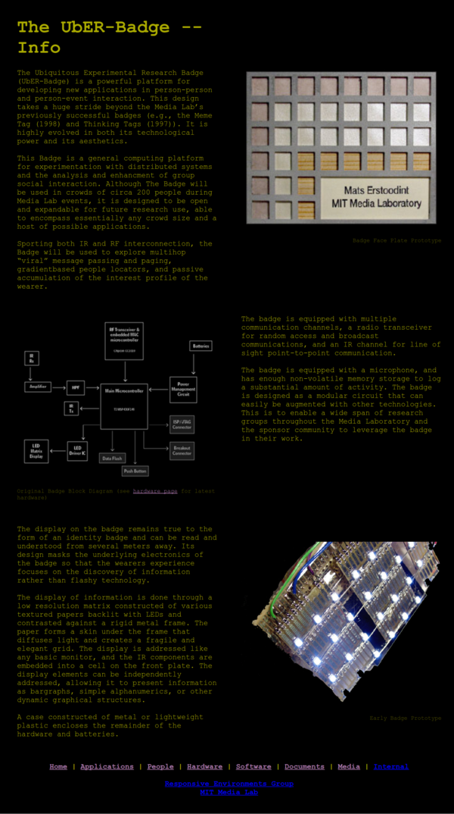

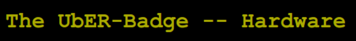

* Here is a link to hardware web page of the UbER - Badge, [http://resenv.media.mit.edu/badge/hardware.html](http://resenv.media.mit.edu/badge/hardware.html).

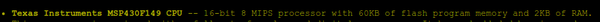

* This badge uses Texas Instrument micro controller.

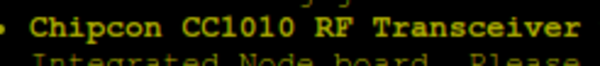

* There is this chip for RF communications.

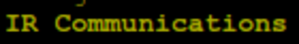

* There is also component to do IR communications.

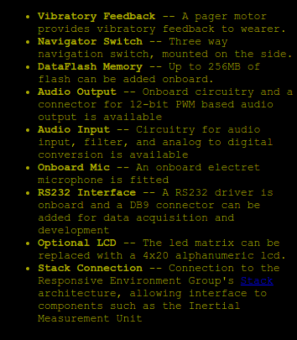

* Additional/sensory modules.
    * 3 ways navigator switch.
    * Audio input.
    * Audio output.
    * DataFlash memory up to 256 MB.
    * LCD.
    * Microphone.
    * Motor vibrator.
    * RS232 for data acquisition.
    * Stack connection (I think this is made to connect to their measurement unit).

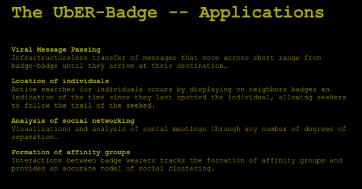

* The applications of UbER - Badge.
    * Analytic of social networking means to create something like networked diagram for people in social meeting, ....
    * Formation of affinity groups means to track an individual and then that individual's group so that the clustering within the community can be known.
    * Location of individuals means to track individuals (like last time they are spotted by the badge).
    * Viral message passing means to transfer message from badge to badge until they are arrived at their destination.

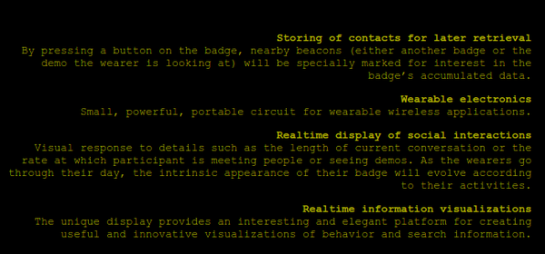

* The applications of UbER - Badge.
    * As a wearable electronics.
    * Real time display of social interaction.
    * Real time information visualizations.
    * Storing contacts.

[./20161106-2306-gmt+2-brp-state-of-the-art-8-uber-badge-21-presentation.pdf](./20161106-2306-gmt+2-brp-state-of-the-art-8-uber-badge-21-presentation.pdf)

[./20161106-2306-gmt+2-brp-state-of-the-art-8-uber-badge-21-presentation.ppt](./20161106-2306-gmt+2-brp-state-of-the-art-8-uber-badge-21-presentation.ppt)

* UbER - Badge presentation.

[./20161106-2306-gmt+2-brp-state-of-the-art-8-uber-badge-22-paper.pdf](./20161106-2306-gmt+2-brp-state-of-the-art-8-uber-badge-22-paper.pdf)

* UbER - Badge official research paper.

[./20161106-2306-gmt+2-brp-state-of-the-art-8-uber-badge-23-developer-guide.pdf](./20161106-2306-gmt+2-brp-state-of-the-art-8-uber-badge-23-developer-guide.pdf)

* Developer guide for UbER - Badge.
* As you can see within the document the price (at that time) for just the micro controller is around 99 US Dollars.

[./20161106-2306-gmt+2-brp-state-of-the-art-8-uber-badge-24-proposal.pdf](./20161106-2306-gmt+2-brp-state-of-the-art-8-uber-badge-24-proposal.pdf)

* UbER - Badge project proposal.