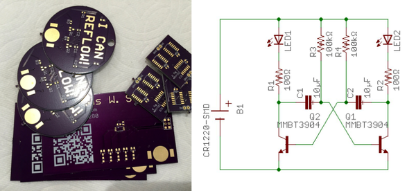

* This is my summary for "I Can Reflow" Merit Badge.

* The schematics of this badge.

* This badge has nothing fancy.
* But, nevertheless it tries to to teach people on how to solder.
* Here is the full article from Hackaday, [https://hackaday.com/2016/06/26/i-can-reflow-merit-badge/](https://hackaday.com/2016/06/26/i-can-reflow-merit-badge/).
* Here is the screenshot of the Hackaday article.

* Here is the documentation, [https://oshpark.com/shared_projects/YrOVLhQb](https://oshpark.com/shared_projects/YrOVLhQb).
* Here is the screenshot of the documentation.

