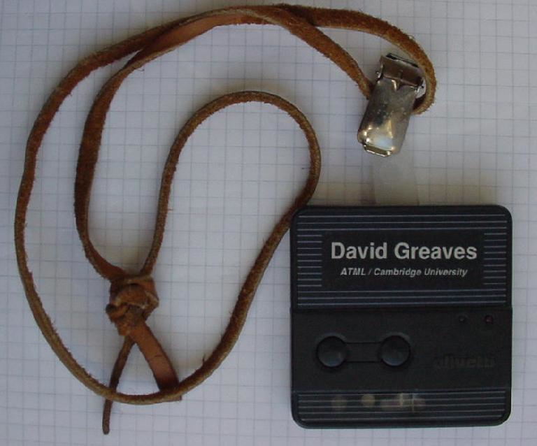
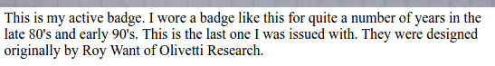
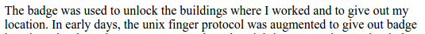
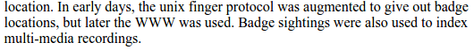
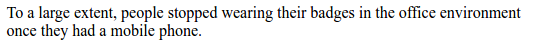
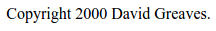
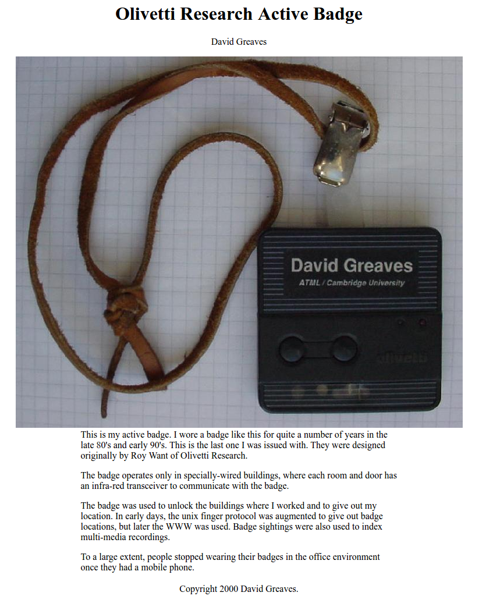

* Here is my review of Active Badge that was built by Olivetti Research in late 80's (around 1990).
* The website of Olivetti Research, [http://www.olivetti.it/](http://www.olivetti.it/). However, this is different than the Olivetti Research. The Olivetti Research went and built Olivetti, I assume this was because later Olivetti Research became AT&T Laboratories.

* This is the image of the Active Badge.
* It looks pretty neat actually.

* This badge was designed by Roy Want, [http://www.roywant.com/cv/vita.htm](http://www.roywant.com/cv/vita.htm).
* Below is a Roy Want CV.

[./20161108-2231-gmt+2-brp-state-of-the-art-10-active-badge-3.pdf](./20161108-2231-gmt+2-brp-state-of-the-art-10-active-badge-3.pdf)

* The badge was used to unlock an office building.

* There was this UNIX finger protocol that gives out the Active Badge location (?).

* People stopped using this badge once they have mobile phone.

* This article was created on 2000. This is like 10 years after active badge was released.
* Does this infer that Active Badge has 10 years life span?
* Here is the link to the article, [http://koo.corpus.cam.ac.uk/projects/badges/](http://koo.corpus.cam.ac.uk/projects/badges/).
* Here is the full screenshot of the tutorial.

