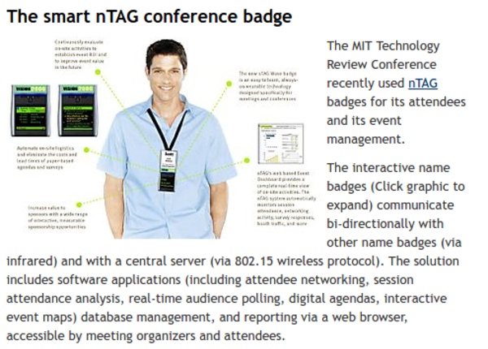
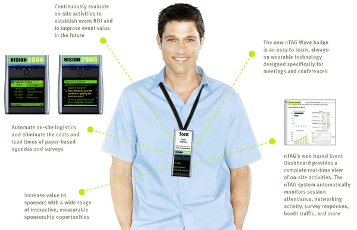

* There is this nTag Conference Badge article from 2008, [http://florence20.typepad.com/renaissance/2008/10/the-smart-ntag-conference-badge.html](http://florence20.typepad.com/renaissance/2008/10/the-smart-ntag-conference-badge.html).
* This badge is used by The MIT Technology Review Conference.
* The nTag Conference Badge is used to manage attendees and to manage the event.
* The badge connect to other badge via infrared.
* The badge connect to its central server via a WiFI module.
* Here is the full screenshot of the article.

* Some features of this nTag Conference Badge are these.
    * Applications.
        * Attendees networking.
        * Digital agendas.
        * Interactive event maps.
        * Logistic management.
        * Session attendance analysis.
    * Database management.
    * Interactive sponsorship opportunities.
    * Real time web application that accessible for the organizers and the attendees.
* Here is the screenshot of the feature specifications.

