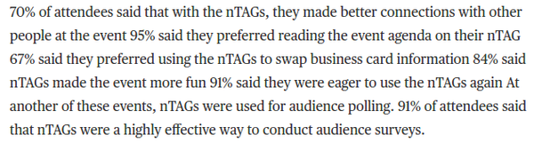
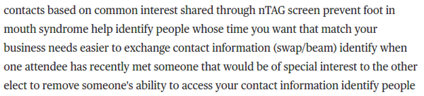

* This article was released in 2014.
* nTag Badge was released on 2004.
* nTag was made to enhance people to people networking in a conference.

* nTag is based on years of research in MIT Media Lab.

* These are the benefits of using nTag Badge.
    * Conduct polling in real time.
    * Evaluate surveys.
    * Help organizers to deliver event information (broadcast message).
    * Manage security.
    * Send massages.
    * To make easier conversation between attendees in a conference.
* nTag Badge exchanges data with each others using infrared as the wearers approach each others.

* Example case of the benefit of using nTag Badge in a conference.

* Badge physical specifications.
    * 10 cm wide.
    * 170 grams weight.
    * 9 cm height.
* Similar appearance to traditional conference badge.
* It has these.
    * 3 control buttons.
    * LCD screen.
    * RFID systems.
* nTag Badge connects individuals with mutual interest(s) and needs.

* The wearers input data at the beginning of the conference.
* The data is the preferences of the wearer.
* When the conference starts the badge will already be filled with with the preferences of the wearer.

* It says here that the nTag connect to the server via RFID, but I think it connects to server using WiFI and not RFID.
* This allowing the conference organizers to monitor these.
    * Broadcasting information and schedule.
    * nTag Badges interactions.
    * Polling.
    * Surveys.
    * What ideas are being shared.

* The organizer can also promotes idea sharing that is broadcast within the badges to promote discussion(s) and interactions.
* For example by assigning discuss able question.

* Comment from the nTag co - founder.
* George Eberstadt now owns, [http://www.turntonetworks.com/](http://www.turntonetworks.com/).

* The thing with nTag Badge is that data is stored in real time. Unlike using traditional survey paper.
* Hence the polling and survey result can be known immediately.

* B2B means business to business.
* This case example shows that nTag Badge could be modified to have different color to segment conference participants.

* Attendees likes nTag.

* These are how nTag works.
    * Attendees register and is given nTag.
    * nTag Badge can be pre - installed with basic preferences.
    * There is a kiosk for attendees to manage/update their preferences inside the badge.
    * The process take ~30 seconds.

* For attendees nTag Badge has this benefits.
    * Attendees inputs (polling and survey).
    * Enhanced networking.
        * nTag helps its wearer to find people that has likely to be beneficial for your network.
    * Event logistic.

* Benefits of using nTag Badge for the conference organizers.
    * Enhanced networking.
    * Event logistic.
    * Key data. Key data means to data mine like, how many attendees are in the conference at certain time, how people meet to each others, ...).
    * Polling.
    * Tracking.

* Here is the link to the article, [http://newatlas.com/go/2543/](http://newatlas.com/go/2543/).
* Here is a full screenshot of the article.

