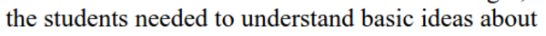
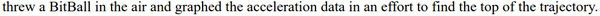

* "Manipulative materials" that is meant here is a hackable thing for kindergarten students to learn.
* Clear example of "manipulative material" is LEGO brick.

* There is also this term called "digital manipulative" this is meant for program that is easily hackable.
* For example of this "digital manipulative" is Minecraft Mods.

* This article specifically gives information on what kind of manipulative materials are there.
* This article is similar to state of the art review for manipulative learning material.

* Friedrich Froebel invented the first kindergarten in Germany in 1837.

* Maria Montessori extended Friedrich Froebel's concept of kindergarten by adding social activity that plays central role in the students life.
* That activity also meant to build network around the kindergarten students.

* Jean Piaget construct a principle that children needs to learn through practice first before go into more formal education.

* LEGO toys are used in more than 20.000 schools in United States Of America.

* There is also a LEGO that let children to write computer program.

* The program that the children alters/hacks/makes is intended to controls their LEGO construction.

* There is this Programmable Bricks.
* Each bricks have a function. For example like motor or sensor.
* Then children can connects these bricks together and programs it to give new functionality to the bricks.

* These Programmable Bricks can be used to create autonomous creatures (simply say it robot).

* However, the problem with the Programmable Bricks is that the student need to learn the basic knowledge first.

* The Programmable Bricks teach children about basic feedback and control.

* Their newest Programmable Bricks are called Crickets.
* It has a Wikipedia entry, [https://en.wikipedia.org/wiki/Programmable_Cricket](https://en.wikipedia.org/wiki/Programmable_Cricket).
* The product name is PicoCricket.
* It made by MIT Media Art.

* There is also a Programmable Beads that can be used to teach children about mathematics sequences.
* The Programmable Beads has a central micro controller and at basic it has LED.
* At basic the programmable beads has an example of 1 dimensional automata.

* Children can use pre - programmed features of the Programmable Beads to observe lightning patterns from the interactions.
* For more advance users, they can write new program and then upload it into the beads.

* A string of Programmable Beads can be viewed as a physical instantiation of a 1 dimensional cellular automata.

* There is a programmable ball called BitBall.
* Children can codes and upload the codes into the BitBall via infrared communication.

* BitBall can also be used for scientific purposes.

* For example BitBall can be used to understand acceleration.
* It says here that this method can be used to easily transfer new contexts.

* The BitBall can be thrown to air then it will graph the acceleration data in order to find its top trajectory.

* There was this Thinking Tag that is based on traditional badge.
* The differences is that it can contact other Thinking Tag using infrared communication.
* Then it will react accordingly based on the received communication.
* I think here most badges that I have been looked into has infrared communications. Is infrared mandatory for sociometric badges?

* Thinking Tag was made for adults to be used in conference.
* Thinking Tag was also developed by MIT Media Lab.

* From what I understand before is that this Thinking Tag is like social networking in real life.
* A physical Facebook.

* The Thinking Tag stores preferences and other personal stuffs. For example it can be also used to store the user favorite quotations.
* When 2 Thinking Tag wearers meet the badges exchange data.

* Information then showed in a small screen.
* And based on those LEDs above the screen, the users can know their similarity to each others (in term of how many preferences are mutual, ...).

* There is also Smart Badge.
* But Smart Badge was designed to monitor human interaction with machine (for example, office electronic door, wearer location within a building).

* Thinking Tag have proved successful as a catalyst in conversation.

* Here is 2 Thinking Tag wearer sharing data to each others.

* There was this case of the usage of Thinking Tags about virus that jumping over tag to tags.
* The challenge here was that to students to develop theories on how the virus works.

* Thinking Tag encourages collaborative theory building.

* At that time "memes" meant ideas.

* The Thinking Tag discover that some people were more resistant to new ideas that other people.

* The latest iteration of Thinking Tag has a two lines display.
* These display used to display text messages.
* Thinking Tag were able to hold up to 7 ideas/memes at that time.

* There is a push button for the Thinking Tag wearer to save his/her favorite ideas/memes.
* The data can also be extracted from Thinking Tag so that it can be analyzed.
* Link to the article, [http://web.media.mit.edu/~mres/papers/chi-98/digital-manip.html](http://web.media.mit.edu/~mres/papers/chi-98/digital-manip.html).
* Full screenshot of the article.

