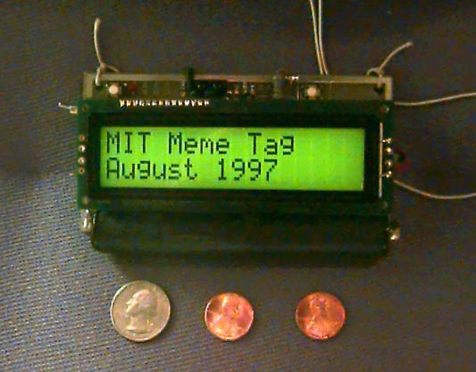
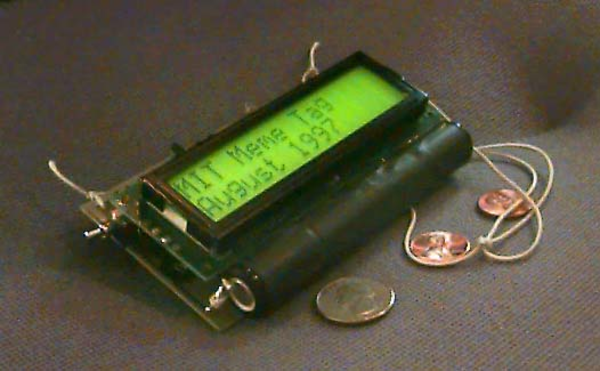
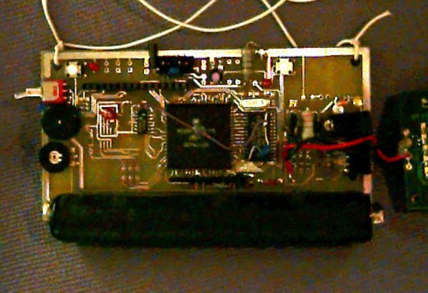

* Meme Tag hardware specifications.

* It has LCD screen.
* It uses elastic wire to tied this tag into the its wearer neck.

* It is shown here that this Meme Tag uses 2 AA battery to operate.

* The open view shows most of the circuitry. The large square chip is a 68HC11, the chip to the right of it is the static RAM.
* Here are some links of Meme Tag.
    * [http://www.cs.uml.edu/~fredm/medialab/memetag/](http://www.cs.uml.edu/~fredm/medialab/memetag/), Meme Tag homepage.
    * [http://www.cs.uml.edu/~fredm/medialab/memetag/manovervw.html](http://www.cs.uml.edu/~fredm/medialab/memetag/manovervw.html), Meme Tag brief hardware specifications.
    * [http://www.cs.uml.edu/~fredm/medialab/memetag/manufacture.html](http://www.cs.uml.edu/~fredm/medialab/memetag/manufacture.html), Meme Tag manufacture web page.