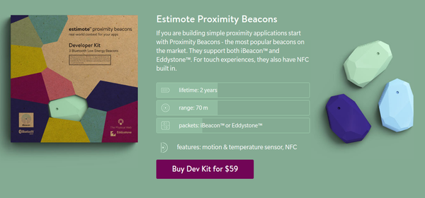
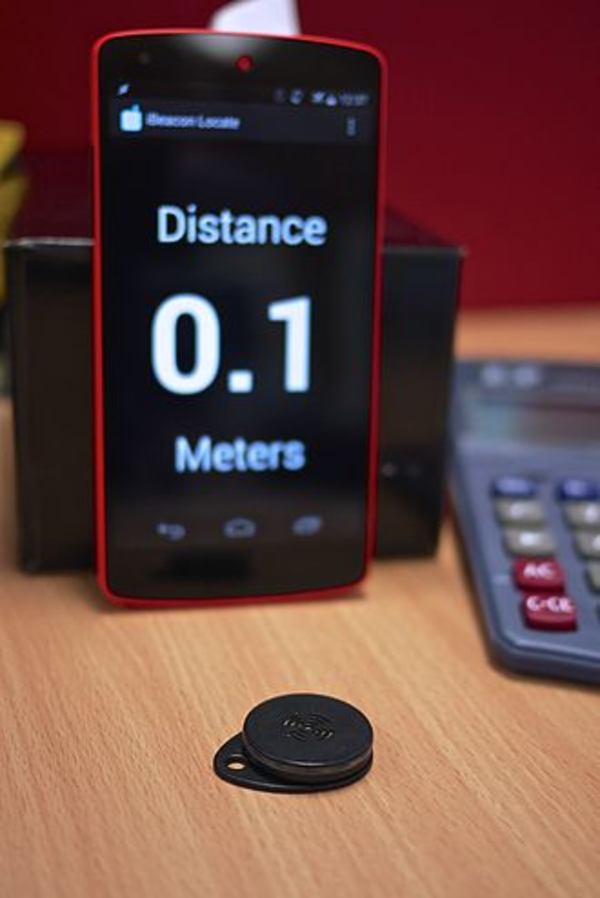

* BLE (Bluetooth low energy) is mostly found in beacon based physical application.
* This Bluetooth beacon is used to manage indoor positioning system (the opposite of global positioning system (GPS)).

* There is this proximity beacon that is developer friendly, named Estimote [http://estimote.com/](http://estimote.com/).
* There is also this GitHub system to get indoor positioning for most WiFi enabled device (including Raspberry PI), [https://github.com/schollz/find](https://github.com/schollz/find). I think this is the most relevant way to achieve proximity detection for my Sociometric Badge for now.
* Apple has a solution for this indoor positioning system called iBeacon. This was released in 2013 yet I never heard about this before, [https://en.wikipedia.org/wiki/IBeacon](https://en.wikipedia.org/wiki/IBeacon).

* Here is an Apple official documentation about iBeacon, [https://developer.apple.com/ibeacon/](https://developer.apple.com/ibeacon/).
* There is this YouTube video that I got from a Reddit that thread I made, [https://www.youtube.com/watch?v=Dw_7Q3LGuOI](https://www.youtube.com/watch?v=Dw_7Q3LGuOI). Here is a link to my Reddit thread asking for a way to determine distance between two Raspberry PIs, [https://www.reddit.com/r/raspberry_pi/comments/5ayn6q/hello_i_need_recommendation_on_detecting/](https://www.reddit.com/r/raspberry_pi/comments/5ayn6q/hello_i_need_recommendation_on_detecting/).