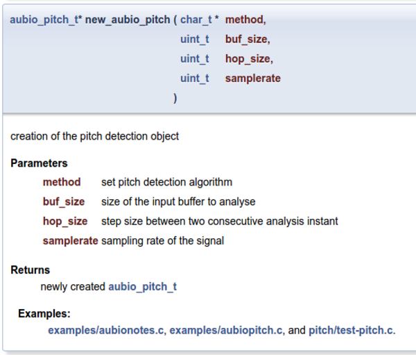
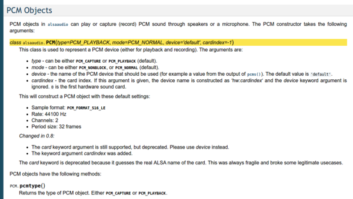
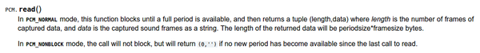
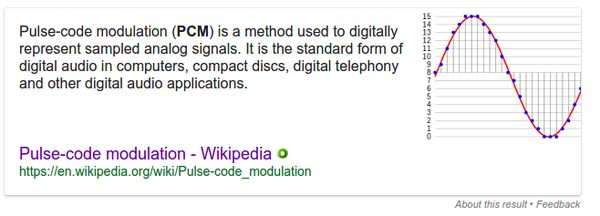
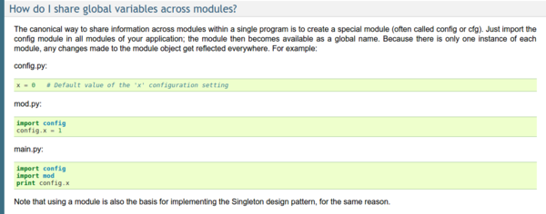
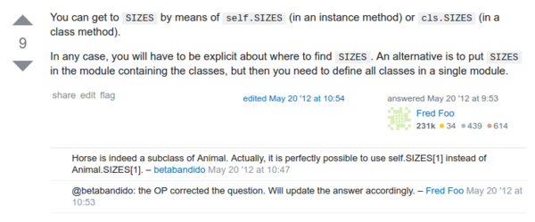
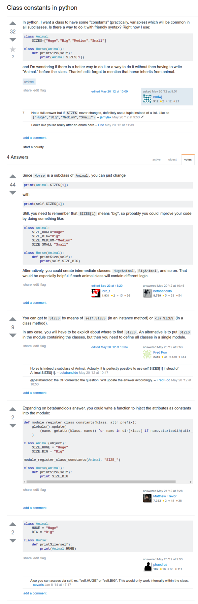
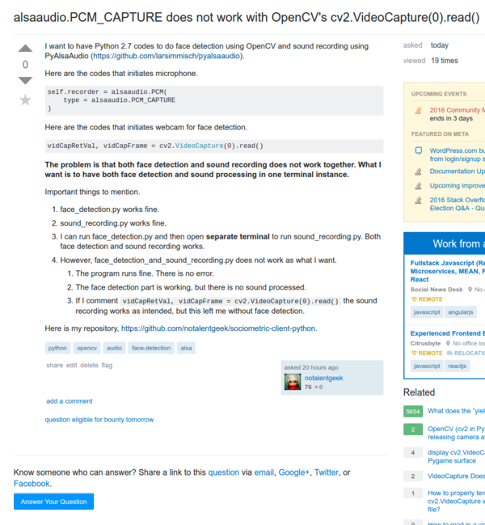
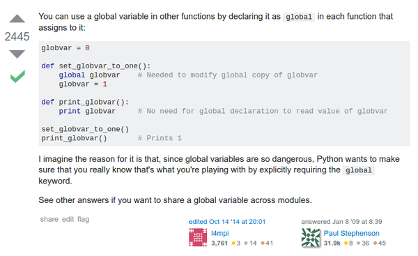

* `aubio` documentation about initiating a pitch detector, [https://aubio.org/doc/latest/pitch_8h.html#a962561ea270e0308ed26ac9bab554550](https://aubio.org/doc/latest/pitch_8h.html#a962561ea270e0308ed26ac9bab554550).
* The 1st parameter is the method of the pitch detection. Up to now, I only know "DEFAULT" method. I am not sure if there is other methods and if those other methods better for my case. Nevertheless, I will keep using "DEFAULT" for now on.
* The 2nd parameter is a buffer before the sound sent to be processed.
* The 3rd parameter is said to be the interval between two consecutive sound analysis. The variable used is called `hop_size`. Other than these, I am not sure on what does this parameter do.
    * In the example code `hop_size` is buffer divided by 2 and rounded up.
* The last parameter is the sample size. I do not know what does sample size do.



* This website shows an example of initiating `alsaaudio` PCM object in Python, [http://larsimmisch.github.io/pyalsaaudio/libalsaaudio.html?highlight=alsaaudio.pcm#alsaaudio.PCM](http://larsimmisch.github.io/pyalsaaudio/libalsaaudio.html?highlight=alsaaudio.pcm#alsaaudio.PCM).
* `alsaaudio` PCM object can be used to either read or record/stream from microphone.
* Because I am going to use `alsaaudio` for audio recording I need to set `type = alsaaudio.PCM_CAPTURE`.
* Here is an example of code of my `alsaaudio` object in Python.

```markdown
self.recorder = alsaaudio.PCM(
    type = alsaaudio.PCM_CAPTURE
)
```



* `PCM.read()` returns a length and data tuple, [http://larsimmisch.github.io/pyalsaaudio/libalsaaudio.html?highlight=alsaaudio.pcm#alsaaudio.PCM](http://larsimmisch.github.io/pyalsaaudio/libalsaaudio.html?highlight=alsaaudio.pcm#alsaaudio.PCM).



* I was wondering what does PCM means. PCM means Pulse-code Modulation. PCM is used to digitally represent analog signals, [https://en.wikipedia.org/wiki/Pulse-code_modulation](https://en.wikipedia.org/wiki/Pulse-code_modulation).



* Sharing variable across modules in Python, [https://docs.python.org/2/faq/programming.html#how-do-i-share-global-variables-across-modules](https://docs.python.org/2/faq/programming.html#how-do-i-share-global-variables-across-modules).
* Example.

```markdown
#variable.py
variable_text = "Hello world!"
```

```markdown
#other.py
import variable
variable.variable_text = variable.variable_text + " Hello world again!"
#This print will result in "Hello world! Hello world again!"
print(variable.variable_text)
```

* Example of constant in Python. Although, Python has no specific method on how to make constant, [http://stackoverflow.com/questions/10672419/class-constants-in-python](http://stackoverflow.com/questions/10672419/class-constants-in-python).



* So, constant can be treated as other normal Python variables. So, make sure to have use prefix `self` in variable that is class wide available.
* Screenshot to the StackOverflow Python discussion.



* My Python thread in StackOverflow, [http://stackoverflow.com/questions/40686640/alsaaudio-pcm-capture-does-not-work-with-opencvs-cv2-videocapture0-read](http://stackoverflow.com/questions/40686640/alsaaudio-pcm-capture-does-not-work-with-opencvs-cv2-videocapture0-read). Seems there is no one that understand the problem. Although, I think I put too specific title.
* Nevertheless, the problem is now solved by only using face detection in appropriate moment. Before, face detection is always on and it makes the program takes more RAM.
* Here is the screenshot of the thread.





* Example of using global variable in Python, [http://stackoverflow.com/questions/423379/using-global-variables-in-a-function-other-than-the-one-that-created-them](http://stackoverflow.com/questions/423379/using-global-variables-in-a-function-other-than-the-one-that-created-them).
* However, for now I will not using this and use the sharing variable across module.