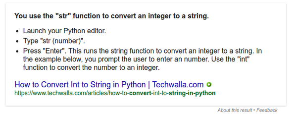
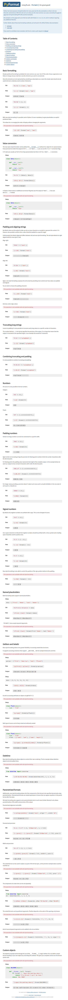
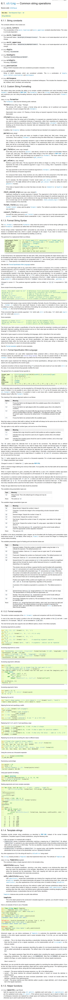
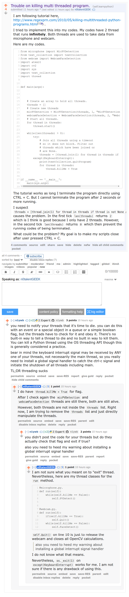
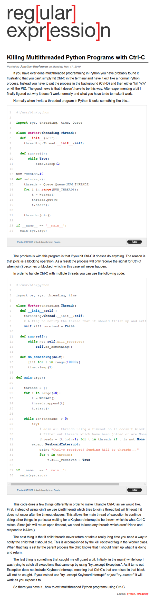
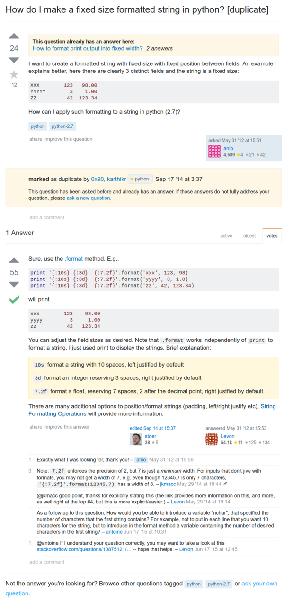
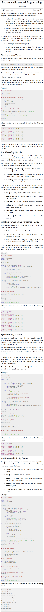

* First thing is that I need to know when a conversation happen.
* Based on what I test briefly.
    * If I speak cautiously the pitch is around 100.
    * If I speak cautiously the volume is around 0,001.
    * If I speak normally the pitch is around 100
    * If I speak normally the volume is around 0,0005.
* Which means that speaking normally happens around 100 pitch and 0,0001 volume.
* Another problem would be that when the web cam started the program takes time to initiate connections to the webcam. Hence, web cam need to be started when the program start and not when the conversation happen.
    * I can do this by letting the webcam take a sample frame when the badge boots.
* There is also a bit of lag when webcam tries to detect faces. My current solutions would be like this.
    * Tell web cam to take one frame when boot.
    * Then calculate when a conversation happen to take another frame.
* Or these solutions could work as well.
    * Multi threading and asynchronize (the hard way).
    * Using 2 separate terminal instances of Python (the simple way).
* Using multi threading works like a charm.
* Now, I need to make sure that I can terminate the program, because this when using multi threading the program will not be closed in normal way.

* In Python you can use `str(a_variable_here)` to cast anything into string.
* Example of creating empty array in Python, `my_array_name = []`.
* Python string formatting guide, [https://pyformat.info/](https://pyformat.info/).
* Full screenshot of the article.

* This is a good thing to remember, Python documentation for string formatting, [https://docs.python.org/3/library/string.html](https://docs.python.org/3/library/string.html). Specifically look at how to format string example.
* Python has one of the best string manipulation out of other programming languages that I have ever tried.

* Up until this moment I have trouble on killing multi threaded Python script.
* My current solution is to do `os._exit(1)` which is to terminate the running Python script the hard way.
    * This means `atexit` function will not be run.
    * This is not the ideal solution on terminating a running script.
    * I need to search the proper way to terminate a running Python script. At least I need to make sure that I can still execute a function/method before the running script terminated.
* I made a Reddit thread over here, [https://www.reddit.com/r/learnpython/comments/5dxum0/trouble_on_killing_multi_threaded_program/](https://www.reddit.com/r/learnpython/comments/5dxum0/trouble_on_killing_multi_threaded_program/), to ask about closing multi threaded script. However, there is no good answer yet.
* Here is the full screenshot of the Reddit thread.

* I was using this, [http://www.regexprn.com/2010/05/killing-multithreaded-python-programs.html](http://www.regexprn.com/2010/05/killing-multithreaded-python-programs.html), tutorial to guide me on closing multi threaded Python script. It sorta works. Perhaps, this tutorial does not work fully on my case because my thread was intended to run forever.
* This is the full screenhot of the tutorial.

* Another guide for string formatting in Python from StackOverflow, [http://stackoverflow.com/questions/10837017/how-do-i-make-a-fixed-size-formatted-string-in-python](http://stackoverflow.com/questions/10837017/how-do-i-make-a-fixed-size-formatted-string-in-python). I think this is the most straight forward guide for me to use.
* The screenshot from StackOverflow.

* In Python you can append an element into an array/list via `my_array_or_list.append(the_thing_i_want_to_add)`. Check StackOverflow discussion here, [http://stackoverflow.com/questions/10487278/python-how-to-declare-and-add-items-to-an-array](http://stackoverflow.com/questions/10487278/python-how-to-declare-and-add-items-to-an-array).
* Tutorial from TutorialPoints about Python multi threading, [https://www.tutorialspoint.com/python/python_multithreading.htm](https://www.tutorialspoint.com/python/python_multithreading.htm).

