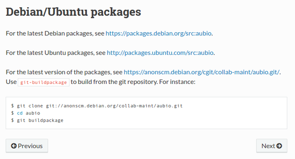
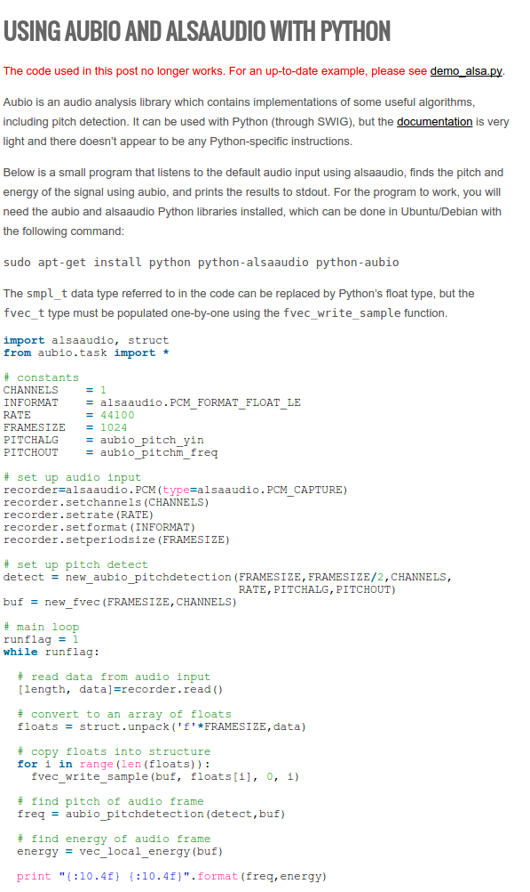
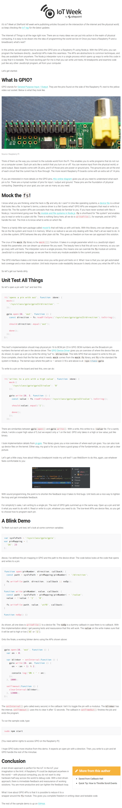

* This project log basically a collection of links. However, These might helpful or not.
* [http://aubio.org/download](http://aubio.org/download), lint to download Aubio.
* Aubio is a audio manipulating library for Python.
* [http://aubio.org/manpages/latest/aubiopitch.1.html](http://aubio.org/manpages/latest/aubiopitch.1.html), Aubio has a command line application called `aubiopitch` to extract energy (volume) and the pitch of an audio file. This can be done all using terminal command and without any programming.
* [http://people.csail.mit.edu/hubert/pyaudio/](http://people.csail.mit.edu/hubert/pyaudio/), another alternative to Aubio. PyAudio is a Python library to help on audio programming. I think this is similar to Minim library in Processing. However, I have intention to use this library just yet.
* [http://webaudiodemos.appspot.com/](http://webaudiodemos.appspot.com/), a neat framework for audio processing with web technology. In this case, this is a library to manipulate audio using JavaScript. Definitely an alternative to look in case I want to make a sociometric badge variant with web technologies.
* [https://aubio.readthedocs.io/en/latest/debian_packages.html](https://aubio.readthedocs.io/en/latest/debian_packages.html), here is a tutorial on how to install Aubio in Debian or Ubuntu based operating system.
* Here is the screenshot.



* [https://chrisbaume.wordpress.com/2013/02/09/aubio-alsaaudio/](https://chrisbaume.wordpress.com/2013/02/09/aubio-alsaaudio/), here is an article to use `alsaaudio` library with Python.
* Here is the screenshot of the article.



* [https://github.com/aubio/aubio/blob/master/python/demos/demo_alsa.py](https://github.com/aubio/aubio/blob/master/python/demos/demo_alsa.py), example code on how to extract energy (volume) and pitch of audio streamed from microphone.
* The codes.

```markdown
#! /usr/bin/env python

import alsaaudio
import numpy as np
import aubio

# constants
samplerate = 44100
win_s = 2048
hop_s = win_s // 2
framesize = hop_s

# set up audio input
recorder = alsaaudio.PCM(type=alsaaudio.PCM_CAPTURE)
recorder.setperiodsize(framesize)
recorder.setrate(samplerate)
recorder.setformat(alsaaudio.PCM_FORMAT_FLOAT_LE)
recorder.setchannels(1)

# create aubio pitch detection (first argument is method, "default" is
# "yinfft", can also be "yin", "mcomb", fcomb", "schmitt").
pitcher = aubio.pitch("default", win_s, hop_s, samplerate)
# set output unit (can be 'midi', 'cent', 'Hz', ...)
pitcher.set_unit("Hz")
# ignore frames under this level (dB)
pitcher.set_silence(-40)

print("Starting to listen, press Ctrl+C to stop")

# main loop
while True:
    try:
        # read data from audio input
        _, data = recorder.read()
        # convert data to aubio float samples
        samples = np.fromstring(data, dtype=aubio.float_type)
        # pitch of current frame
        freq = pitcher(samples)[0]
        # compute energy of current block
        energy = np.sum(samples**2)/len(samples)
        # do something with the results
        print("{:10.4f} {:10.4f}".format(freq,energy))
    except KeyboardInterrupt:
        print("Ctrl+C pressed, exiting")
        break
```

* [https://github.com/aubio/aubio/issues/72#issuecomment-260916688](https://github.com/aubio/aubio/issues/72#issuecomment-260916688), my issue in the Aubio repository page.
* [https://github.com/cwilso/PitchDetect/blob/master/js/pitchdetect.js](https://github.com/cwilso/PitchDetect/blob/master/js/pitchdetect.js), example of pitch detection using JavaScript.
* [https://github.com/eduardolundgren/tracking.js/blob/master/examples/face_camera.html](https://github.com/eduardolundgren/tracking.js/blob/master/examples/face_camera.html), example code from TrackingJS on how to do face detection.
* [https://github.com/nwjs/nw.js/wiki/Control-camera-and-microphone-with-getusermedia-api](https://github.com/nwjs/nw.js/wiki/Control-camera-and-microphone-with-getusermedia-api), .
* [https://trackingjs.com/examples/face_camera.html](https://trackingjs.com/examples/face_camera.html), example page from TrackingJS on how to do face detection and tracking. As you can see here, human user need to handled the usage of web cam permission from the web browser. Unless there is way to automate the permission, using TrackingJS for this project is not "automatic" enough. What I want is for the sociometric application to automatically granted permission to use web cam.
* [https://ubuntuforums.org/showthread.php?t=1811171](https://ubuntuforums.org/showthread.php?t=1811171), you can open Chromium Browser from terminal using this command `chromium-browser`.
* In case you want to open specific URL directly then go with this example, `chromium-browser https://www.google.com`.
* [https://www.sitepoint.com/getting-started-with-the-raspberry-pi-gpio-pins-in-node-js/](https://www.sitepoint.com/getting-started-with-the-raspberry-pi-gpio-pins-in-node-js/), tutorial on programming Raspberry PI's GPIO with NodeJS.
* Here is the screenshot.

