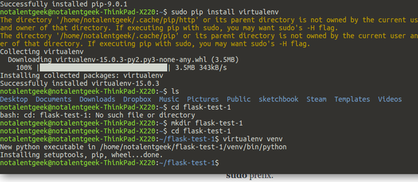
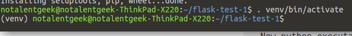
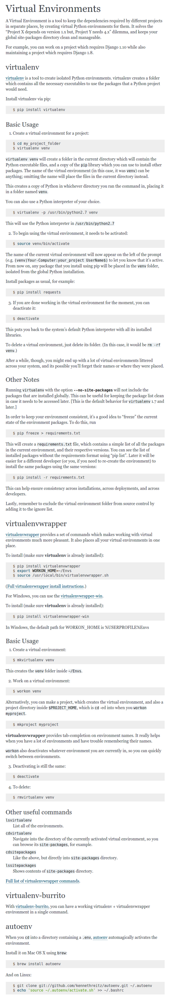

* There is this concept on video streaming called motion JPEG.
* Motion JPEG is streaming JPEG image over and over within certain time interval. So, the result is like a choppy stop motion animation.
* However, motion JPEG is beneficial in high latency network. Hence, this method is used more in security camera, so that it can take more videos compared to binary video file (.avi, .mpeg).
* Anyway, there is this command to start web server in Python. This is simple server only for serve file statically, so there is no MySQL or PHP installed. The terminal command is `python3 -m http.server 8000`. I am not sure of this command also available for Python 2.x.
* In Flask (I think requirements.txt is only for Flask) there is this `requirements.txt` that is the `package.json` (from NodeJS) in Flask project.
* On the other hand, I failed to install OpenTOK with this command, `pip install opentok-python-sdk`. Here are things that I did to solve this problem.
    * The work around can be find in OpenTOK GitHub repository, [https://github.com/opentok/Opentok-Python-SDK](https://github.com/opentok/Opentok-Python-SDK).
    * Create an empty `requirements.txt` and put it in the root of the project directory.
    * Then run `pip install -r requirements.txt`. However, make sure that this command execute within Python virtual environment.
    * After this the OpenTOK Python SDK installed in my Ubuntu Linux computer.





* Here are example on creating Python virtual environment.

```markdown
mkdir my_project_folder
cd my_project_folder
virtualenv venv
. venv/bin/activate
```

* After those commands you can just install Python library using `pip` without installing Python library into the operating system directly.
* This tutorial will show you on how to install Python virtual environment, [http://docs.python-guide.org/en/latest/dev/virtualenvs/](http://docs.python-guide.org/en/latest/dev/virtualenvs/).
* Here is the screenshot of the tutorial.



*  As you can see the `requirements.txt` is actually a thing from `virtualenvironment`