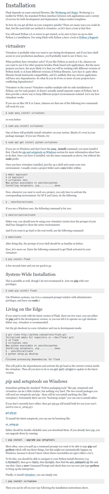
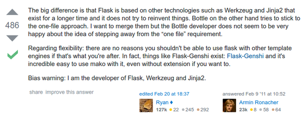

* Here is a link to Flask installation tutorial, [http://flask.pocoo.org/docs/0.11/installation/](http://flask.pocoo.org/docs/0.11/installation/).
* Here is the screenshot from the tutorial.

* Here is a Flask quick start guide, [http://flask.pocoo.org/docs/0.11/quickstart/](http://flask.pocoo.org/docs/0.11/quickstart/).
* Here is the full screenshot of the guide.

* Discussion about Bottle vs. Flask. Both are Python server side scripting that offer simplicity offer features. Here is the link to the discussion, [http://stackoverflow.com/questions/4941145/python-flask-vs-bottle](http://stackoverflow.com/questions/4941145/python-flask-vs-bottle).

* To sum up with, Bottle is simpler than Flask. However, it is not scalable. Flask is scalable but still intended for smaller project.
* For this project keep using Python 2.x. There are some configuration necessary for Python 3.x. Changing codes into Python 3.x takes time, better use Python 2.x for this project.
* The Flask setup is done when Flask is installed in a virtual environment.
    * Move to virtual environment.
    * Run `pip install flask` in terminal.
* Now move to Flask quick started tutorial.
* Do not forget to restart in case the newly installed module does not working. In my case the command `mkvirtualenv` does not working after installation unless I restarted my computer. So, just remember to restart computer in case there is a newly installed module that does not working.
* The installation of Raspbian in Raspberry PI did not work as intended because I use faulty micro SD card.
* So please make sure to use micro SD card from good manufacture and from good store.
* Here is my Reddit thread concerning about this problem, [https://www.reddit.com/r/raspberry_pi/comments/5fykn3/i_have_been_installing_raspbian_from_noobs_four/](https://www.reddit.com/r/raspberry_pi/comments/5fykn3/i_have_been_installing_raspbian_from_noobs_four/).
* Here is the screenshot of the Reddit thread.

