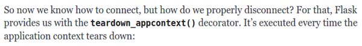
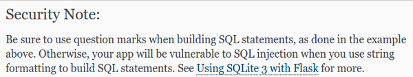

* There will be an AssertionError when the assert condition does not meet.
* This does not mean that the program is buggy/vaulty.


* `app.root_path` refer to the root directory of the Python project.
* This notion comes from Python's `os.path` module. So, I need to `import os` at the start of the Python codes.


* It is a good idea to separate environmental settings and any other specific configuration files.
* Flask allows one to import these setting as a separate files later on if the settings is necessary.
* There is a method `from_envvar()` that is used to enable robust configuration setup. However, I am not sure yet on how to use this. Perhaps this is useful for this project? I am not so sure.


* Ooo `from_envar()` is a method to called your pre - made environmental variables.
* From this example `app.config.from_envvar('FLASKR_SETTINGS', silent=true)` means that this Flask web application will look into `FLASKR_SETTING` environment variable (in Linux, `export FLASKR_SETTING=value_here`) the `silent=true` means that this application will not complain if the setting value is not provided.


* Basically there is this function to connect the Flask web application with database.
* This tutorial used SQLite3 for database. So I am not sure if the method to connecting to database is different to non - lite SQL.
* Here are the codes to connecting to database.

```markdown
def connect_db():
    rv = sqlite3.connect(app.config['DATABASE'])
    rv.row_factory = sqlite3.Row
    return rv
```

* There are little to no description on what this codes does.
* I think the `sqlite.connect()` is for connecting to the database.
* Then I suggest that its first argument is the database path which is located in `app.config['DATABASE']`.
* When assigning a variable into `sqlite3.connect()` I assume it returns the database object itself. Hence, the variable now has access to `row_factory` field.
* I am not sure on how the `sqlite3.Row` works.


* There is a method in Flask of where you can assign new command to be executed in terminal.


* So here is the basic setup to run the Flask web application.

```markdown
export FLASK_APP=main_entry_of_your_flask_application.py
export FLASK_DEBUG=1
flask run
```

* The first line is to determine the entry point of this Flask web application.
* The second line is to set Flask application in debug mode. Means that the application will not required to be stopped and then run again to see the changes made.


* Use `set` instead of `export` when using Windows.
* Also never use debugging mode for a production system. Debugging mode will allow user to execute code in server.


* This was an example of the code working.
* There is nothing to display on `'/'` because the route is not yet set.


* Transaction encapsulation, I am not sure on why on the ideal case there will be only one request at the time that uses the database connection.
* What happen in the real time application if there are multiple request at the same time?


* Flask provides application context and the request context.
* In NodeJS' ExpressJS there are request and response handler. But in Flask there are the application context and the request context.
* I am not so sure if these notion from NodeJS's ExpressJS works the same with Flask.


* There is this `flask.g` object that can be used to store settings across sessions.




* There is a `teardown_appcontext()` decorator that will execute codes when the the application is closed in the client side. It says in this tutorial that `teardown_appcontext()` will be executed when a request finishes.
    * When everything went well (the error parameter will be `None`)
    * An exception happened.
* This is useful to disconnect the connection to the database.


* I am not sure why it is necessary to put all of these methods after `connect_db()` function.


* It is only says that this is logical to put methods for same module together.
* So, there would be no harm to put it alphabetically I guess.


* Flask is a database powered application.
* Hence, we need to create schema first for every database that we are going to make.


* Relational database is the SQL variants.
* Does this means that Flask is not intended to use with NoSQL databases like MongoDB?


* Basic command to create schema are as follows, `sqlite3 /tmp/flaskr.db < schema.sql`.
* However, the command needs to have `sqlite3` CLI application to be installed.
* There is a Flask way to generate database from schema.
* It is also good to have in application method to build and initialize database for the application itself.


* I had this problem.
* I thought the problem lies on my Python codes.
* But the problem actually is in my schema file.
* It is supposed to be `exists` no `exist`.


* The `sqlite3.Row` makes the returned value looks like a Python's dictionary.


* When you can to refactor your project it is necessary to create new virtual environment.
* Delete the `venv` folder and initiate `virtualenv venv` again.
* Because otherwise the path will stay in the old project's directory.



* You need to use question marks when building SQL statement.
* Otherwise the application will be vulnerable to SQL injection.
* Example codes.

```markdown
db.execute(
    'insert into entries (title, text) values (?, ?)',
    [request.form['title'], request.form['text']]
)
```