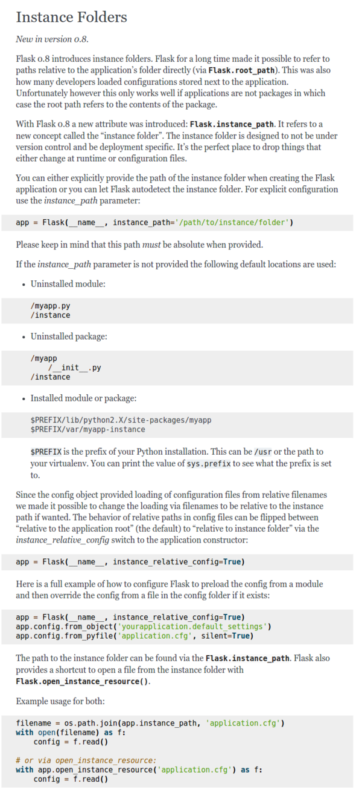
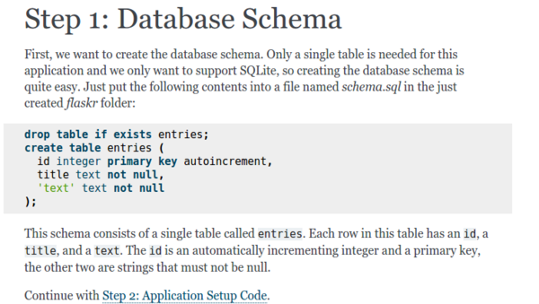
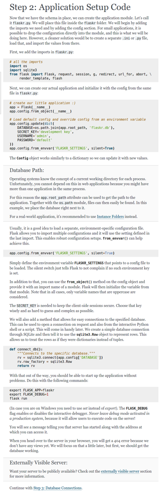
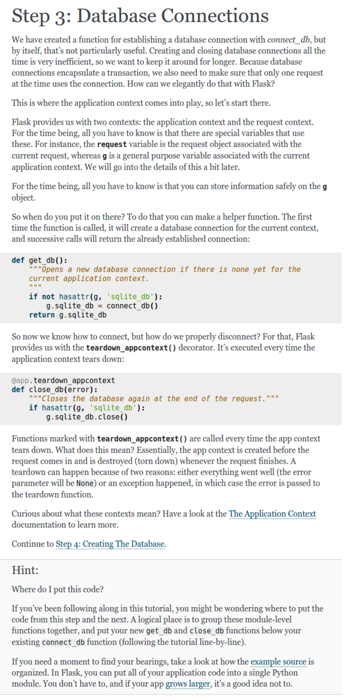
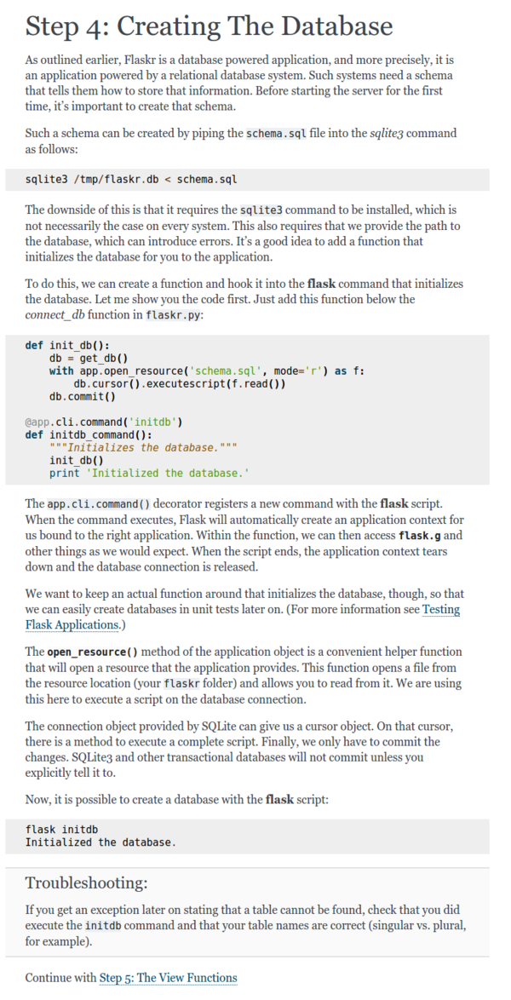
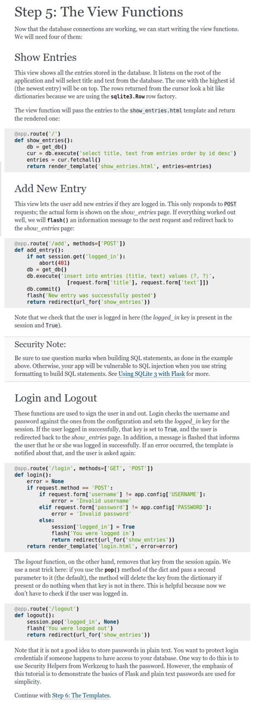
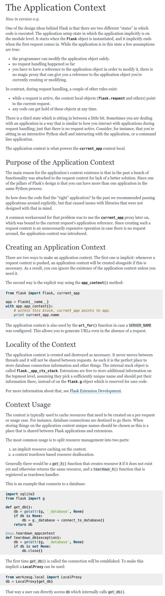
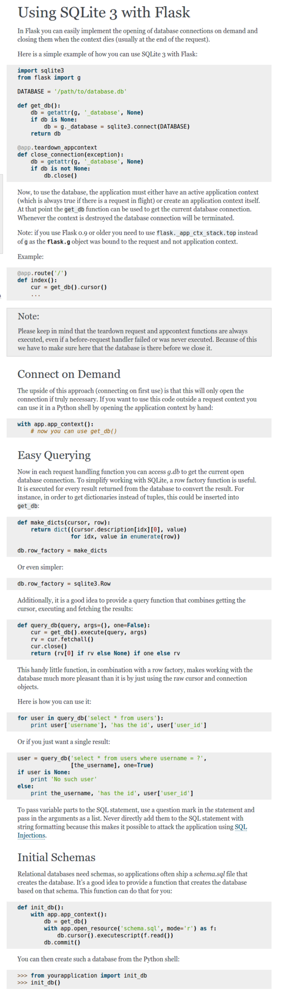
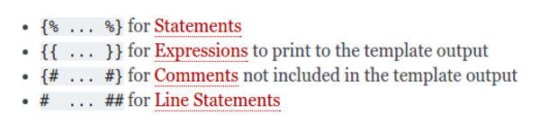
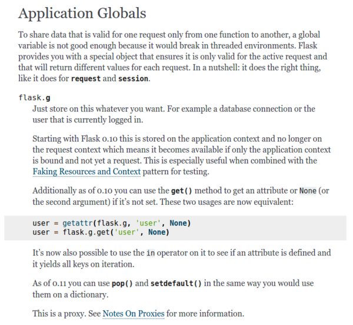

* This project log is a compilation of article and tutorial used from this working session.
* Here is an official article about instanced folder in Flask, [http://flask.pocoo.org/docs/0.11/config/#instance-folders](http://flask.pocoo.org/docs/0.11/config/#instance-folders).
* Here is the full screenshot.

* Setting up simple database schema for SQLite3 in Flask, [http://flask.pocoo.org/docs/0.11/tutorial/schema/](http://flask.pocoo.org/docs/0.11/tutorial/schema/).
* Full screenshot.

* Application setup code for web application that uses SQLite3 database, [http://flask.pocoo.org/docs/0.11/tutorial/setup/](http://flask.pocoo.org/docs/0.11/tutorial/setup/).
* Full screenshot.

* Setting up database connection, [http://flask.pocoo.org/docs/0.11/tutorial/dbcon/](http://flask.pocoo.org/docs/0.11/tutorial/dbcon/).
* Full screenshot.

* Creating the database, [http://flask.pocoo.org/docs/0.11/tutorial/dbinit/](http://flask.pocoo.org/docs/0.11/tutorial/dbinit/).
* Full screenshot.

* Creating simple routing for the web application, [http://flask.pocoo.org/docs/0.11/tutorial/views/](http://flask.pocoo.org/docs/0.11/tutorial/views/).
* Full screenshot of the tutorial.

* Tutorial about application context, [http://flask.pocoo.org/docs/0.11/appcontext/](http://flask.pocoo.org/docs/0.11/appcontext/).
* Full screenshot.

* Article about using SQLite3 with Flask, [http://flask.pocoo.org/docs/0.11/patterns/sqlite3/](http://flask.pocoo.org/docs/0.11/patterns/sqlite3/).
* Full screenshot.

* Flask's Jina templating syntaxes, [http://jinja.pocoo.org/docs/dev/templates/](http://jinja.pocoo.org/docs/dev/templates/).

* Application global's `flask.g` documentation, [http://flask.pocoo.org/docs/0.11/api/#application-globals](http://flask.pocoo.org/docs/0.11/api/#application-globals).
* Full screenshot.

