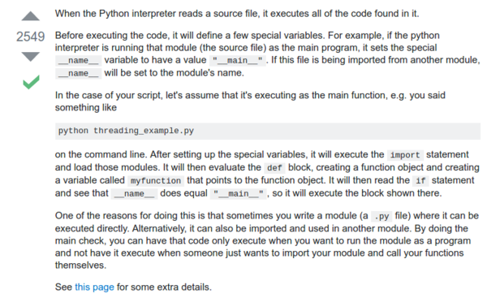

* What is `python-dev` package?
    * `python-dev` is a package that contain Python C API. It is used because of its high performance.
    * The discussion about this matter is here, [http://stackoverflow.com/questions/31002091/what-is-python-dev-package-used-for](http://stackoverflow.com/questions/31002091/what-is-python-dev-package-used-for).
* There is a Python virtual environment wrapper, however I would not install it and keep using the method that is from Flask website.
* All in all I prefer to make Python virtual environment with the method from Flask guide for this moment. And I would not use the method from this book until I got clear understanding on what is the benefit of each others.
* There is this `touch` command that is native to Linux. It is used to create an empty file. This is pretty neat to make a blank .md file or blank .py file.
* What is the usage `coding:utf-8` in the beginning of the Flask entry file?
    * To tell Python which encoding used for this application.
    * Also to prevent from nasty bug (?).
* What is `__name__` means in Python programming?
    * I think it used to determine the root of the project.
    * In case the `__name__` is not `__main__` then the executed codes might comes from other packages.
    * Check here, [http://stackoverflow.com/questions/419163/what-does-if-name-main-do](http://stackoverflow.com/questions/419163/what-does-if-name-main-do).



```markdown
if __name__ == "__main__":
    app.run(
```

* If you want to test your Flask project try to use these commands.

```markdown
export FLASK_APP=your_entry_file.py
flask run
```

* Or you can just run Flask application using `python your_entry_file.py` without even `export FLASK_APP=your_entry_file.py`. I am not sure what are the differences.
* What happened if you change to other Python virtual environment without using `deactivate` first?
    * If you want to refactor your project you need to make new virtual environment delete the `venv` folder and initiate `virtualenv venv` again.
    * Because, otherwise the path is still tact into the old directory.