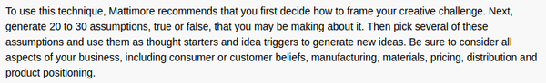
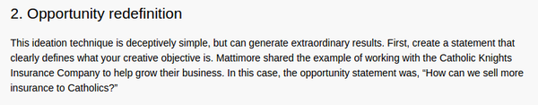
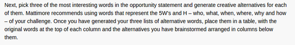
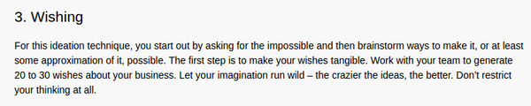
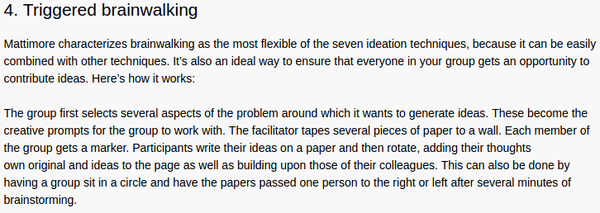
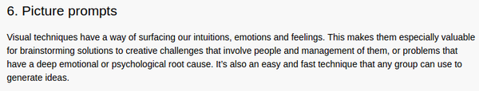
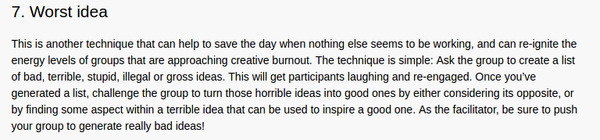
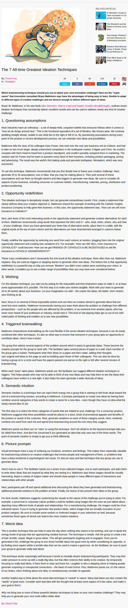

* Make several assumptions to kick start the idea generation.

* Make a statement that __clearly__ identifies what thing am I going to make. Or what thing am I currently brainstorming on.
* For example this is can be considered as an opportunity statement, "How can you sell more insurance to Catholics?".

* Generate many alternative words from the opportunity statement.
* Make a causation between these.
* These are like related word that I used for the previous poem generation application.
* Mattimore suggests that using 5W + 1H could help to generate this process.

* From these processes I need to create a new, modified opportunity statement.
* For example the modified statement from the first part would be, "How can we get friends of Catholics to be incentive to sell insurance to Catholic grandparents?"

* Using "I wish...." method.
* "Let your imagination runs wild!".

* Triggered brainwalking is like making chain story from Reddit.
* However, I need to have more than one person.

* Picture prompt is to spam several related or not so related image to trigger the process of idea generation.

* Suggest the worst idea and try to conclude with the opposite.
* This is from, [http://www.innovationmanagement.se/2013/05/30/the-7-all-time-greatest-ideation-techniques/](http://www.innovationmanagement.se/2013/05/30/the-7-all-time-greatest-ideation-techniques/).
* Below is the full screenshot.

