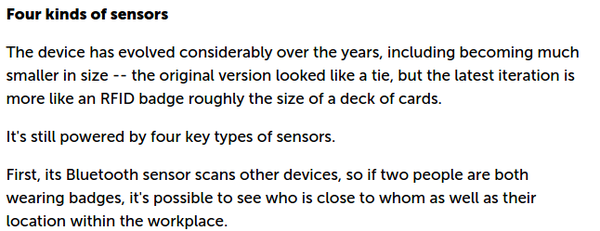

* Coffe machine as a gathering spot canbe used as a tool to increase interactivity and productivity in general in company.

* Track social activity at work.
* For example like.
    * How people talks to.
    * How people interacts.
* The real intention is to make the company understand them better.
* Later in this article this badge also meant to be a personal benchmark tool to let individual get what he/she wants to achieve.

* There is a physical interface that used data gathered from the sociometric badge which is the social coffee robot.
* This coffee robot would see which group need to interact more then hence it arranges something (?).
* I am thinking like a scheduled free coffee coupon or something like that.

* The result from the coffee machine is that those certain group of people have more time to interact hence more collaboration.

* Simple thing is to use RFID chip.
* The creator of this sociometric badge could tell where people are in the office by using some RFID chips.

* Additional Bluetooth, infrared, and an accelerometer as well.
* The microphone tracked these.
    * How long a person speak.
    * How often a person interrupt another person speaking.
    * And then the volume of the speech.

* In MIT the technology could be used to predict 85 percent accuracy on who would win in salary negotiation in controlled test environment.
* Achieved similar thing in speed dating.

* "Who talks to whom.".

* So it is indeed the same person who invented the original sociometric badge from MIT Human Dynamics group.

* There are 4 kinds of sensors in this sociometric badge.
    * Bluetooth to scan other devices in range.
    * Infrared scanner to detect if a conversation is happening between person.
    * Microphones.
    * Accelerometer.

* Example case of sociometric badge in Bank Of America in term of engagement of social interaction between teammates.

* New keywords here are myopic metrics to reducing cost, KPIs.

* This sociometric badge does not record what happened in the bathroom.

* Helping people to understand the big tool.
* Much clear conversation.

* There is something like contract/NDA/TOA (Term Of Agreement) before someone is about to use sociometric badge within their office environment.
* So, is this what I meant about data gathering with consent?

* FitBit for your career instead for jogging/running/sport.
* This sociometric badge setup what people want to achieve.

* Case examples.
* I actually want this now.

* SMOODLY, adaptable office environment.

* Humanyze provides its technology to research based group.
* For example Arizona State University produced particular project about whether creativity can be measures behaviorally.
* Here is the link to the main article, [http://www.computerworld.com/article/3006631/data-analytics/startup-humanyzes-people-analytics-wants-to-transform-your-workplace.html](http://www.computerworld.com/article/3006631/data-analytics/startup-humanyzes-people-analytics-wants-to-transform-your-workplace.html).
* Below is the full article about Humanyze and its main product.

