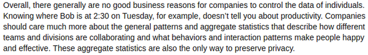

* I have seen a lot of articles about sociometric badge.
* The main use of the sociometric badge is to help people in collaboration.
* It is also possible to know whether a person will win a negotiation or not from data gathered from the sociometric badge.

* Companies can already spy on to their workers' privacy.
* Even legally (I think this is only for United States)!

* New deal on data by MIT.
* Professor Sandy "Alex" Pentland.
* The 3 points are these.
    * Data collections is an option and informed.
    * Individuals control their own data.
    * Data must be aggregated (the meaning of aggregated will be explained later).

* Fake badge in case people does not want to participate in using sociometric badge.
* However, since it mostly benefits the wearer people will rarely resist.

* What it means by aggregated data is that data is shown together with all other data.
* Meaning there is no way to look for specific data.
* Whoever have right to see the data will see it as a very big collection of data, not just data for a particular person.

* The key thing about data gathering is not how to spy on people's privacy but for making a transparent environment (well ideally this would never happen, I think).
* This article can be found here, [http://data-informed.com/people-analytics-how-to-ethically-use-social-sensors-to-track-workers/](http://data-informed.com/people-analytics-how-to-ethically-use-social-sensors-to-track-workers/).
* Below is the screnshot for the whole article.

