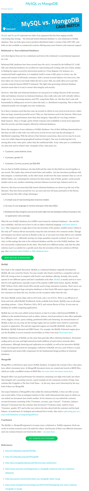

* Comparison between MySQL vs MongoDB, [https://www.upguard.com/articles/mysql-vs-mongodb](https://www.upguard.com/articles/mysql-vs-mongodb).
* The main red line is that MySQL is good for data integrity while MongoDB is good for scalability.
* Here is the screenshot of the article.

