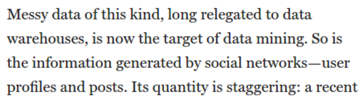
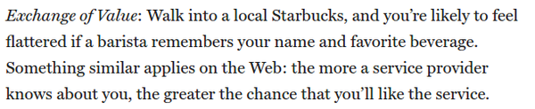

* This is an article about ethical practice on big data gathering.

* There is this startup named Color.
* They want to use usable sensors in common smart phone for big data gathering.

* Color make us realized that companies are always gaining new ways to capture and gather information about everything.

* There are these technology that is commonly used for big data gathering.
    * Language processing.
    * Machine learning.
    * Software architecture like Hadoop which can handle multiple simultaneous search query.

* Back then gathered data was arranged very messy and unstructured.
* Now everything is stored in data warehouses.
* The target of data mining could be anything, although it is usually comes from social networking site.

* Data gathered is reached into staggering amount of 8.000 billion gigabytes.
* By 2020, there would be total of 35 zetabytes of information stored globally.

* Some privacy measures by American government.
    * John McCain and John Kerry proposed Consumer Privacy Bill Of Right Act in 2011.
    * Senator Jay Rockfeller has proposed Do - Not - Track Online Act also in 2011.
* In Europe, there is The European Union Article 29 Working Group that addressing similar content.

* Aside from government there is also a precaution dropped by Digital Advertising Alliance.
* They introduced rule - making privacy framework to assure security and safety of customer information.
* There is also Self - Regulatory Program For Online Behavior Adverting as well.

* From Wall Street Journal it is known that average price of untargeted advertisement was at some point around 1.98 US Dollars per thousands view. While average price of targeted advertisement could go double at rate of 4.12 US Dollars.

* Big company started to acquire smaller company that run around big data and data mining.

* David Moore said, "It ceases to be an ad, it becomes important information.".

* Facebook, Google, and Zynga start to aggregate data of billions user informations.

* Example of security breach happened to Apple and Sony's PlayStation.
* For around 100 million customers information.

* Opportunities.
    * Data exchange.
    * Data market.
    * Predictive analytic market.
* Below are some good practices on data mining.
* In big line.
    * Clarity of practices.
    * Simplicity of settings.
    * Privacy by design (security).
    * Exchange values.

* Clarity of practices means that users need to be able to see what kind of data that are being collected during their activity online.

* Simplicity of settings means that user need to be able to set every possible aspect of their privacy.
* Facebook and Google do this practice really well.

* For example Facebook privacy settings can have an option up to 170 options.

* Privacy by design means that the organization need to also protect their data from malicious attack.
* It is said by Ann Cavaoukin a privacy comisioner from Ontario, Canada that options and transparency is not enough if unauthorized people can access the data.
* So security need to be in mind when the whole data gathering infrastructure is made.

* Exchange value means that the data gatherer needs to provide back to user in form of convenience.
* For example some web application records how their user use their web application. In result there would be a recommended contents that is curated specifically for each of their users.

* Clear example of exchange value is Netflix.
* Netflix can show movie/serial/television program that might interest their user based on what kind of content that the user opened/searched before.

* These points are made to make easy companies on defining their product's principles.

* Nevertheless, the golden rule is that, "Do unto the data of others as you would have them unto yours.".
* Basically it means that to treat others the way you want to be treated.
* You can find the article here, [https://www.technologyreview.com/s/424104/what-big-data-needs-a-code-of-ethical-practices/](https://www.technologyreview.com/s/424104/what-big-data-needs-a-code-of-ethical-practices/).
* Here is the screen shot of the article.

