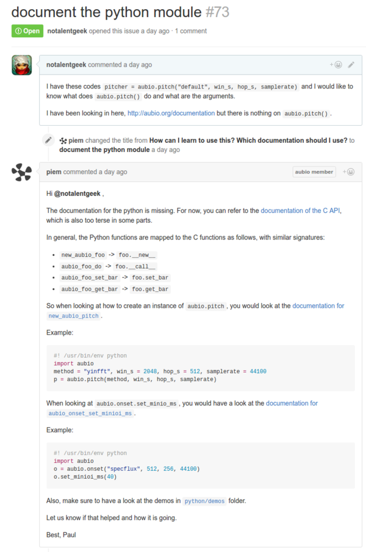

* There is no documentation nor tutorial for Python Aubio.
* All documentations are all currently in C.
* I opened a ticket here asking on how can I understand Python Aubio, [https://github.com/aubio/aubio/issues/73#issuecomment-261038498](https://github.com/aubio/aubio/issues/73#issuecomment-261038498).
* The maintainer responded to my question. He said that the there is no Python Aubio documentation at this moment. So, instead Python Aubio documentation can still refer to C Aubio documentation.
* Here is the screenshot of the answer.

