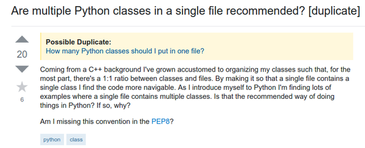
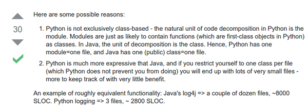
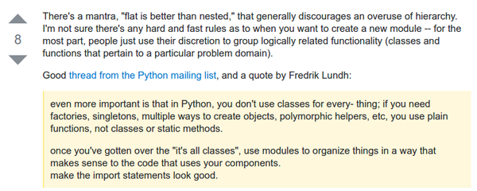
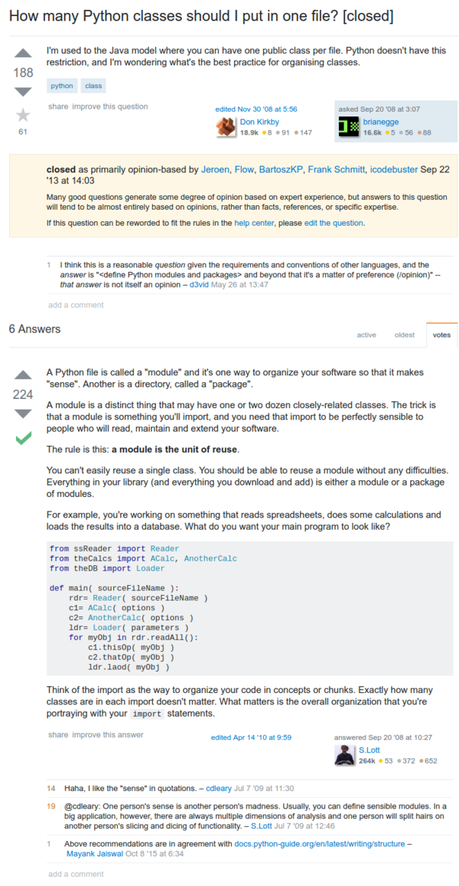

* Class in Python is not necessarily to be in separate file for each class.
* Python is similar to JavaScript than C in term of class/hierarchical management.
* So a .py file could contains several classes.
* There is this link to a discussion with same topic, [http://stackoverflow.com/questions/1091756/are-multiple-python-classes-in-a-single-file-recommended](http://stackoverflow.com/questions/1091756/are-multiple-python-classes-in-a-single-file-recommended).

* Python programming is different than that is in C/C++.
* In C/C++ codes are managed into several file to differ the codes as it is an object.

* However, the nature of Python is not class based programming, rather more into functional programming.

* The flatter the hierarchy of the project the better it is for Python.
* There is also a similar discussion in here as well, [http://stackoverflow.com/questions/106896/how-many-python-classes-should-i-put-in-one-file](http://stackoverflow.com/questions/106896/how-many-python-classes-should-i-put-in-one-file).
* The discussion was about "How many classes are recommended in .py file?".
* The distinction here is that Python codes was intended to be a module rather than object.
* There is no limit or convention on how many classes are supposed to be in a .py file.
* So each module contains a set of methods that can be used several times.
* Usually in C or Java the codes was more into as an object. That can only be used as the object itself (what I mean here, is that you cannot/should not use method in another class for another class in C/Java).
* What I see here, is that Python codes was more into set of static function in OOP based programming language like C or Java.
* Here is the screenshot of the discussion.

