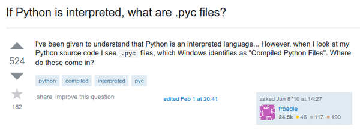
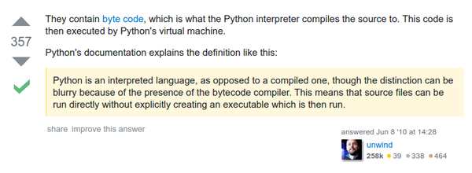

* There is a .pyc file when Python codes is ran.
* The .pyc file is a compiled Python that runs in Python virtual machine.
* This makes Python is not fully interpreted language.

* I think this is the flexibility of Python.
* It can run with just a codes using an interpreter or compiled into binary.

* In fact all programming language has the compiled and the interpreted aspect.
* Here is the link to the StackOverflow discussion, [http://stackoverflow.com/questions/2998215/if-python-is-interpreted-what-are-pyc-files](http://stackoverflow.com/questions/2998215/if-python-is-interpreted-what-are-pyc-files).