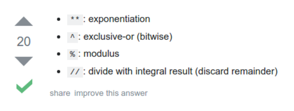

* Here are some specific Python operator those are not common in other programming languages, [http://stackoverflow.com/questions/15193927/what-does-these-operators-mean-python](http://stackoverflow.com/questions/15193927/what-does-these-operators-mean-python).

* `%` used for modulus.
* `**` used for exponentiation.
* `//` used for divide with integral result (discard remainder).
* `^` used for exclusive - or (bitwise).