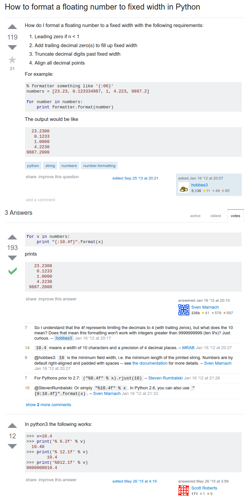

* Here is a StackOverflow discussion on how to have a floating point to have a specific amount of width when put into Python's `print()`, [http://stackoverflow.com/questions/8885663/how-to-format-a-floating-number-to-fixed-width-in-python](http://stackoverflow.com/questions/8885663/how-to-format-a-floating-number-to-fixed-width-in-python).
* Here is the screenshot.

