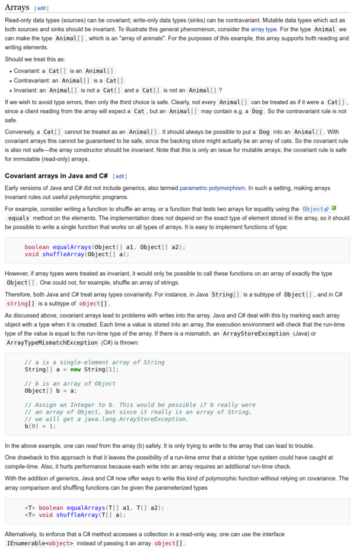

* Wikipedia entry for covariance and contravariance in programming, [https://en.wikipedia.org/wiki/Covariance_and_contravariance_(computer_science)](https://en.wikipedia.org/wiki/Covariance_and_contravariance_(computer_science)).
* I looked into this because there is a specific variable naming convention in Python for covariance and contravariance variable.
* In my understanding, covariance is when a `Cat` type data inherit from an `Animal` type data.
* Contravariance is the other way around. It is when an `Animal` type data is the superset of `Cat` type data.
* Nevertheless, my understanding could be wrong.
* Below is an example for C# and Java programming language.

