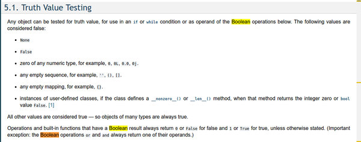

* Example of truth value testing in Python, [https://docs.python.org/2/library/stdtypes.html](https://docs.python.org/2/library/stdtypes.html).
* In Python `False` can be expressed in several different ways.

