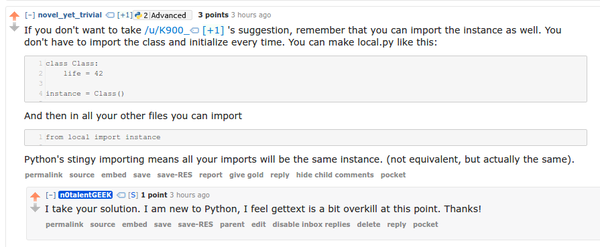
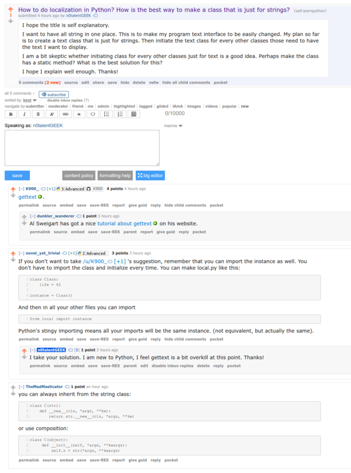

* I was asking on how to pack every text in my Python based application into 1 separate class in Reddit, [https://www.reddit.com/r/learnpython/comments/5din3b/how_to_do_localization_in_python_how_is_the_best/](https://www.reddit.com/r/learnpython/comments/5din3b/how_to_do_localization_in_python_how_is_the_best/).
* Here is my preferred answer.

* Here is the whole Reddit thread.

